### Table of Contents

#### 1. [Trustlines Network](#trustlines-network)

-   1.1 [Grapefruit](#grapefruit)
-   1.2 [Gradient](#gradient)
-   1.3 [Grayscales](#grayscales)

#### 2. [Trustlines Foundation](#trustlines-foundation)

-   2.1 [Blue](#blue)
-   2.2 [Gradient](#gradient-1)
-   2.3 [Grayscales](#grayscales-1)

#### 2. [Trustlines Protocol](#trustlines-protocol)

-   2.1 [Blue](#blue-2)
-   2.2 [Gradient](#gradient-2)
-   2.3 [Grayscales](#grayscales-2)

___

## Trustlines Network

### Grapefruit

<h4>Primary palette - Grapefruit tones</h4>
Our primary palette is composed of grapefruit
tones, and it should represent at least 80% of
all brand communications (e.g. blogposts and
website should be 80% grapefruit tones).

	

		

		
Download: [<a href="../../assets/images/brand/network/png/grapefruit/TN-Logo-Grapefruit_1_1.png">PNG</a>]&nbsp;[<a href="../../assets/images/brand/network/svg/grapefruit/TN-Logo-Grapefruit_1_1.svg">SVG</a>]

	

  

		
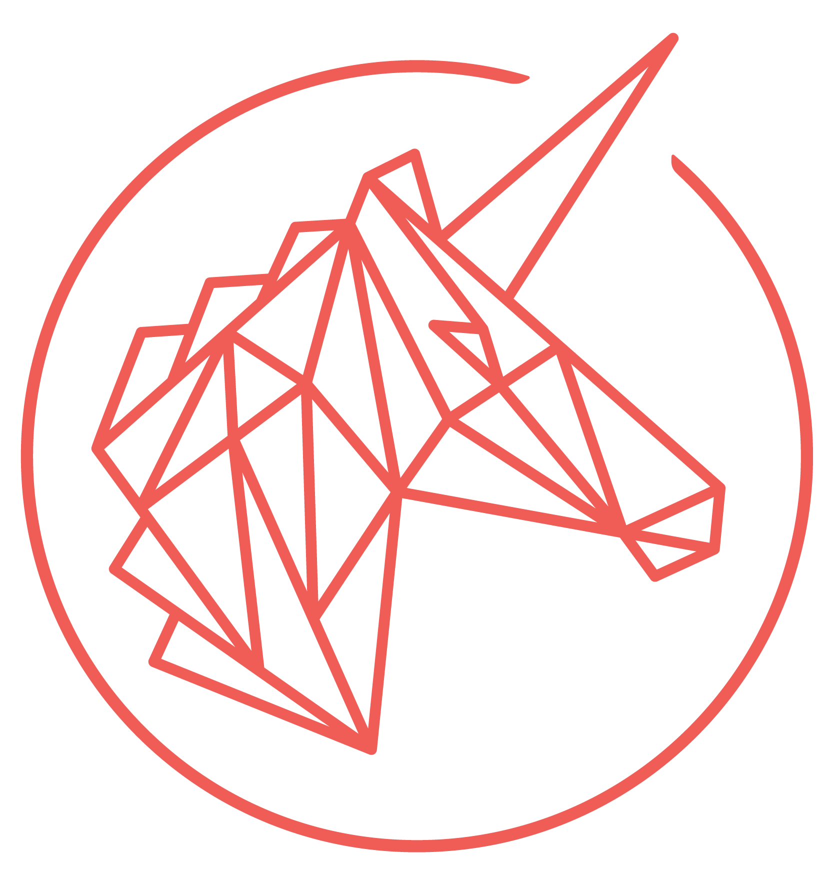

		
Download: [<a href="../../assets/images/brand/network/png/grapefruit/TN-Logo-Grapefruit_1_4.png">PNG</a>]&nbsp;[<a href="../../assets/images/brand/network/svg/grapefruit/TN-Logo-Grapefruit_1_4.svg">SVG</a>]

	

	

		
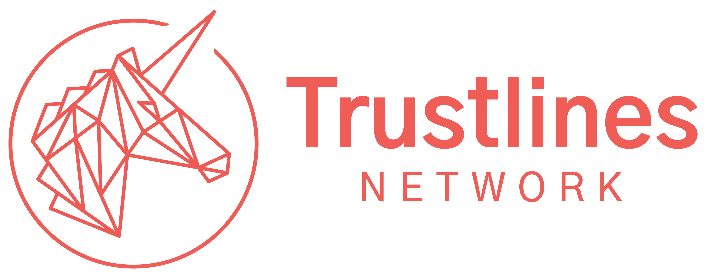

		
Download: [<a href="../../assets/images/brand/network/png/grapefruit/TN-Logo-Grapefruit_1_2.png">PNG</a>]&nbsp;[<a href="../../assets/images/brand/network/svg/grapefruit/TN-Logo-Grapefruit_1_2.svg">SVG</a>]

	

  

		

		
Download: [<a href="../../assets/images/brand/network/png/grapefruit/TN-Logo-Grapefruit_1_3.png">PNG</a>]&nbsp;[<a href="../../assets/images/brand/network/svg/grapefruit/TN-Logo-Grapefruit_1_3.svg">SVG</a>]

	

### Gradient

Treat gradients carefully. When applying them,
use linear mode at 45 degrees and make sure
grapefruit tones are significantly dominant,
as in these examples.

See the [Brand Guidelines](brand_guidelines.html#32-gradients) for more details on how to
build up consistent gradients.

	

		

		
Download: [<a href="../../assets/images/brand/network/png/gradient/TN-Logo-Gradient_1_13.png">PNG</a>]&nbsp;[<a href="../../assets/images/brand/network/svg/gradient/TN-Logo-Gradient_1_13.svg">SVG</a>]

	

  

		

		
Download: [<a href="../../assets/images/brand/network/png/gradient/TN-Logo-Gradient_1_16.png">PNG</a>]&nbsp;[<a href="../../assets/images/brand/network/svg/gradient/TN-Logo-Gradient_1_16.svg">SVG</a>]

	

	

		

		
Download: [<a href="../../assets/images/brand/network/png/gradient/TN-Logo-Gradient_1_14.png">PNG</a>]&nbsp;[<a href="../../assets/images/brand/network/svg/gradient/TN-Logo-Gradient_1_14.svg">SVG</a>]

	

  

		

		
Download: [<a href="../../assets/images/brand/network/png/gradient/TN-Logo-Gradient_1_15.png">PNG</a>]&nbsp;[<a href="../../assets/images/brand/network/svg/gradient/TN-Logo-Gradient_1_15.svg">SVG</a>]

	

### Grayscales

Use the gray tones here specified, as they do a
great job at complementing our primary and
secondary palettes. Avoid full black at all cost –
it is too invasive for our color palette.

Select one of the following monochromatic
versions of the logo in scenarios where full
color is not feasible.

To guarantee enough contrast between the
logo and its background, use exclusively the
combinations specified in the [Brand Guidelines](brand_guidelines.html#34-grayscales) and refrain from
creating any new ones.

These tones respond to the grayscale
palette detailed in the [Brand Guidelines](brand_guidelines.html#34-grayscales),
and these values should never be altered.

#### Black

	

		

		
Download: [<a href="../../assets/images/brand/network/png/black/TN-Logo-Black_1_5.png">PNG</a>]&nbsp;[<a href="../../assets/images/brand/network/svg/black/TN-Logo-Black_1_5.svg">SVG</a>]

	

  

		

		
Download: [<a href="../../assets/images/brand/network/png/black/TN-Logo-Black_1_8.png">PNG</a>]&nbsp;[<a href="../../assets/images/brand/network/svg/black/TN-Logo-Black_1_8.svg">SVG</a>]

	

	

		

		
Download: [<a href="../../assets/images/brand/network/png/black/TN-Logo-Black_1_6.png">PNG</a>]&nbsp;[<a href="../../assets/images/brand/network/svg/black/TN-Logo-Black_1_6.svg">SVG</a>]

	

  

		

		
Download: [<a href="../../assets/images/brand/network/png/black/TN-TN-Logo-Black_1_7.png">PNG</a>]&nbsp;[<a href="../../assets/images/brand/network/svg/black/TN-Logo-Black_1_7.svg">SVG</a>]

	

#### White

	

		

		
Download: [<a href="../../assets/images/brand/network/png/white/TN-Logo-White_1_9.png">PNG</a>]&nbsp;[<a href="../../assets/images/brand/network/svg/white/TN-Logo-White_1_9.svg">SVG</a>]

	

  

		

		
Download: [<a href="../../assets/images/brand/network/png/white/TN-Logo-White_1_12.png">PNG</a>]&nbsp;[<a href="../../assets/images/brand/network/svg/white/TN-Logo-White_1_12.svg">SVG</a>]

	

	

		

		
Download: [<a href="../../assets/images/brand/network/png/white/TN-Logo-White_1_10.png">PNG</a>]&nbsp;[<a href="../../assets/images/brand/network/svg/white/TN-Logo-White_1_10.svg">SVG</a>]

	

  

		

		
Download: [<a href="../../assets/images/brand/network/png/white/TN-TN-Logo-White_1_11.png">PNG</a>]&nbsp;[<a href="../../assets/images/brand/network/svg/white/TN-Logo-White_1_11.svg">SVG</a>]

	

#### Gray - Dark

	

		

		
Download: [<a href="../../assets/images/brand/network/png/gray-dark/TN-Logos-DarkGray_1_21.png">PNG</a>]&nbsp;[<a href="../../assets/images/brand/network/svg/gray-dark/TN-Logo-DarkGray_1_21.svg">SVG</a>]

	

  

		
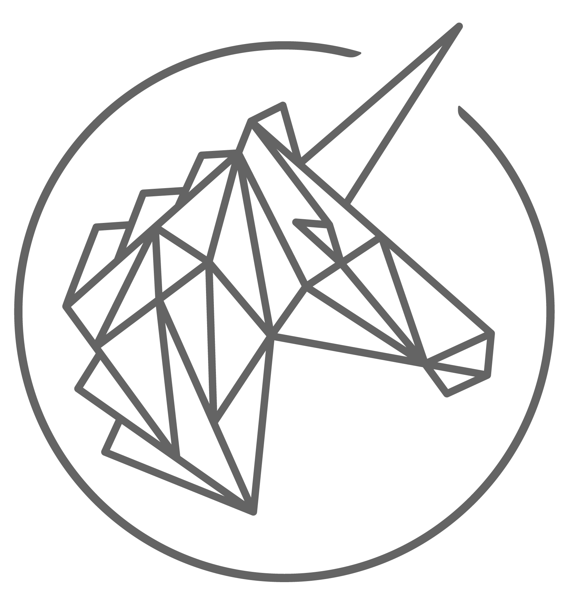

		
Download: [<a href="../../assets/images/brand/network/png/gray-dark/TN-Logos-DarkGray_1_24.png">PNG</a>]&nbsp;[<a href="../../assets/images/brand/network/svg/gray-dark/TN-Logo-DarkGray_1_24.svg">SVG</a>]

	

	

		
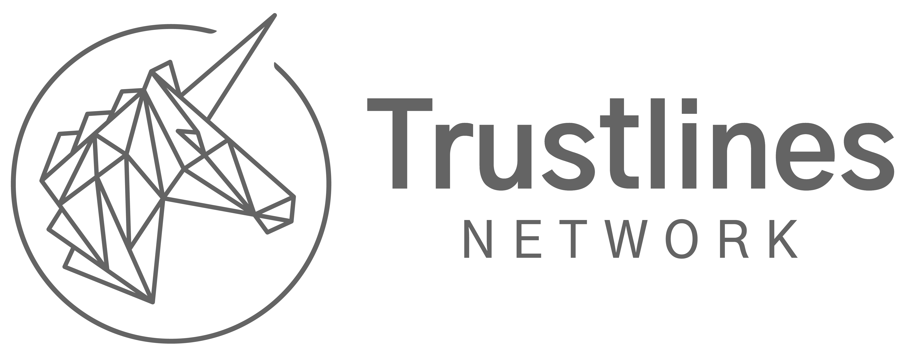

		
Download: [<a href="../../assets/images/brand/network/png/gray-dark/TN-Logos-DarkGray_1_22.png">PNG</a>]&nbsp;[<a href="../../assets/images/brand/network/svg/gray-dark/TN-Logo-DarkGray_1_22.svg">SVG</a>]

	

  

		

		
Download: [<a href="../../assets/images/brand/network/png/gray-dark/TN-Logos-DarkGray_1_23.png">PNG</a>]&nbsp;[<a href="../../assets/images/brand/network/svg/gray-dark/TN-Logo-DarkGray_1_23.svg">SVG</a>]

	

#### Gray - Light

	

		

		
Download: [<a href="../../assets/images/brand/network/png/gray-light/TN-Logos-LightGray_1_17.png">PNG</a>]&nbsp;[<a href="../../assets/images/brand/network/svg/gray-light/TN-Logo-LightGray_1_17.svg">SVG</a>]

	

  

		

		
Download: [<a href="../../assets/images/brand/network/png/gray-light/TN-Logos-LightGray_1_20.png">PNG</a>]&nbsp;[<a href="../../assets/images/brand/network/svg/gray-light/TN-Logo-LightGray_1_20.svg">SVG</a>]

	

	

		

		
Download: [<a href="../../assets/images/brand/network/png/gray-light/TN-Logos-LightGray_1_18.png">PNG</a>]&nbsp;[<a href="../../assets/images/brand/network/svg/gray-light/TN-Logo-LightGray_1_18.svg">SVG</a>]

	

  

		

		
Download: [<a href="../../assets/images/brand/network/png/gray-light/TN-Logos-LightGray_1_19.png">PNG</a>]&nbsp;[<a href="../../assets/images/brand/network/svg/gray-light/TN-Logo-LightGray_1_19.svg">SVG</a>]

	

___

## Trustlines Foundation

The differentiation between the Trustlines Network
and the Trustlines Foundation is achived throughout
our taglines (Network & Foundation), but most
importantly throughout our colors.

Apart from this distinction, follow all considerations
described in Sections 1-5 of the [Brand Guidelines](brand_guidelines.html), without any
exceptions.

### Blue

<h4>Primary palette - sky blue tones</h4>

For the Trustlines Foundation, we invert the color
palette from the Trustlines Network. The deal is
simple: sky blue tones become our primary
palette, while grapefruit tones become our
secondary palette.

By doing so, we help create clear distinctions
between the Network and the Foundation, while
integrating them as part of one united system.

	

		

		
Download: [<a href="../../assets/images/brand/foundation/png/blue/TF-Logo-Blue_1.png">PNG</a>]&nbsp;[<a href="../../assets/images/brand/foundation/svg/blue/TF-Logo-Blue_1_1.svg">SVG</a>]

	

  

		
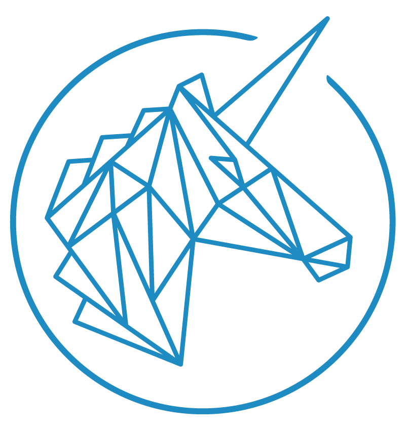

		
Download: [<a href="../../assets/images/brand/foundation/png/blue/TF-Logo-Blue_4.png">PNG</a>]&nbsp;[<a href="../../assets/images/brand/foundation/svg/blue/TF-Logo-Blue_1_4.svg">SVG</a>]

	

	

		
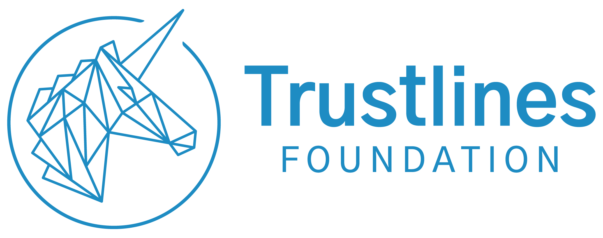

		
Download: [<a href="../../assets/images/brand/foundation/png/blue/TF-Logo-Blue_2.png">PNG</a>]&nbsp;[<a href="../../assets/images/brand/foundation/svg/blue/TF-Logo-Blue_1_2.svg">SVG</a>]

	

  

		

		
Download: [<a href="../../assets/images/brand/foundation/png/blue/TF-Logo-Blue_3.png">PNG</a>]&nbsp;[<a href="../../assets/images/brand/foundation/svg/blue/TF-Logo-Blue_1_3.svg">SVG</a>]

	

### Gradient

To create gradients for the Trustlines Foundation,
simply substitute the grapefruit hexadecimal
codes with those from the sky blue palette.

See the [Brand Guidelines](brand_guidelines.html#63-gradients) for more details on how to
build up consistent gradients.

	

		

		
Download: [<a href="../../assets/images/brand/foundation/png/gradient/TF-Logo-Gradient_1.png">PNG</a>]&nbsp;[<a href="../../assets/images/brand/foundation/svg/gradient/TF-Logo-Gradient_1_13.svg">SVG</a>]

	

  

		

		
Download: [<a href="../../assets/images/brand/foundation/png/gradient/TF-Logo-Gradient_4.png">PNG</a>]&nbsp;[<a href="../../assets/images/brand/foundation/svg/gradient/TF-Logo-Gradient_1_16.svg">SVG</a>]

	

	

		
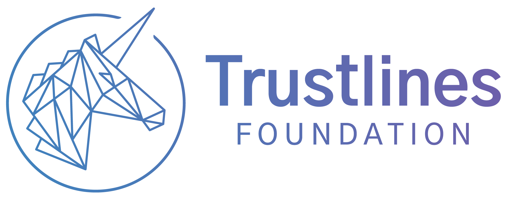

		
Download: [<a href="../../assets/images/brand/foundation/png/gradient/TF-Logo-Gradient_2.png">PNG</a>]&nbsp;[<a href="../../assets/images/brand/foundation/svg/gradient/TF-Logo-Gradient_1_14.svg">SVG</a>]

	

  

		

		
Download: [<a href="../../assets/images/brand/foundation/png/gradient/TF-Logo-Gradient_3.png">PNG</a>]&nbsp;[<a href="../../assets/images/brand/foundation/svg/gradient/TF-Logo-Gradient_1_15.svg">SVG</a>]

	

### Grayscales

#### Black

	

		

		
Download: [<a href="../../assets/images/brand/foundation/png/black/TF-Logo-Black_4.png">PNG</a>]&nbsp;[<a href="../../assets/images/brand/foundation/svg/black/TF-Logo-Black_1_5.svg">SVG</a>]

	

  

		

		
Download: [<a href="../../assets/images/brand/foundation/png/black/TF-Logo-black_4.png">PNG</a>]&nbsp;[<a href="../../assets/images/brand/foundation/svg/black/TF-Logo-Black_1_8.svg">SVG</a>]

	

	

		

		
Download: [<a href="../../assets/images/brand/foundation/png/black/TF-Logo-Black_2.png">PNG</a>]&nbsp;[<a href="../../assets/images/brand/foundation/svg/black/TF-Logo-Black_1_6.svg">SVG</a>]

	

  

		

		
Download: [<a href="../../assets/images/brand/foundation/png/black/TF-Logo-Black_3.png">PNG</a>]&nbsp;[<a href="../../assets/images/brand/foundation/svg/black/TF-Logo-Black_1_7.svg">SVG</a>]

	

#### White

	

		

		
Download: [<a href="../../assets/images/brand/foundation/png/white/TF-Logo-White_1.png">PNG</a>]&nbsp;[<a href="../../assets/images/brand/foundation/svg/white/TF-Logos-White_9.svg">SVG</a>]

	

  

		

		
Download: [<a href="../../assets/images/brand/foundation/png/white/TF-Logo-White_4.png">PNG</a>]&nbsp;[<a href="../../assets/images/brand/foundation/svg/white/TF-Logos-White_12.svg">SVG</a>]

	

	

		

		
Download: [<a href="../../assets/images/brand/foundation/png/white/TF-Logo-White_2.png">PNG</a>]&nbsp;[<a href="../../assets/images/brand/foundation/svg/white/TF-Logos-White_10.svg">SVG</a>]

	

  

		

		
Download: [<a href="../../assets/images/brand/foundation/png/white/TF-Logo-White_3.png">PNG</a>]&nbsp;[<a href="../../assets/images/brand/foundation/svg/white/TF-Logos-White_11.svg">SVG</a>]

	

#### Gray - Dark

	

		

		
Download: [<a href="../../assets/images/brand/foundation/png/gray-dark/TF-Logo-DarkGray_1.png">PNG</a>]&nbsp;[<a href="../../assets/images/brand/foundation/svg/gray-dark/TF-Logos-DarkGray_21.svg">SVG</a>]

	

  

		

		
Download: [<a href="../../assets/images/brand/foundation/png/gray-dark/TF-Logo-DarkGray_4.png">PNG</a>]&nbsp;[<a href="../../assets/images/brand/foundation/svg/gray-dark/TF-Logos-DarkGray_24.svg">SVG</a>]

	

	

		

		
Download: [<a href="../../assets/images/brand/foundation/png/gray-dark/TF-Logo-DarkGray_2.png">PNG</a>]&nbsp;[<a href="../../assets/images/brand/foundation/svg/gray-dark/TF-Logos-DarkGray_22.svg">SVG</a>]

	

  

		

		
Download: [<a href="../../assets/images/brand/foundation/png/gray-dark/TF-Logo-DarkGray_3.png">PNG</a>]&nbsp;[<a href="../../assets/images/brand/foundation/svg/gray-dark/TF-Logos-DarkGray_23.svg">SVG</a>]

	

#### Gray - Light

	

		

		
Download: [<a href="../../assets/images/brand/foundation/png/gray-light/TF-Logo-LightGray_1.png">PNG</a>]&nbsp;[<a href="../../assets/images/brand/foundation/svg/gray-light/TF-Logos-LightGray_17.svg">SVG</a>]

	

  

		

		
Download: [<a href="../../assets/images/brand/foundation/png/gray-light/TF-Logo-LightGray_4.png">PNG</a>]&nbsp;[<a href="../../assets/images/brand/foundation/svg/gray-light/TF-Logos-LightGray_20.svg">SVG</a>]

	

	

		
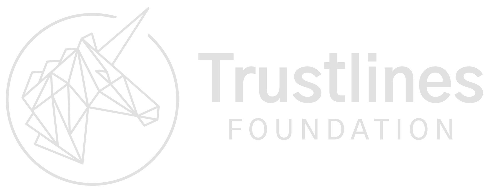

		
Download: [<a href="../../assets/images/brand/foundation/png/gray-light/TF-Logo-LightGray_2.png">PNG</a>]&nbsp;[<a href="../../assets/images/brand/foundation/svg/gray-light/TF-Logos-LightGray_18.svg">SVG</a>]

	

  

		

		
Download: [<a href="../../assets/images/brand/foundation/png/gray-light/TF-Logo-LightGray_3.png">PNG</a>]&nbsp;[<a href="../../assets/images/brand/foundation/svg/gray-light/TF-Logos-LightGray_19.svg">SVG</a>]

	

___

## Trustlines Protocol

### Blue

	

		
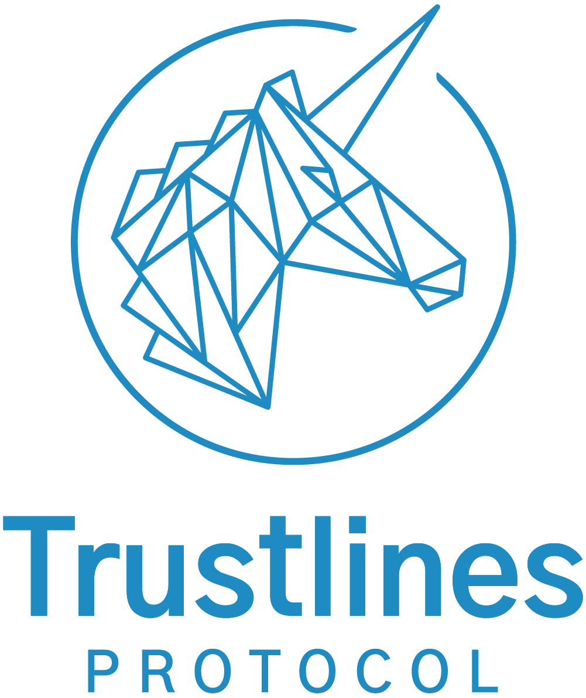

		
Download: [<a href="../../assets/images/brand/protocol/png/blue/TP-Logo-Blue_1.png">PNG</a>]&nbsp;[<a href="../../assets/images/brand/protocol/svg/blue/TP-Logo-Blue_1.svg">SVG</a>]

	

  

		

		
Download: [<a href="../../assets/images/brand/protocol/png/blue/TP-Logo-Blue_4.png">PNG</a>]&nbsp;[<a href="../../assets/images/brand/protocol/svg/blue/TP-Logo-Blue_4.svg">SVG</a>]

	

	

		

		
Download: [<a href="../../assets/images/brand/protocol/png/blue/TP-Logo-Blue_2.png">PNG</a>]&nbsp;[<a href="../../assets/images/brand/protocol/svg/blue/TP-Logo-Blue_2.svg">SVG</a>]

	

  

		

		
Download: [<a href="../../assets/images/brand/protocol/png/blue/TP-Logo-Blue_3.png">PNG</a>]&nbsp;[<a href="../../assets/images/brand/protocol/svg/blue/TP-Logo-Blue_3.svg">SVG</a>]

	

### Gradient

Treat gradients carefully. When applying them,
use linear mode at 45 degrees and make sure
grapefruit tones are significantly dominant,
as in these examples.

See the [Brand Guidelines](brand_guidelines.html#32-gradients) for more details on how to
build up consistent gradients.

	

		
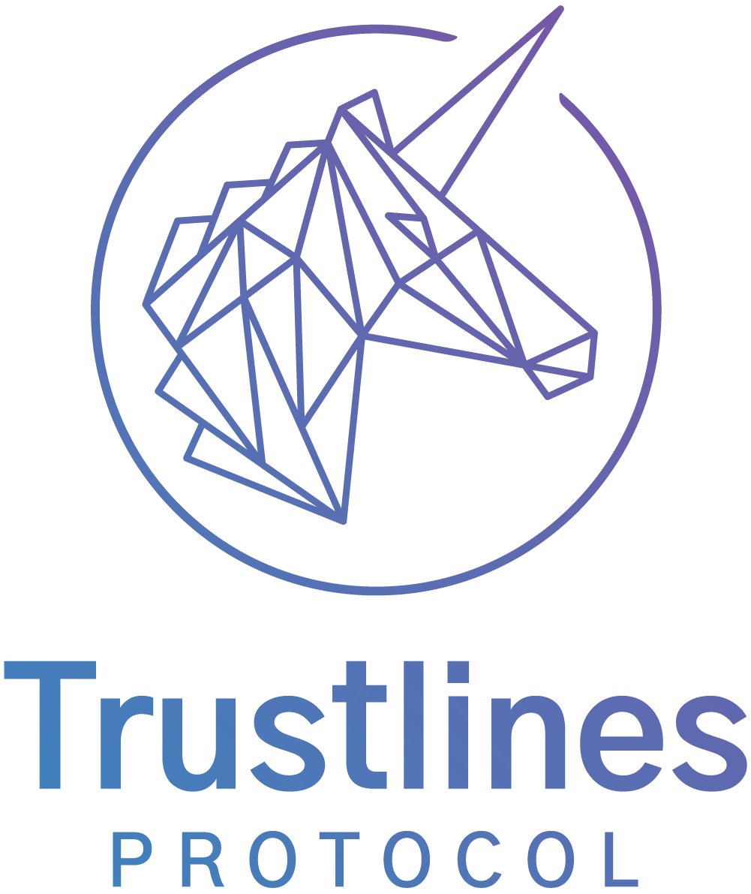

		
Download: [<a href="../../assets/images/brand/protocol/png/gradient/TP-Logo-Gradient_1.png">PNG</a>]&nbsp;[<a href="../../assets/images/brand/protocol/svg/gradient/TP-Logo-Gradient_1.svg">SVG</a>]

	

  

		
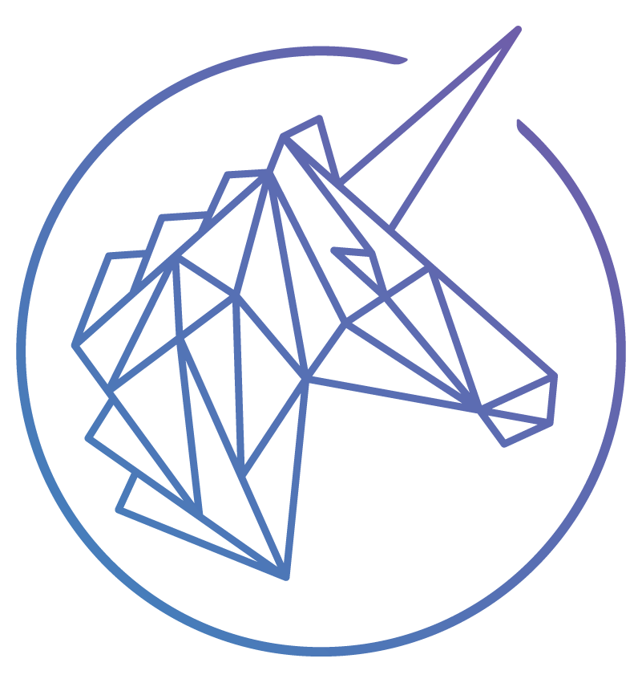

		
Download: [<a href="../../assets/images/brand/protocol/png/gradient/TP-Logo-Gradient_4.png">PNG</a>]&nbsp;[<a href="../../assets/images/brand/protocol/svg/gradient/TP-Logo-Gradient_4.svg">SVG</a>]

	

	

		
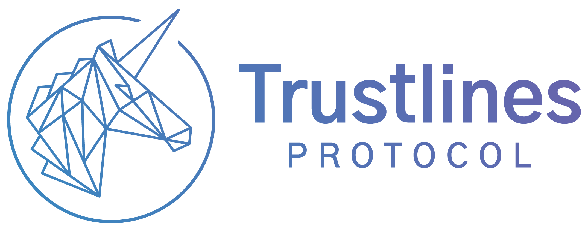

		
Download: [<a href="../../assets/images/brand/protocol/png/gradient/TP-Logo-Gradient_2.png">PNG</a>]&nbsp;[<a href="../../assets/images/brand/protocol/svg/gradient/TP-Logo-Gradient_2.svg">SVG</a>]

	

  

		

		
Download: [<a href="../../assets/images/brand/protocol/png/gradient/TP-Logo-Gradient_3.png">PNG</a>]&nbsp;[<a href="../../assets/images/brand/protocol/svg/gradient/TP-Logo-Gradient_3.svg">SVG</a>]

	

### Grayscales

Use the gray tones here specified, as they do a
great job at complementing our primary and
secondary palettes. Avoid full black at all cost –
it is too invasive for our color palette.

Select one of the following monochromatic
versions of the logo in scenarios where full
color is not feasible.

To guarantee enough contrast between the
logo and its background, use exclusively the
combinations specified in the [Brand Guidelines](brand_guidelines.html#34-grayscales) and refrain from
creating any new ones.

These tones respond to the grayscale
palette detailed in the [Brand Guidelines](brand_guidelines.html#34-grayscales),
and these values should never be altered.

#### Black

	

		
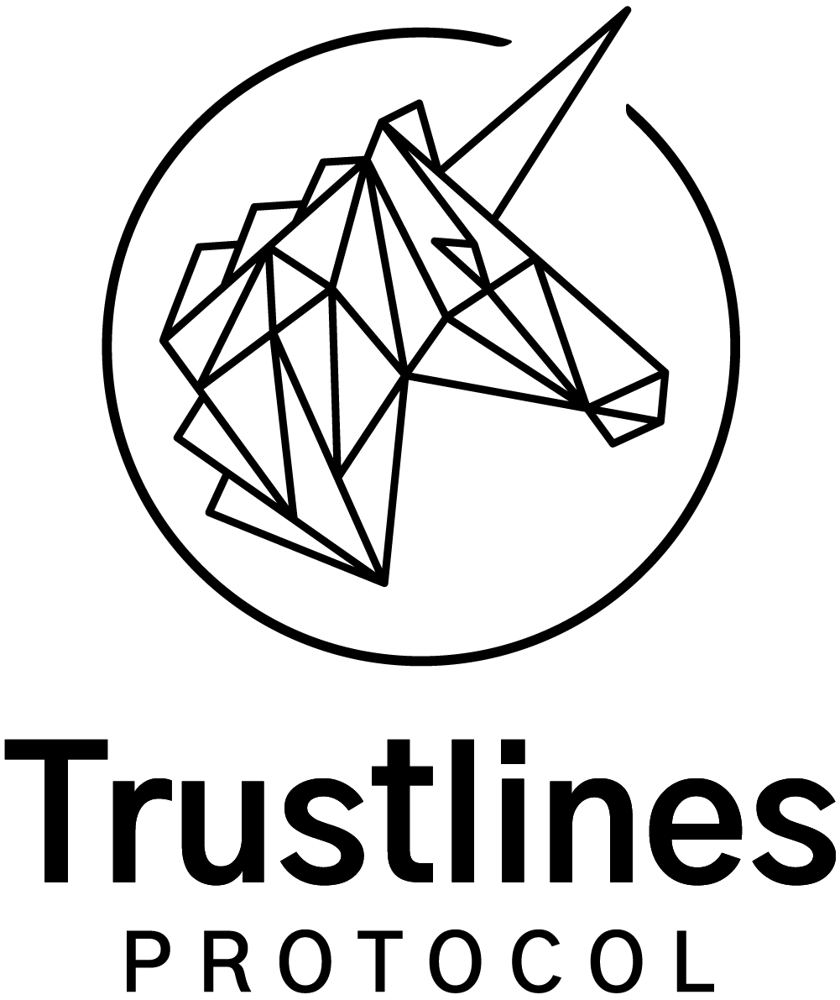

		
Download: [<a href="../../assets/images/brand/protocol/png/black/TP-Logo-Black_1.png">PNG</a>]&nbsp;[<a href="../../assets/images/brand/protocol/svg/black/TP-Logo-Black_1.svg">SVG</a>]

	

  

		

		
Download: [<a href="../../assets/images/brand/protocol/png/black/TP-Logo-Black_4.png">PNG</a>]&nbsp;[<a href="../../assets/images/brand/protocol/svg/black/TP-Logo-Black_4.svg">SVG</a>]

	

	

		
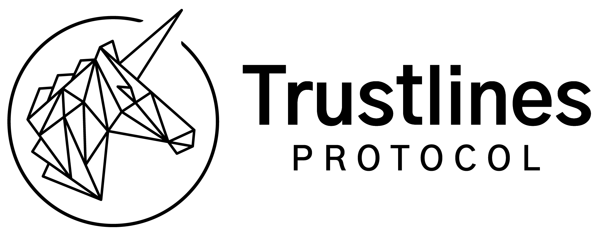

		
Download: [<a href="../../assets/images/brand/protocol/png/black/TP-Logo-Black_2.png">PNG</a>]&nbsp;[<a href="../../assets/images/brand/protocol/svg/black/TP-Logo-Black_2.svg">SVG</a>]

	

  

		

		
Download: [<a href="../../assets/images/brand/protocol/png/black/TP-Logo-Black_3.png">PNG</a>]&nbsp;[<a href="../../assets/images/brand/protocol/svg/black/TP-Logo-Black_3.svg">SVG</a>]

	

#### White

	

		

		
Download: [<a href="../../assets/images/brand/protocol/png/white/TP-Logo-White_1.png">PNG</a>]&nbsp;[<a href="../../assets/images/brand/protocol/svg/white/TP-Logo-White_1.svg">SVG</a>]

	

  

		

		
Download: [<a href="../../assets/images/brand/protocol/png/white/TP-Logo-White_4.png">PNG</a>]&nbsp;[<a href="../../assets/images/brand/protocol/svg/white/TP-Logos-RGB_4.svg">SVG</a>]

	

	

		

		
Download: [<a href="../../assets/images/brand/protocol/png/white/TP-Logo-White_2.png">PNG</a>]&nbsp;[<a href="../../assets/images/brand/protocol/svg/white/TP-Logo-White_2.svg">SVG</a>]

	

  

		

		
Download: [<a href="../../assets/images/brand/protocol/png/white/TP-Logo-White_3.png">PNG</a>]&nbsp;[<a href="../../assets/images/brand/protocol/svg/white/TP-Logo-White_3.svg">SVG</a>]

	

#### Gray - Dark

	

		

		
Download: [<a href="../../assets/images/brand/protocol/png/gray-dark/TP-Logo-DarkGray_1.png">PNG</a>]&nbsp;[<a href="../../assets/images/brand/protocol/svg/gray-dark/TP-Logo-DarkGray_1.svg">SVG</a>]

	

  

		
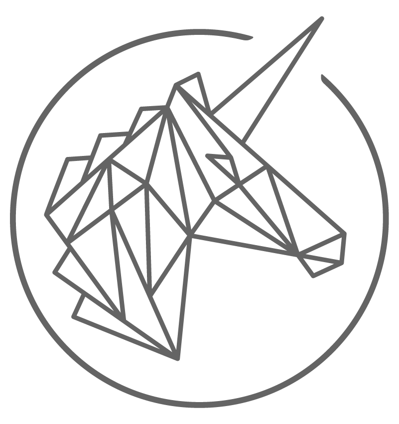

		
Download: [<a href="../../assets/images/brand/protocol/png/gray-dark/TP-Logo-DarkGray_4.png">PNG</a>]&nbsp;[<a href="../../assets/images/brand/protocol/svg/gray-dark/TP-Logo-DarkGray_4.svg">SVG</a>]

	

	

		
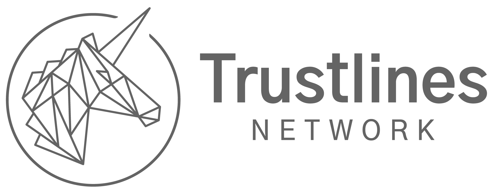

		
Download: [<a href="../../assets/images/brand/protocol/png/gray-dark/TP-Logo-DarkGray_2.png">PNG</a>]&nbsp;[<a href="../../assets/images/brand/protocol/svg/gray-dark/TP-Logo-DarkGray_2.svg">SVG</a>]

	

  

		

		
Download: [<a href="../../assets/images/brand/protocol/png/gray-dark/TP-Logo-DarkGray_3.png">PNG</a>]&nbsp;[<a href="../../assets/images/brand/protocol/svg/gray-dark/TP-Logo-DarkGray_3.svg">SVG</a>]

	

#### Gray - Light

	

		

		
Download: [<a href="../../assets/images/brand/protocol/png/gray-light/TP-Logo-LightGray_1.png">PNG</a>]&nbsp;[<a href="../../assets/images/brand/protocol/svg/gray-light/TP-Logo-LightGray_1.svg">SVG</a>]

	

  

		

		
Download: [<a href="../../assets/images/brand/protocol/png/gray-light/TP-Logo-LightGray_4.png">PNG</a>]&nbsp;[<a href="../../assets/images/brand/protocol/svg/gray-light/TP-Logo-LightGray_4.svg">SVG</a>]

	

	

		

		
Download: [<a href="../../assets/images/brand/protocol/png/gray-light/TP-Logo-LightGray_2.png">PNG</a>]&nbsp;[<a href="../../assets/images/brand/protocol/svg/gray-light/TP-Logo-LightGray_2.svg">SVG</a>]

	

  

		

		
Download: [<a href="../../assets/images/brand/protocol/png/gray-light/TP-Logo-LightGray_3.png">PNG</a>]&nbsp;[<a href="../../assets/images/brand/protocol/svg/gray-light/TP-Logo-LightGray_3.svg">SVG</a>]

	

