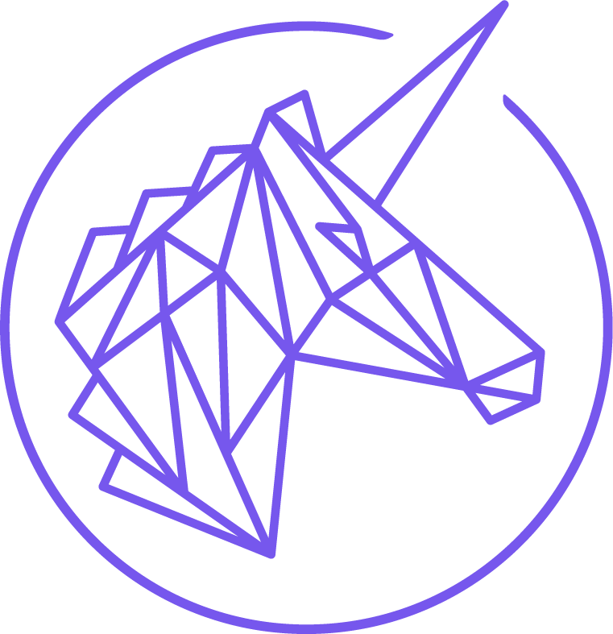
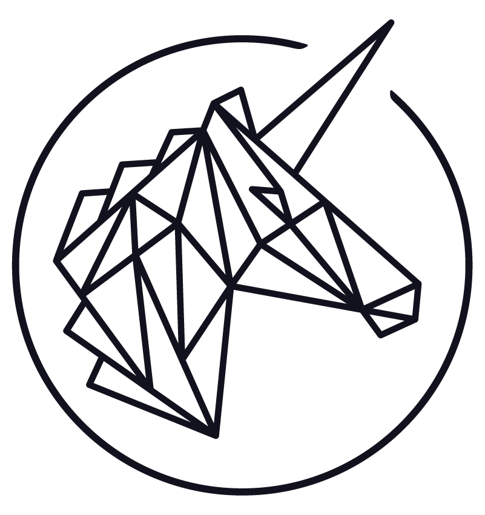
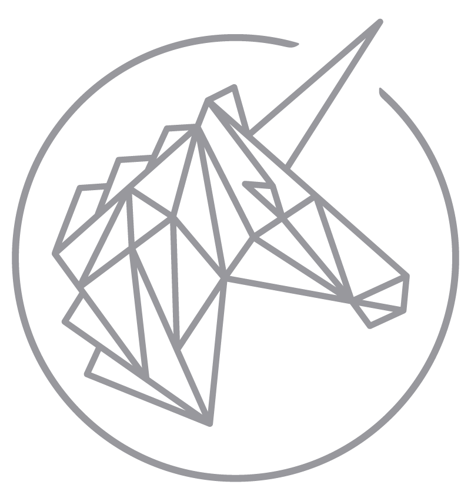

### Table of Contents

#### 1. [Trustlines Network](#trustlines-network)

#### 2. [Trustlines Foundation](#trustlines-foundation)

#### 3. [Trustlines Protocol](#trustlines-protocol)

#### 4. [Symbol](#symbol)

___

## Trustlines Network

#### Black

	

		

		
Download: [<a href="../../assets/images/brand/Network/PNG/trustlines-network-name-logo-black.png">PNG</a>]&nbsp;[<a href="../../assets/images/brand/network/svg/trustlines-network-name-logo-black.svg">SVG</a>]

	

	

		

		
Download: [<a href="../../assets/images/brand/Network/PNG/trustlines-network-logo-black.png">PNG</a>]&nbsp;[<a href="../../assets/images/brand/network/svg/trustlines-network-logo-black.svg">SVG</a>]

	

	

		

		
Download: [<a href="../../assets/images/brand/Network/PNG/trustlines-network-logo-center-black.png">PNG</a>]&nbsp;[<a href="../../assets/images/brand/network/svg/trustlines-network-logo-center-black.svg">SVG</a>]

	

#### White

	

		

		
Download: [<a href="../../assets/images/brand/Network/PNG/trustlines-network-name-logo-white.png">PNG</a>]&nbsp;[<a href="../../assets/images/brand/network/svg/trustlines-network-name-logo-white.svg">SVG</a>]

	

	

		

		
Download: [<a href="../../assets/images/brand/Network/PNG/trustlines-network-logo-white.png">PNG</a>]&nbsp;[<a href="../../assets/images/brand/network/svg/trustlines-network-logo-white.svg">SVG</a>]

	

	

		

		
Download: [<a href="../../assets/images/brand/Network/PNG/trustlines-network-logo-center-white.png">PNG</a>]&nbsp;[<a href="../../assets/images/brand/network/svg/trustlines-network-logo-center-white.svg">SVG</a>]

	

#### Dark Grey

	

		

		
Dark Grey [<a href="../../assets/images/brand/Network/PNG/trustlines-network-name-logo-dark-grey.png">PNG</a>]&nbsp;[<a href="../../assets/images/brand/network/svg/trustlines-network-name-logo-dark-grey.svg">SVG</a>]

	

	

		

		
Dark Grey [<a href="../../assets/images/brand/Network/PNG/trustlines-network-logo-dark-grey.png">PNG</a>]&nbsp;[<a href="../../assets/images/brand/network/svg/trustlines-network-logo-dark-grey.svg">SVG</a>]

	

	

		

		
Dark Grey [<a href="../../assets/images/brand/Network/PNG/trustlines-network-logo-center-dark-grey.png">PNG</a>]&nbsp;[<a href="../../assets/images/brand/network/svg/trustlines-network-logo-center-dark-grey.svg">SVG</a>]

	

#### Light Grey

	

		

		
Light Grey [<a href="../../assets/images/brand/Network/PNG/trustlines-network-name-logo-light-grey.png">PNG</a>]&nbsp;[<a href="../../assets/images/brand/network/svg/trustlines-network-name-logo-light-grey.svg">SVG</a>]

	

	

		

		
Light Grey [<a href="../../assets/images/brand/Network/PNG/trustlines-network-logo-light-grey.png">PNG</a>]&nbsp;[<a href="../../assets/images/brand/network/svg/trustlines-network-logo-light-grey.svg">SVG</a>]

	

	

		

		
Light Grey [<a href="../../assets/images/brand/Network/PNG/trustlines-network-logo-center-light-grey.png">PNG</a>]&nbsp;[<a href="../../assets/images/brand/network/svg/trustlines-network-logo-center-light-grey.svg">SVG</a>]

	

___

## Trustlines Foundation

	

		

		
Black [<a href="../../assets/images//brand/Foundation/PNG/trustlines-foundation-name-logo-black.png">PNG</a>]&nbsp;[<a href="../../assets/images//brand/Foundation/SVG/trustlines-foundation-name-logo-black.svg">SVG</a>]

	

    

		

		
Dark Grey [<a href="../../assets/images//brand/Foundation/PNG/trustlines-foundation-name-logo-dark-grey.png">PNG</a>]&nbsp;[<a href="../../assets/images//brand/Foundation/SVG/trustlines-foundation-name-logo-dark-grey.svg">SVG</a>]

	

	

		

		
 White [<a href="../../assets/images//brand/Foundation/PNG/trustlines-foundation-name-logo-white.png">PNG</a>]&nbsp;[<a href="../../assets/images//brand/Foundation/SVG/trustlines-foundation-name-logo-white.svg">SVG</a>]

	

    

		

		
Light Grey [<a href="../../assets/images//brand/Foundation/PNG/trustlines-foundation-name-logo-light-grey.png">PNG</a>]&nbsp;[<a href="../../assets/images//brand/Foundation/SVG/trustlines-foundation-name-logo-light-grey.svg">SVG</a>]

	

___

## Trustlines Protocol

	

		

		
Black [<a href="../../assets/images//brand/protocol/PNG/trustlines-protocol-name-logo-black.png">PNG</a>]&nbsp;[<a href="../../assets/images//brand/protocol/SVG/trustlines-protocol-name-logo-black.svg">SVG</a>]

	

    

		

		
Dark Grey [<a href="../../assets/images//brand/protocol/PNG/trustlines-protocol-name-logo-dark-grey.png">PNG</a>]&nbsp;[<a href="../../assets/images//brand/protocol/SVG/trustlines-protocol-name-logo-dark-grey.svg">SVG</a>]

	

	

		

		
 White [<a href="../../assets/images//brand/protocol/PNG/trustlines-protocol-name-logo-white.png">PNG</a>]&nbsp;[<a href="../../assets/images//brand/protocol/SVG/trustlines-protocol-name-logo-white.svg">SVG</a>]

	

    

		

		
Light Grey [<a href="../../assets/images//brand/protocol/PNG/trustlines-protocol-name-logo-light-grey.png">PNG</a>]&nbsp;[<a href="../../assets/images//brand/protocol/SVG/trustlines-protocol-name-logo-light-grey.svg">SVG</a>]

	

___

## Symbol

	

		

		
Coral [<a href="../../assets/images/brand/mark/PNG/trustlines-mark-logo-red.png">PNG</a>]&nbsp;[<a href="../../assets/images/brand/mark/SVG/trustlines-mark-logo-red.svg">SVG</a>]

	

  	

		

		
Blue [<a href="../../assets/images/brand/mark/PNG/trustlines-mark-logo-blue.png">PNG</a>]&nbsp;[<a href="../../assets/images/brand/mark/SVG/trustlines-mark-logo-blue.svg">SVG</a>]

	

	

		

		
Black [<a href="../../assets/images/brand/mark/PNG/trustlines-mark-logo-black.png">PNG</a>]&nbsp;[<a href="../../assets/images/brand/mark/SVG/trustlines-mark-logo-black.svg">SVG</a>]

	

  	

		

		
Dark Grey [<a href="../../assets/images/brand/mark/PNG/trustlines-mark-logo-dark-grey.png">PNG</a>]&nbsp;[<a href="../../assets/images/brand/mark/SVG/trustlines-mark-logo-dark-grey.svg">SVG</a>]

	

	

		

		
White [<a href="../../assets/images/brand/mark/PNG/trustlines-mark-logo-white.png">PNG</a>]&nbsp;[<a href="../../assets/images/brand/mark/SVG/trustlines-mark-logo-white.svg">SVG</a>]

	

  	

		

		
Light Grey [<a href="../../assets/images/brand/mark/PNG/trustlines-mark-logo-light-grey.png">PNG</a>]&nbsp;[<a href="../../assets/images/brand/mark/SVG/trustlines-mark-logo-light-grey.svg">SVG</a>]

	

