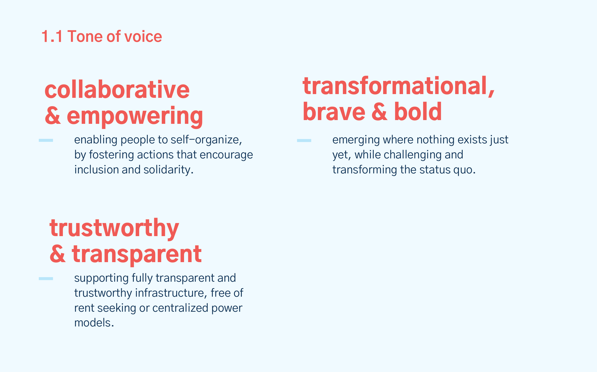
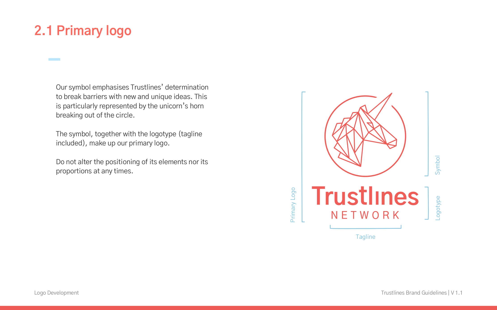
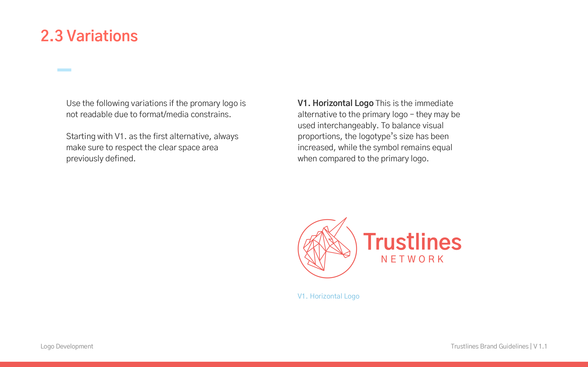
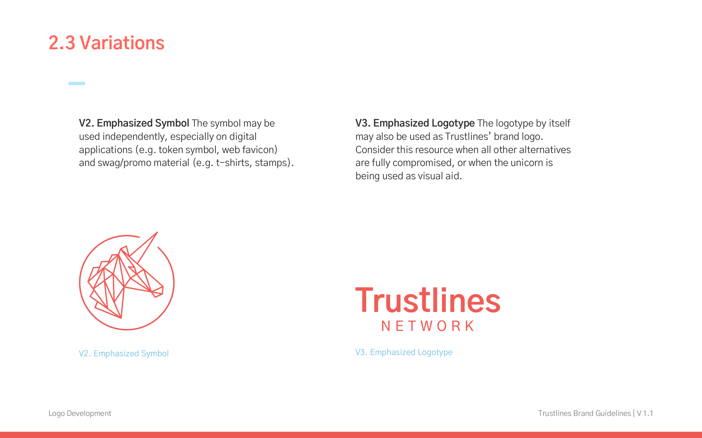
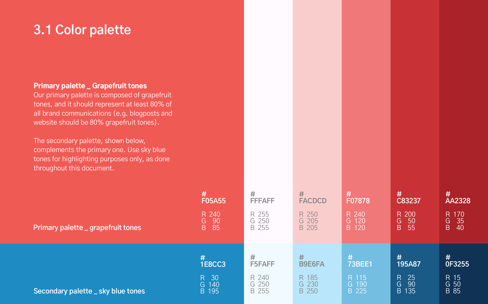
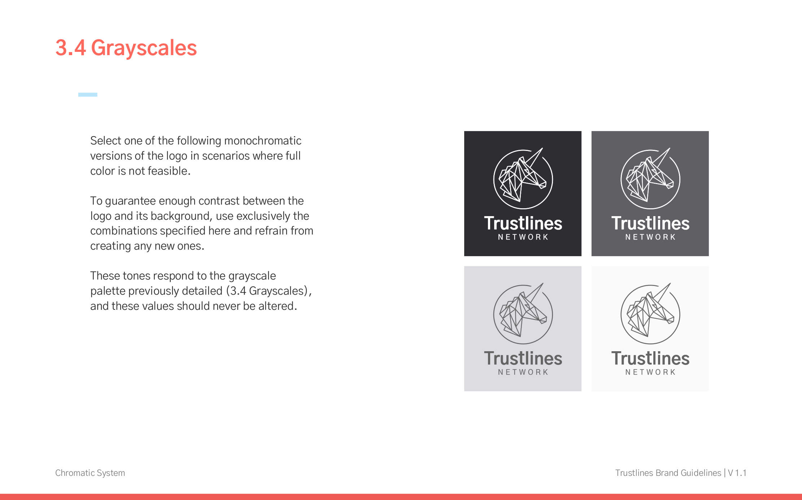
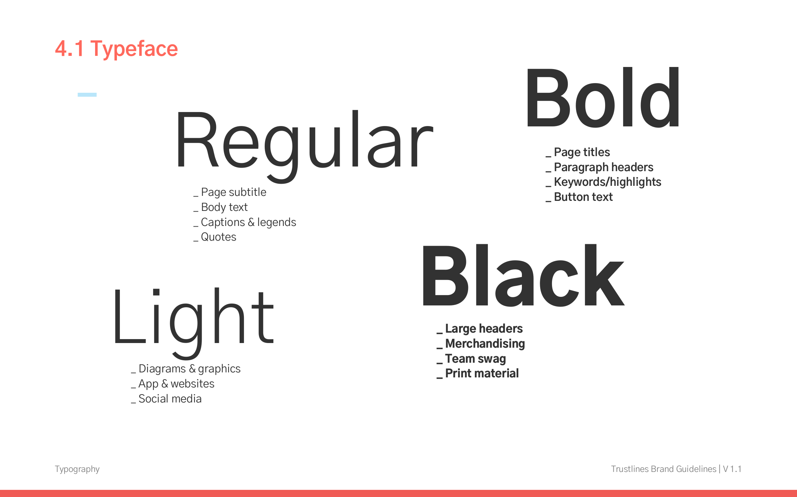
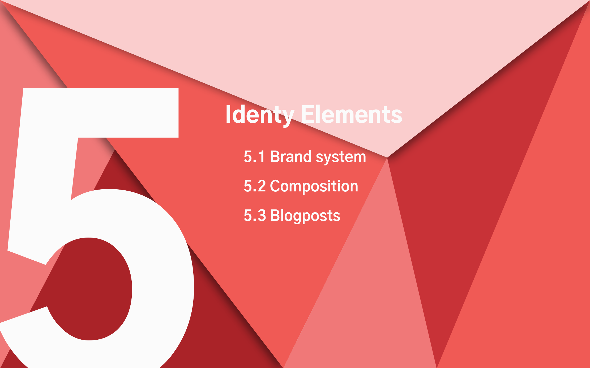
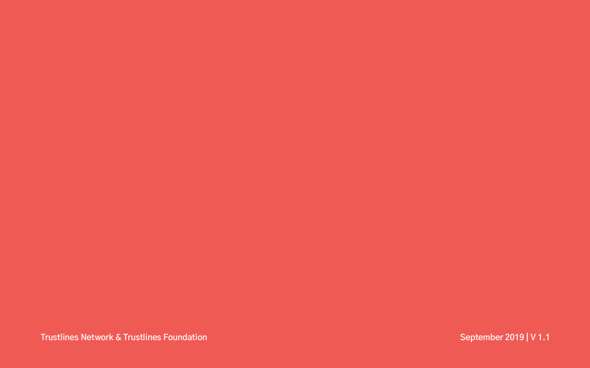

_Last updated: September 2019_

_Download as PDF: <a href="../assets/pdf/TL-Brand-Guidelines-V1.1.pdf" target="_blank">TL-Brand-Guidelines-V1.1.pdf</a>_

### Table of Contents

#### 1. [Brand Persona](#1-brand-persona-1)

  - 1.1 [Tone of voice](#11-tone-of-voice)

#### 2. [Logo Development](#2-logo-development-1)

  - 2.1 [Primary logo](#21-primary-logo)
  - 2.2 [Clear space](#22-clear-space)
  - 2.3 [Variations](#23-variations)
  - 2.4 [Minimal sizes](#24-minimal-sizes)

#### 3. [Chromatic System](#3-chromatic-system-1)

  - 3.1 [Color palette](#31-color-palette)
  - 3.2 [Gradients](#32-gradients)
  - 3.3 [Gradient & logo](#33-gradient--logo)
  - 3.4 [Grayscales](#34-grayscales)

#### 4. [Typography](#4-typography-1)

  - 4.1 [Typeface](#41-typeface)

#### 5. [Identity Elements](#5-identity-elements-1)

  - 5.1 [Brand system](#51-brand-system)
  - 5.2 [Composition](#52-composition)

#### 6. [Trustlines Foundation](#6-trustlines-foundation-1)

  - 6.1 [Logo adaptations](#61-logo-adaptations)
  - 6.2 [Color swap](#62-color-swap)
  - 6.3 [Gradients](#63-gradients)
  - 6.4 [Gradient & logo](#64-gradient--logo)

___

## 1. Brand Persona

#### 1.1 Tone of voice

## 2. Logo Development

#### 2.1 Primary logo

#### 2.2 Clear space

#### 2.3 Variations

#### 2.4 Minimal sizes

## 3. Chromatic System

#### 3.1 Color palette

#### 3.2 Gradients

#### 3.3 Gradient & logo

#### 3.4 Grayscales

## 4. Typography

#### 4.1 Typeface

## 5. Identity Elements

#### 5.1 Brand system

#### 5.2 Composition

## 6. Trustlines Foundation

#### 6.1 Logo adaptations

#### 6.2 Color swap

#### 6.3 Gradients

#### 6.4 Gradient & logo

