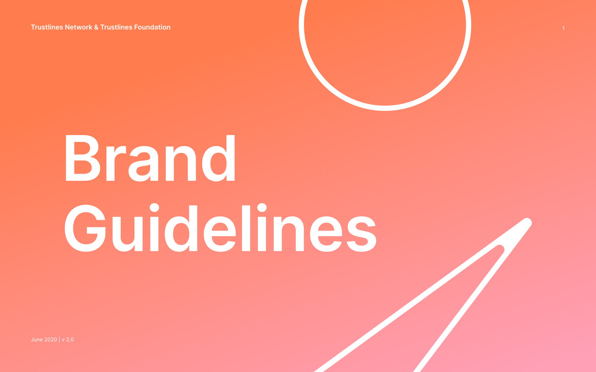
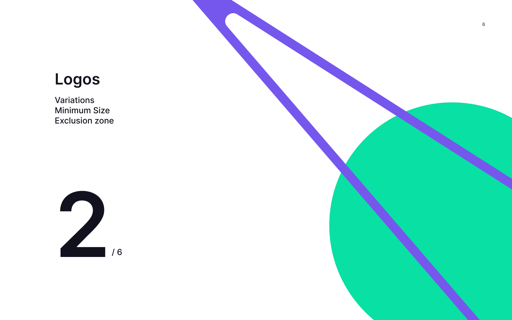
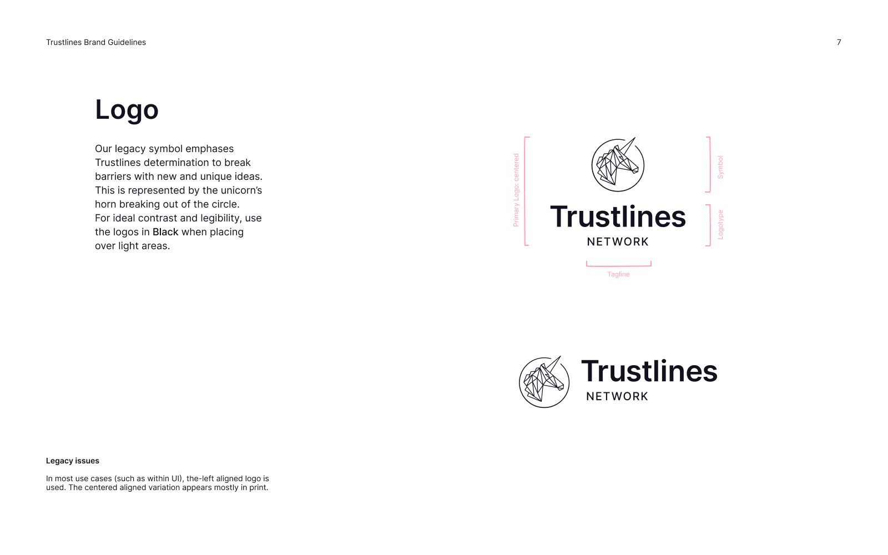
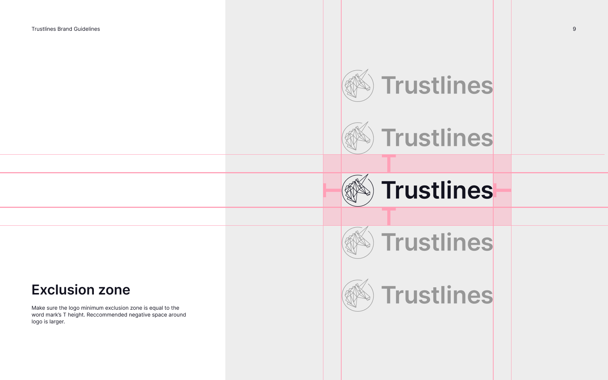
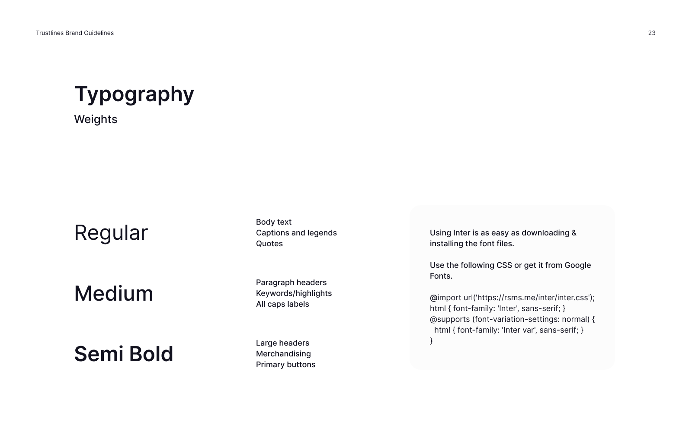
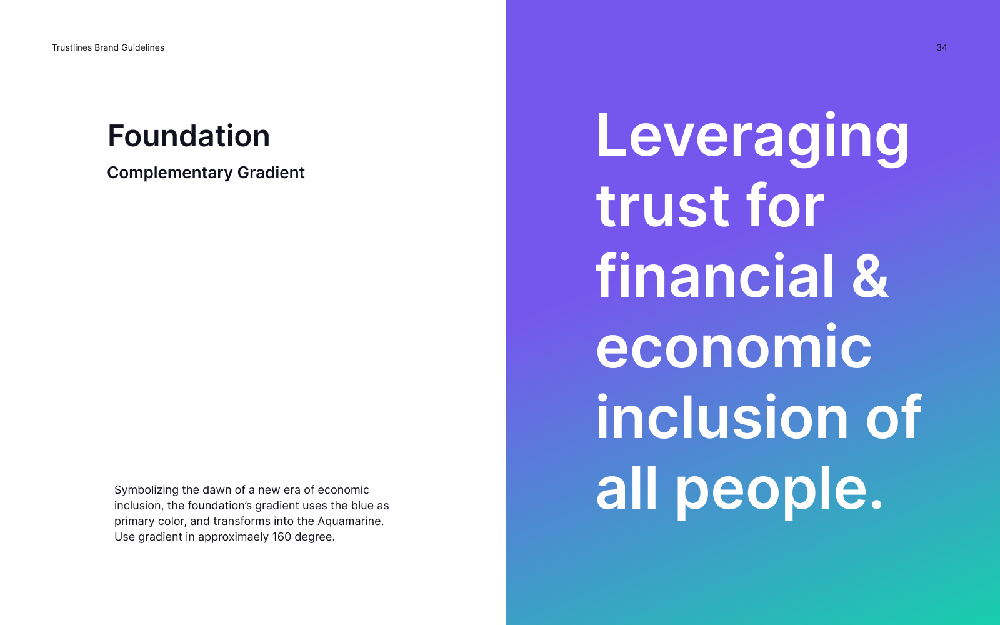
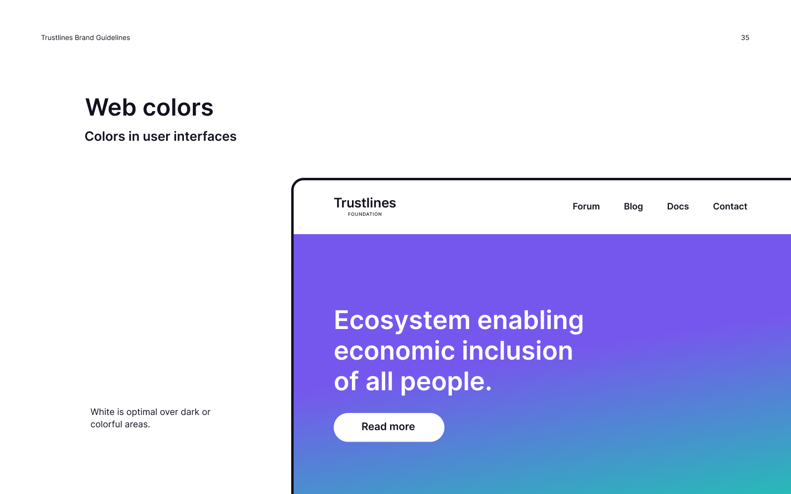
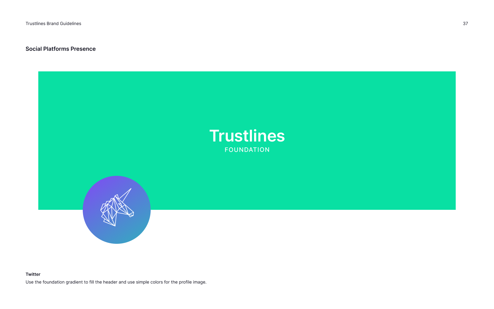
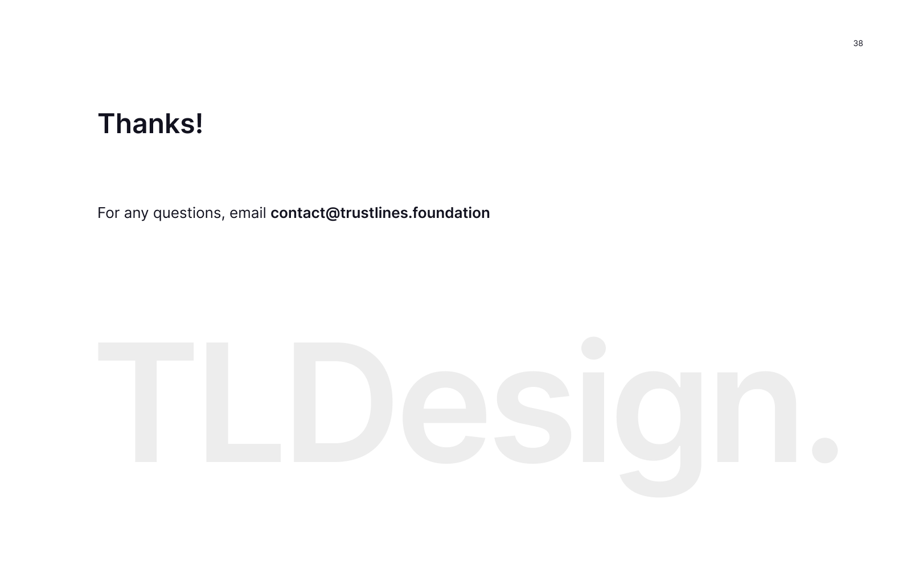

_Last updated: November 2020_

_Download PDF: <a href="../../assets/pdf/TL-Brand-Guidelines-V2.pdf" target="_blank">TL-Brand-Guidelines-V2.pdf</a>_

### Table of Contents

#### 1. [Brand Tonality](#1-brand-tonality-1)

#### 2. [Logos](#2-logo-1)

  - 2.1 [Variations and Minimum Size](#21-variations-and-minimum-size)
  - 2.2 [Exclusion zone](#22-exclusion-zone)

#### 3. [Color System](#3-color-system-1)

  - 3.1 [Primary Colors](#31-primary-colors)
  - 3.2 [Secondary Colors](#32-secondary-colors)
  - 3.3 [Specifications](#33-specifications)
  - 3.4 [Complementary Gradient](#34-complementary-gradient)
  - 3.5 [Colors in UI](#35-colors-in-ui)
  - 3.6 [Colors in Dark UI](#36-colors-in-dark-ui)
  - 3.7 [Print Colors](#37-print-colors)

#### 4. [Typography](#4-typography-1)

  - 4.1 [Typeface](#41-typeface)
  - 4.2 [Weights](#42-weights)
  - 4.3 [Style Guides for UI](#43-style-guides-for-UI)

#### 5. [Identity Elements](#5-identity-elements-1)

  - 5.1 [Identity Elements](#51-identity-elements)
  - 5.2 [Icons](#52-icons)

#### 6. [Trustlines Foundation](#6-trustlines-foundation-1)

  - 6.1 [Logo adaptation](#61-logo-adaptation)
  - 6.2 [Brand Tonality](#62-brand-tonality)
  - 6.3 [Primary Colors](#63-primary-colors)
  - 6.4 [Complementary Gradient](#64-complementary-gradient)
  - 6.5 [Colors in UI](#65-colors-in-ui)
  - 6.6 [Blog Post images](#66-blog-post-images)
  - 6.7 [Social Platforms Presence](#67-social-platforms-presence)

___

## 1. Brand Tonality

## 2. Logos

#### 2.1 Variations and Minimum Size

#### 2.2 Exclusion zone

## 3. Color System

#### 3.1 Primary Colors

#### 3.2 Secondary Colors

#### 3.3 Specifications

#### 3.4 Complementary Gradient

#### 3.5 Colors in UI

#### 3.6 Colors in Dark UI

#### 3.7 Print Colors

## 4. Typography

#### 4.1 Typeface

#### 4.2 Weights

#### 4.3 Style Guides for UI

## 5. Identity Elements

#### 5.1 Identity Elements

#### 5.2 Icons

## 6. Trustlines Foundation

#### 6.1 Logo Adaptation

#### 6.2 Brand Tonality

#### 6.3 Primary Colors

#### 6.4 Complementary Gradient

#### 6.5 Colors in UI

#### 6.6 Blog Post Images

#### 6.7 Social Platforms Presence

___

<a href="../use_cases/time_credits/time_credits_on_trustlines" class="prev_next_text">Previous</a>

 

<a href="../use_cases/time_credits/time_credits_on_trustlines" class="prev_next_text">Time Credits on Trustlines</a>

<a href="brand_resources" class="prev_next_text">Next</a>

 

<a href="brand_resources" class="prev_next_text">Brand Resources</a>

