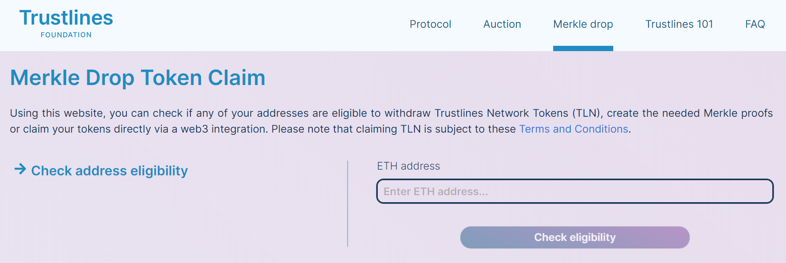
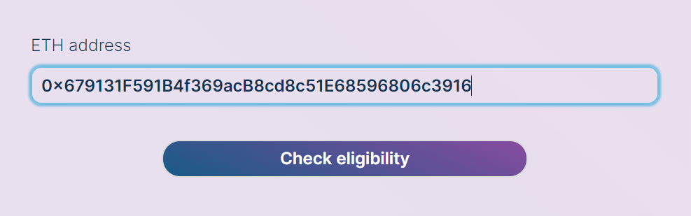
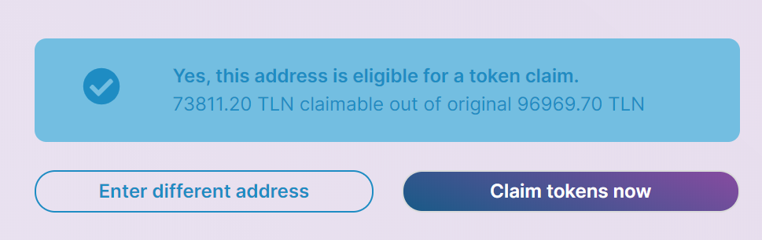
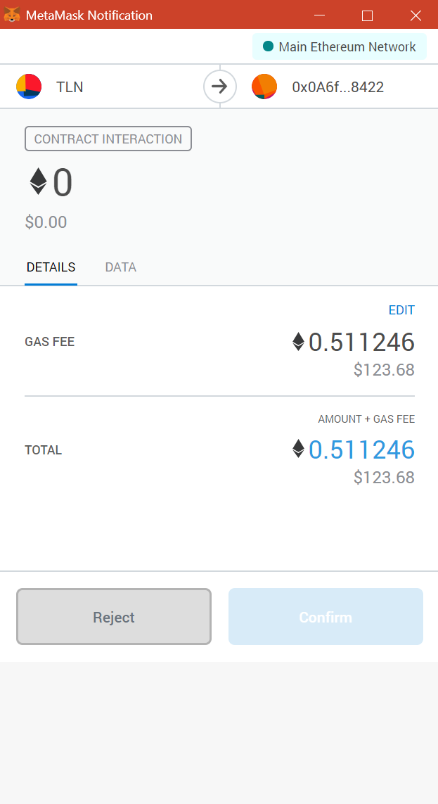

The goal for the [Trustlines Foundation](https://trustlines.foundation/index.html) is to make Trustlines Network Coins widely accessible. TLC is the native token of [Trustlines Blockchain](https://blog.trustlines.network/introducing-the-trustlines-blockchain) that TLN can be converted to. A wide distribution of the token should help in creating use cases that align with the mission of financial inclusion. Merkle drop was the [chosen tool](https://medium.com/@DJohnstonEC/the-smartdrop-model-859888916d94) to make this happen. For the accessibility of Trustlines Network Tokens, the Foundation emphasized eligibility in groups that it sees as aligned with [its mission](https://blog.trustlines.network/trustlines-foundation-announcement).

### These are the groups of eligible addresses that can now claim their TLN tokens

!!! info "Eligible groups"
    -   Early contributors to the [Trustlines Network](https://trustlines.network/) ecosystem. This includes, for example, testers and [testnet](https://explore.laika.trustlines.foundation/) validators, as well as those who whitelisted their address to become validators, but did not secure a slot in the auction
    -   People who were interested in participating in the drop via [our community channels](https://twitter.com/TrustlinesFound/status/1201901024576987137)
    -   [ETHBerlin2](https://ethberlinzwei.com/) hackers
    -   Addresses included in the Genesis block of [Ethereum](https://ethereum.org/) (with at least one transfer executed)
    -   [Maker (MKR)](https://makerdao.com/), [Bancor (BNT)](https://www.bancor.network/) and [DAI token holders](https://makerdao.com/)
    -   [dxDAO](https://blog.gnosis.pm/the-dxdao-has-awoken-78cb2e39661c) Rep holders and HumanityDAO human participants
    -   [POAP](https://www.poap.xyz/), Proof-of-Attendance NFT holders
    -   Collection of ETH addresses, that underwent some form of identity verification in the past

Once an address has claimed their TLN tokens *(Note: claiming TLN is subject to the *[**Terms and Conditions of the Merkle drop**](https://trustlines.foundation/terms-conditions-merkle-drop.html)*)*, they are free to do whatever they want with them. The primary use case envisioned for the TLN tokens would be to use the bridge between Ethereum and [Trustlines Blockchain](https://explore.tlbc.trustlines.foundation/) to convert the tokens into Trustlines Network Coins. TLC is the native token of Trustlines Blockchain and is used to pay fees on the chain. These fees are similar in [functions as ETH on Ethereum](https://blockgeeks.com/guides/ethereum-gas/#What_is_Ethereum_Gas). For example, they are used for transaction fees and smart contract deployment. The distributed TLN tokens will be freely transferable. Meaning they can be moved, or, for example, traded for other assets as well.

**You can read more in the [Merkle Drop Launch](https://blog.trustlines.network/merkle-drop-launch/) blog post.**

## Claiming TLN using the website and MetaMask

The easiest way to claim TLN from the Merkle Drop is to use the Merkle Drop website with [MetaMask](https://metamask.io/).

### Go to the Merkle Drop website

!!! quote ""
    Head on over to [https://trustlines.foundation/merkle-drop](https://trustlines.foundation/merkle-drop) to get started.

    

### Check eligibility

!!! quote ""
    Enter your Ethereum address in the box and click on `Check eligibility` to confirm that your address is eligible to claim TLN from the Merkle Drop.

    

### Claiming the tokens

!!! quote ""
    After entering an eligible address, you can claim your tokens.

    !!! note
        The page will show "X TLN claimable out of original Y TLN" because the amount is decaying over time. The sooner you claim, the more you get.

    

You will need to **Accept** the [Terms and Conditions](https://trustlines.foundation/terms-conditions-merkle-drop.html) of the Merkle Drop in order to move forward in claiming your tokens.

!!! quote ""
    A MetaMask notification will pop up where you need to confirm the transaction for claiming the tokens.

    

After the transaction has been confirmed, you will soon receive the TLN in your wallet.
