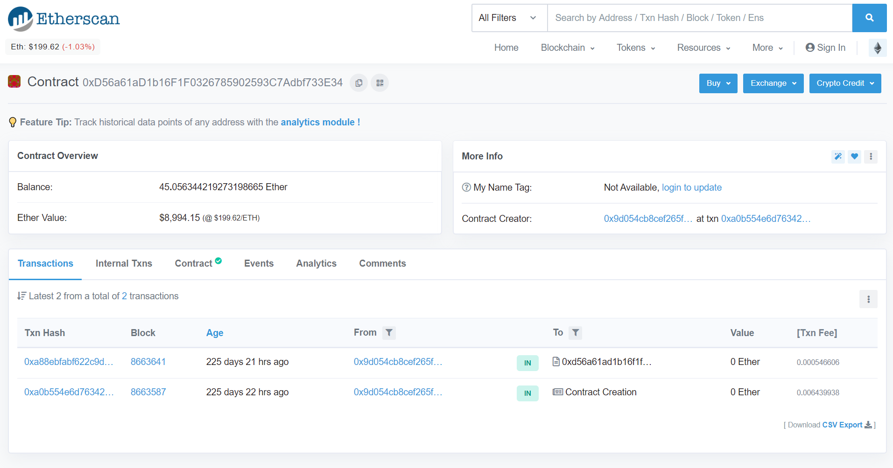
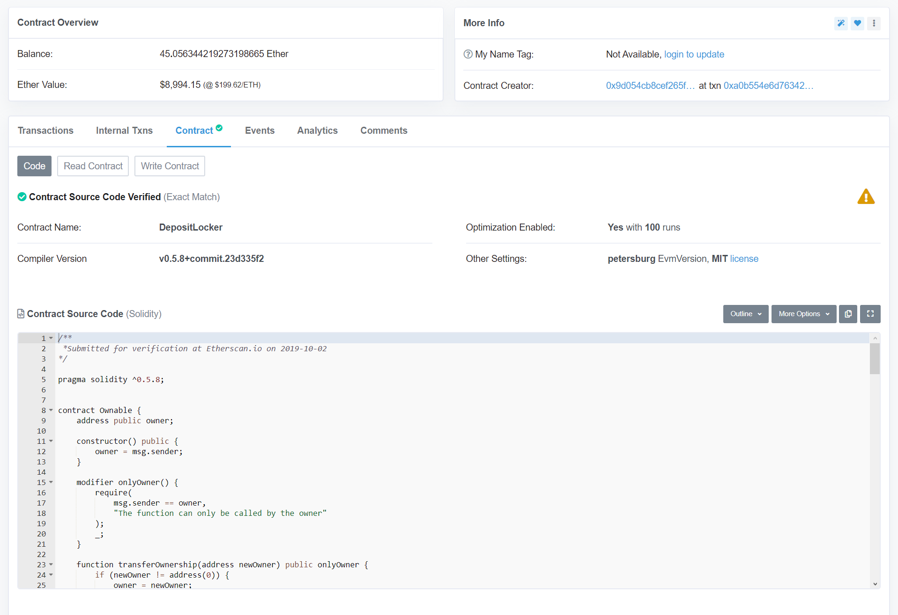
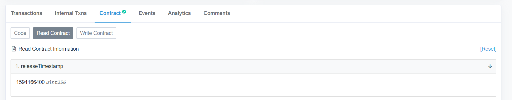
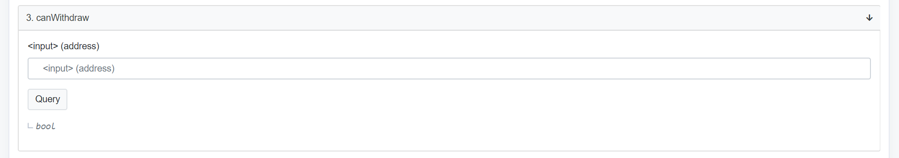
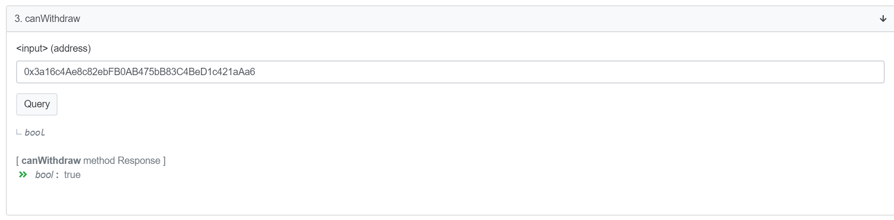
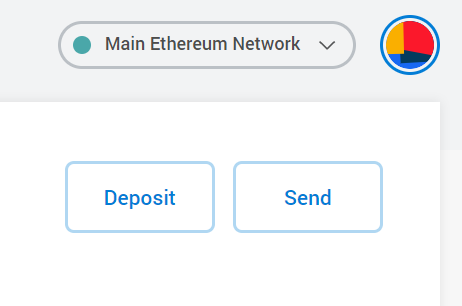
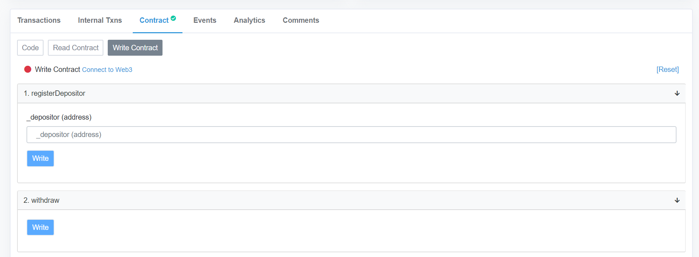
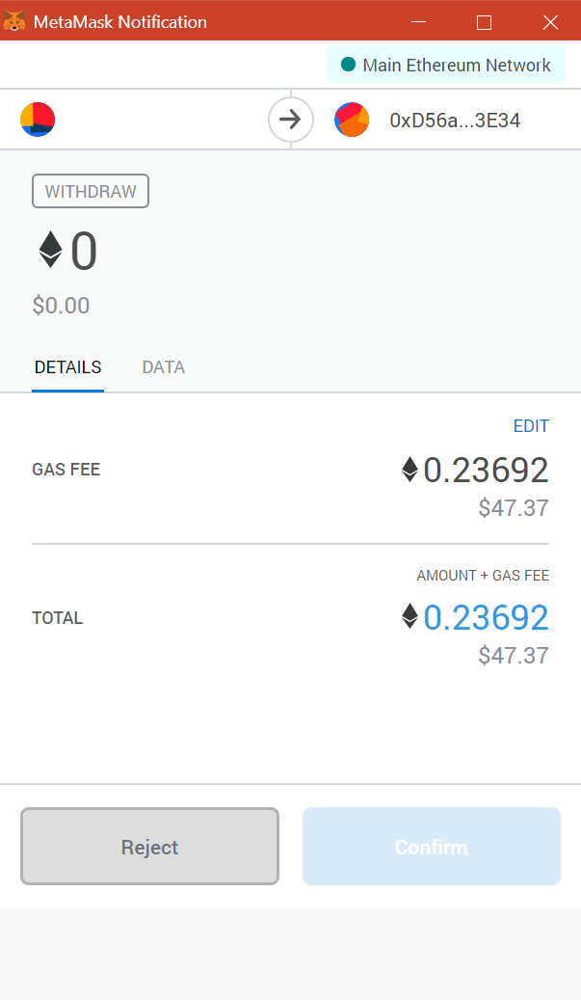

Validators are able to withdraw their deposits after the locking period ends.

## Checking that the locking period has ended
To withdraw your deposit from the contract, you will need to interact with the `DepositLocker` contract. The contract address on Ethereum is [0xd56a61ad1b16f1f0326785902593c7adbf733e34](https://etherscan.io/address/0xd56a61ad1b16f1f0326785902593c7adbf733e34).

Make sure the deposits are unlocked by checking that the `releaseTimestamp` has passed. To do this on the contract page, click on `contract`.

Continue to click on `read contract`.

You can find out the current **Unix timestamp** using a search engine of your choice.

## Verifying that your address can withdraw from the contract
You will need to use the same address to withdraw that you used to bid.
To verify your address, you can use the third field, `canWithdraw`.

Enter your address in the field and click `Query`. You will see `bool: true` if you are able to withdraw, or `bool: false` if not.

### Withdrawing using MetaMask
Once you have verified that you’re entitled to withdraw, log-in to your MetaMask account. You should make sure you have the `Main Ethereum Network` network selected.

Click on Write Contract, then, `Connect to Web3`. This will allow Etherscan to connect to MetaMask.

For the actual withdrawal, click on `Write` under `2. withdraw`. MetaMask will then ask you to sign a transaction. The transaction should require less than 30k gas.

Once this transaction is confirmed, you should receive your deposit back.

___

<a href="../guides/tl_app_user_guide" class="prev_next_text">Previous</a>

 

<a href="../guides/tl_app_user_guide" class="prev_next_text">User guide for Trustlines App</a>

<a href="how_to_claim_tln" class="prev_next_text">Next</a>

 

<a href="how_to_claim_tln" class="prev_next_text">How to claim TLN</a>

