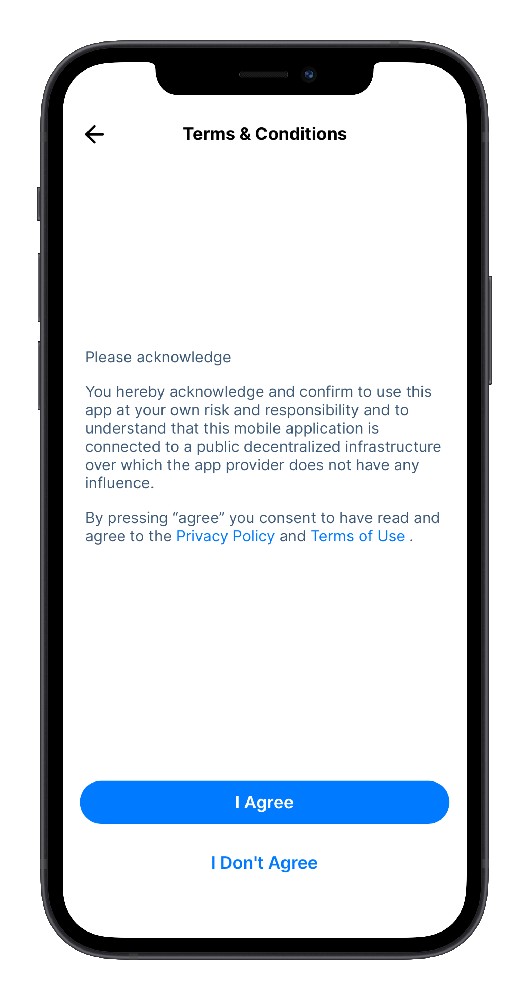
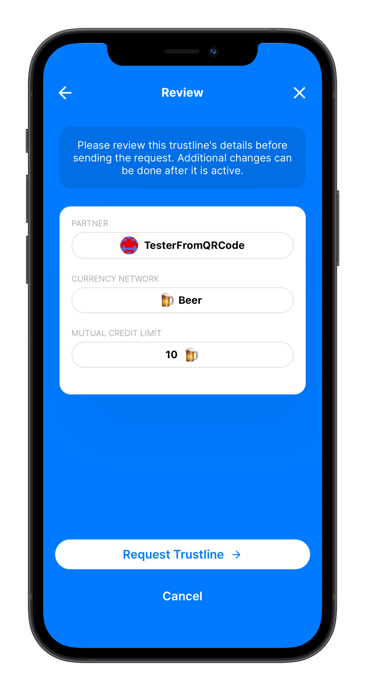
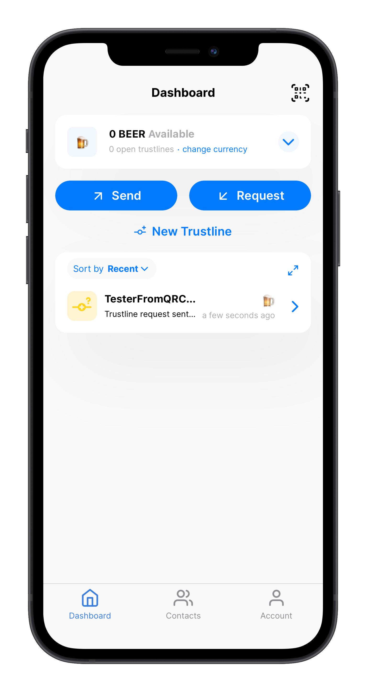
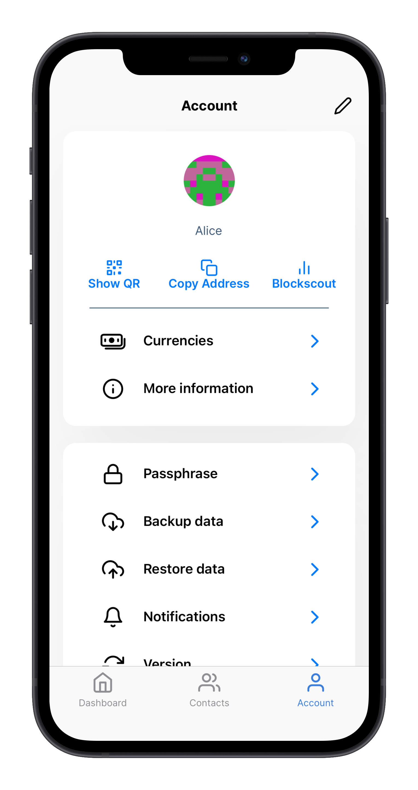
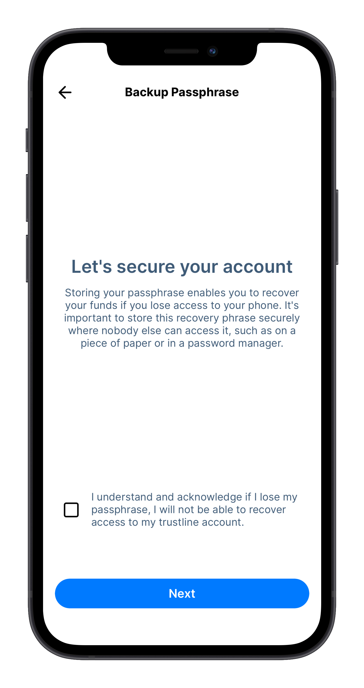
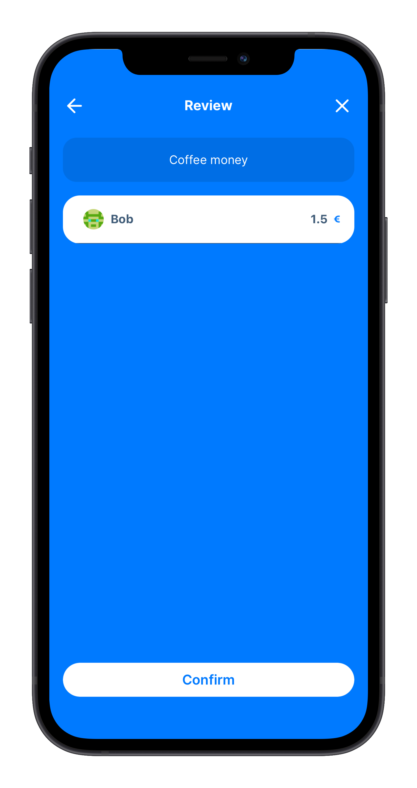
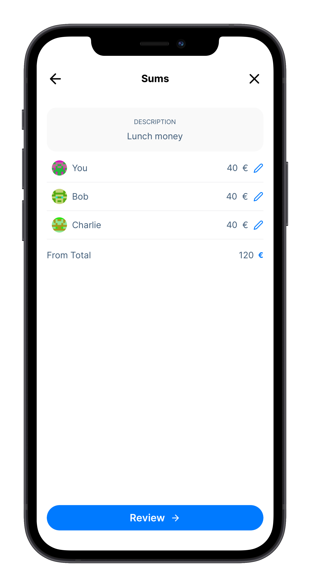

[:gb:](tl_app_user_guide.md)

!!! note "Nota"
    Las imágenes de esta guía son para fines educativos y es posible que no muestren los últimos cambios en la aplicación.

<center><a href="https://trustlines.app/" target="_blank"></a>

<p class="app_guide_dl">You can get the Trustlines App for Android and iOS from <a href="https://trustlines.app/" target="_blank">https://trustlines.app</a></p></center>

!!! note "Nota para los usuarios de iOS que actualizan desde una versión anterior"

    Si tienes la versión beta de la aplicación Trustlines instalada en un dispositivo iOS con TestFlight, tendrás que desinstalar la versión beta antes de instalar la versión en producción. En primer lugar, debes realizar una copia de seguridad de tu frase semilla, desinstalar la versión beta, e instalar la versión en producción. También debes hacer una copia de seguridad de los datos y el contenido de tu cuenta antes de desinstalar la versión beta.

## Introducción

Para que los mercados funcionen correctamente, las personas necesitan acceso a un medio de intercambio confiable. Históricamente, debido a la forma en que funciona el sistema bancario, esta ha sido una meta difícil de alcanzar. Aún en tiempos de abundancia, la falta de acceso a herramientas financieras sencillas puede causar problemas en la disponibilidad de un medio de cambio (ej. pensemos en las dificultades asociadas a no estar en el sistema bancario). El problema se hace especialmente urgente ante las recesiones económicas (lo cual causa escasez de dinero). Por esto necesitamos una nueva forma de dinero que pueda proveer un medio de intercambio al que cualquiera pueda acceder: “Dinero impulsado por personas.”

## Crédito mutuo

La aplicación Trustlines es tu llave para utilizar una forma de dinero basado en la idea de crédito mutuo. El crédito mutuo es una forma orgánica y accesible que sencillamente consiste en créditos y débitos entre dos partes iguales que poseen confianza mutua. Dos personas  pueden elegir hacer transacciones entre sí usando el principio de crédito mutuo al crear una línea de crédito informal bilateral entre sí, a la cual se refiere como una “trustline.”

Si se formalizan estos acuerdos informales naturales en una base de datos digital de amigos de confianza, se adquiere la posibilidad de “saltar” transacciones entre una red conectada de amigos-de-amigos. Esta es la parte brillante de utilizar Trustlines: convierte las relaciones de confianza en una red de pagos que se ve y actúa como dinero “de verdad.”

## Empezando con la app de Trustlines

Es posible que hayas recibido un enlace de invitación para comenzar con la aplicación de Trustlines, o tal vez acabas de descargar la aplicación y quieres comenzar a usarla. Estos dos procesos difieren un poco y tenemos una guía para cada enfoque.

Selecciona la opción correcta para ti; [empezando con un enlace de invitación](#starting-via-an-invite-link) o [empezar desde la app](#starting-with-a-sign-up-in-the-app).

!!! note "Nota para los usuarios de iOS que actualizan desde una versión anterior"

    Si tienes la versión beta de la aplicación Trustlines instalada en un dispositivo iOS con TestFlight, tendrás que desinstalar la versión beta antes de instalar la versión en producción. En primer lugar, debes realizar una copia de seguridad de tu frase semilla, desinstalar la versión beta, e instalar la versión en producción. También debes hacer una copia de seguridad de los datos y el contenido de tu cuenta antes de desinstalar la versión beta.

### Empezando con un enlace de invitación

Es posible que hayas recibido una invitación de alguien a tráves de un link para usar Trustlines App. Este link te permitirá configurar tu cuenta y ¡crear tu primera Trustline!

<center><a href="../../../assets/images/app_user_guide/v1.11/trustline_invitation.png"></a><a href="../../../assets/images/app_user_guide/v1.11/sign_up_login.png"></a></center>

1-.Lo primero que debes hacer al registrarte para obtener una nueva cuenta es aceptar los Términos y Condiciones. Al aceptar los Términos y Condiciones, la aplicación generará automáticamente una nueva cuenta para ti.

<center><a href="../../../assets/images/app_user_guide/v1.11/terms_and_conditions.png"></a><a href="../../../assets/images/app_user_guide/v1.11/generating_account.png"></a></center>

2.- Una vez completada la creación de la cuenta, puedes elegir el nombre que quieres enseñar. Elige el nombre que deseas usar en la aplicación y estarás listo para crear tu primera trustline.

<center><a href="../../../assets/images/app_user_guide/v1.11/choose_name.png"></a><a href="../../../assets/images/app_user_guide/v1.11/your_first_trustline.png"></a></center>

3.- Cómo creaste la cuenta a través de un enlace de invitación, ya hay una solicitud de trustline lista para que la revises. Te mostrará el nombre de la otra persona, qué red de divisas está sugiriendo para la trustline, así como los límites de crédito sugeridos. Una solicitud de trustline de un nuevo enlace de invitación es ligeramente diferente de otras y se activará solo después de que se envíe de vuelta a su nuevo compañero para su aprobación final.

<center><a href="../../../assets/images/app_user_guide/v1.11/your_first_trustline_review.png"></a><a href="../../../assets/images/app_user_guide/v1.11/your_first_trustline_pending.png"></a></center>

Eso es todo. ¡Ya estás listo para comenzar a usar Trustlines!

### Comenzando desde la app

Comenzar con un registro en la aplicación es bastante similar a comenzar a través de un enlace de invitación. Hay un par de pasos menos que realizar antes de acceder al Panel de control, pero la aplicación no será muy útil hasta que crees una trustline con alguien.

_Si ya pasaste por los pasos de inicio a través de un enlace de invitación, puedes omitir esta sección e ir directamente a la sección sobre cómo asegurar la cuenta._

___

1.- Lo primero que debes hacer al registrarte para obtener una nueva cuenta es aceptar los Términos y Condiciones

<center><a href="../../../assets/images/app_user_guide/v1.11/sign_up_login.png"></a><a href="../../../assets/images/app_user_guide/v1.11/terms_and_conditions.png"></a></center>

2.- Al aceptar los Términos y Condiciones, la aplicación generará automáticamente una nueva cuenta. Una vez creada la cuenta, puedes elegir tu nombre dentro de  la app.

<center><a href="../../../assets/images/app_user_guide/v1.11/generating_account.png"></a><a href="../../../assets/images/app_user_guide/v1.11/choose_name.png"></a></center>

3.- Después de elegir un nombre que desees usar en la aplicación, ¡estás listo para crear tu primera trustline! Puedes  añadir a tu compañero escaneando su código QR o ingresando su dirección. ¡Asegúrate de ponerles un nombre para que puedas ver fácilmente con quién estás interactuando!

También puedes omitir este paso y crear una nueva trustline más adelante, ¡pero la aplicación no es útil sin al menos una!

<center><a href="../../../assets/images/app_user_guide/v1.11/your_first_trustline.png"><a href="../../../assets/images/app_user_guide/v1.11/trustline_partner.png"></a></a></center>

4.- Tras agregar a tu compañero, deberás escoger una red de divisas para esta trustline. En la siguiente pantalla deberás escoger el límite de crédito de la trustline.

<center><a href="../../../assets/images/app_user_guide/v1.11/choose_currency_network_simple.png"></a><a href="../../../assets/images/app_user_guide/v1.11/set_credit_limit_simple.png"></a></center>

5.- Revisa y aprueba los detalles de la trustline que deseas crear antes de enviarla, y listo, ¡estás listo para usar la aplicación de Trustlines!

<center><a href="../../../assets/images/app_user_guide/v1.11/trustline_review_sign_up.png"></a><a href="../../../assets/images/app_user_guide/v1.11/trustline_pending.png"></a></center>

<center><a href="../../../assets/images/app_user_guide/v1.11/dashboard_trustline_pending.png"></a></center>

## Asegurando el acceso a tu cuenta de Trustlines

!!! warning ""
    Este es un proceso muy importante que debe hacer cada usuario de la plataforma.

!!! note "Nota"
    Esto no es lo mismo que hacer una copia de seguridad de tu cuenta.  Esto asegurará el acceso a tu cuenta, pero también deberías asegurarte de que los datos de tu cuenta estén asegurados.

Copiar tu frase de seguridad garantizará que podrás entrar a tu cuenta en caso de que  no tengas acceso a tu dispositivo. Sin la frase de seguridad, no podrás acceder a tu cuenta en otro dispositivo.

1.- Para iniciar, ve a la pestaña Cuenta en la barra de menú. Allí, selecciona Frase de Seguridad para iniciar el proceso de resguardo.

<center><a href="../../../assets/images/app_user_guide/v1.11/account_view.png"></a><a href="../../../assets/images/app_user_guide/v1.11/backup_passphrase.png"></a></center>

2.- El siguiente paso te mostrará la frase de seguridad personal asociada con tu cuenta. Esta frase de seguridad tiene 12 palabras. Debes copiarlas en un lugar seguro, como un administrador de contraseñas. Después de copiar tu frase, deberás verificar que la hayas guardado correctamente.

La aplicación te pedirá que ingreses la frase de seguridad de 12 palabras en el orden correcto, asegurándose así de que la hayas copiado correctamente y permitiéndote acceder a tu cuenta en el futuro si es necesario.

<center><a href="../../../assets/images/app_user_guide/v1.11/copy_passphrase.png"></a><a href="../../../assets/images/app_user_guide/v1.11/verify_passphrase.png"></a></center>

Estos son todos los pasos necesarios para asegurar el acceso a tu cuenta. Como recordatorio, **guardar tu frase de seguridad como captura de pantalla, en tu email o un servicio en la nube no es una forma segura de almacenarla**.

## Respaldar y restaurar los datos de tu cuenta

Todos los datos personales de tu cuenta se almacenan sólo en tu dispositivo. Si bien Trustlines Blockchain almacena información sobre tus saldos y transferencias, la información personal como los nombres de tus contactos y las solicitudes de pago solo se almacenan en tu dispositivo. Por eso es importante hacer una copia de seguridad de los datos de tu cuenta. Recomendamos hacer una copia de seguridad periódica de estos datos en caso de que tu teléfono sea robado, se dañe o se pierda.

El respaldo de los datos se hace en formato JSON, que podrás fácilmente guardar en el texto que prefieras. Para un usuario regular sin conocimiento del formato, esto se hace fácilmente, y puede hacerse tan solo copiando y pegando la información para guardarla.

He aquí un ejemplo de cómo se vería la información de tu cuenta.

```json
{
  "contacts": [{
    "address": "0xdbF44585FD4C8fc748fB5b6f99d24f8540E0ebEc",
    "username": "Alice"
  }, {
    "address": "0x062E470d519d5feCC78a501644B402d00BBbF393",
    "username": "Dan"
  }],
  "activeCurrencies": [{
    "address": "0x57c4a2cCF2CC99f3dF7855465d1528C110Ff4F14"
  }, {
    "address": "0x7Ac3fC1C428df99D81d9b644106FF67c44A155aA"
  }],
  "messages": [{
    "id": "0x88DD2B76c8eAa369f38764EF71cEcF74F168a6f85262b8Aa66Ba22",
    "direction": "sent",
    "networkAddress": "0x7aF939CC78E5805d232752571cab0723613bD327",
    "timestamp": 1606128428,
    "type": "PaymentRequest",
    "counterpartyAddress": "0x21fa801a76196cEb92417c436eEf0a15EB57C649",
    "accountAddress": "0xB25bAb13E693CE19405A73F3c4A868aB32E46979",
    "paymentRequestID": "0xC7edf264F6218c9A",
    "amount": "10",
    "subject": "Lunch"
  }],
  "bills": []
}
```

### Hacer un respaldo de tu cuenta

Dirígete a la pestaña Cuentas en la barra de menú. Allí encontrarás la opción Copia de seguridad de datos. Presiona Crear Copia de Seguridad, aparecerá una selección de cómo deseas guardar los datos. Los datos se guardarán en un archivo con formato de texto (archivo .txt), que contiene los datos en lenguaje JSON, el cual podrás copiar y guardar en cualquier lugar, o seleccionar directamente una opción para guardarlo en tu dispositivo.

<center><a href="../../../assets/images/app_user_guide/v1.11/account_view.png"></a><a href="../../../assets/images/app_user_guide/v1.11/backup_data.png"></a></center>

### Restaurar una copia de Seguridad

Dirígete a la pestaña Cuentas en la barra de menú. Allí encontrarás la opción Restaurar datos. Esto te permitirá pegar los datos para restaurar tus datos. Como se mencionó anteriormente, los datos estarán en un archivo de texto (archivo .txt), que puedes copiar y pegar desde donde los guardaste al realizar tu copia de seguridad.

<center><a href="../../../assets/images/app_user_guide/v1.11/account_view.png"></a><a href="../../../assets/images/app_user_guide/v1.11/restore_data.png"></a></center>

## Creando una trustline

¡La aplicación no es útil sin al menos una trustline! Si no tienes una, lo primero que hay que hacer al descargar la aplicación es crear una trustline con un compañero de confianza.

Para crear una trustline, primero, un compañero debe hacer una propuesta y luego el otro debe aceptarla.

Cada trustline consta de dos líneas de crédito. De forma predeterminada, te sugerimos que establezcas ambos límites en el mismo valor. Como cualquier otro acuerdo, es mejor discutir esto en conjunto mientras crean la trustline. Seleccionar el modo avanzado permitirá establecer dos valores; a la izquierda es la cantidad que prestarías a tu compañero y a la derecha es la cantidad que puedes pedir prestada a tu compañero. Lo que puedes "Pedir prestado" se considera tu "límite de gasto" con este compañero. Estas dos cantidades se pueden establecer según lo que tu compañero y tú acuerden. Algunas redes de divisas también tienen la opción de agregar intereses a cualquiera de estas líneas de crédito.

Desde el Panel de control en la vista principal puedes iniciar el proceso tocando “Nueva trustline”.

1.- El primer paso es seleccionar qué red de divisas y, por lo tanto, la denominación que deseas utilizar para esta trustline específica.

<center><a href="../../../assets/images/app_user_guide/v1.11/dashboard.png"></a><a href="../../../assets/images/app_user_guide/v1.11/choose_currency_network_simple.png"></a></center>

2.- Luego, debes establecer un límite de crédito para la trustline. Es mejor acordar esto en conjunto mientras crean la trustline. El modo avanzado ofrece más opciones si deseas establecer diferentes límites de crédito para ti y tu compañero, cómo agregar un interés personalizado para la trustline.

<center><a href="../../../assets/images/app_user_guide/v1.11/set_credit_limit_simple.png"></a><a href="../../../assets/images/app_user_guide/v1.11/set_credit_limit_advanced.png"></a></center>

3.- Después de seleccionar el límite de crédito para la trustline, revisa bien la solicitud antes de seleccionar a tu compañero.

En este punto, puedes elegir compartir un enlace para enviarlo a un destinatario, es decir, usando una aplicación de mensajería, correo electrónico, etc., compartir tu código QR para escanear, o puedes seleccionar a un compañero de la lista de contactos existentes, pegar la dirección de cuenta de tu compañero o escanear el código QR.

<center><a href="../../../assets/images/app_user_guide/v1.11/review_trustline_cn.png"></a><a href="../../../assets/images/app_user_guide/v1.11/trustline_creation_choose_partner.png"></a></center>

Al seleccionar la opción Compartir al elegir un compañero podrás compartir tu propio código QR o, de seleccionar Compartir nuevamente, para enviar un enlace de solicitud trustline a alguien. Ambas opciones contendrán la información que se seleccionó previamente para la solicitud de trustline.

<center><a href="../../../assets/images/app_user_guide/v1.11/share_trustline_qr_code.png"></a></center>

Si has seleccionado otra opción como un contacto existente, revisa los detalles asegurando que todo esté correcto, y ¡envía tu solicitud!

<center><a href="../../../assets/images/app_user_guide/v1.11/trustline_review.png"></a></center>

## Añadiendo  un contacto

Para agregar un contacto, su compañero debe compartir la dirección de su cuenta. Para añadir al contacto haz clic en Contactos en la barra de menú. En la parte superior de la pantalla, hay un botón para agregar nuevos contactos. Haz clic allí.

El compañero que estás agregando debe ir a la pestaña Cuenta en la barra de menú y seleccionar Mostrar QR en la parte superior de la pantalla.

<center><a href="../../../assets/images/app_user_guide/v1.11/contacts.png"></a><a href="../../../assets/images/app_user_guide/v1.11/add_contact.png"></a></center>

Simplemente escanea su código QR dándole al botón Escanear ¡Y listo!

Si no están en el mismo espacio físico, tu compañero también puede convertirse en tu contacto presionando Copiar dirección en Cuenta, enviando su dirección a través de un servicio de mensajería.

¡Asegúrate de ingresar un nombre para tu compañero! Ponle un nombre que puedas reconocer fácilmente.

## Cómo escoger una red de divisas

Podrás habilitar las redes de divisas para crear trutlines con diferentes denominaciones. Elige algo que te interese utilizar como una "unidad de cuenta". Las redes de divisas más populares son USD, EUR, Horas y Cerveza. También puedes usar la moneda local.

Para habilitar diferentes redes de divisas, simplemente selecciona la pestaña Cuenta en el menú inferior y luego selecciona Divisas. Aquí puedes habilitar o deshabilitar diferentes redes de divisas que podrás utilizar.

Las redes de divisas también se pueden habilitar durante el proceso de creación de trustlines sin necesidad de habilitarlas por adelantado.

<center><a href="../../../assets/images/app_user_guide/v1.11/currencies.png"></a></center>

___

## Establecer un Límite de Crédito

Cada trustline consta de dos líneas de crédito. De forma predeterminada, te sugerimos que establezcas ambos límites en el mismo valor. Es mejor discutir esto en conjunto mientras establecen los números. Seleccionar el modo avanzado permitirá establecer dos valores; a la izquierda es la cantidad que prestarías a tu compañero y a la derecha es la cantidad que puedes pedir prestada a tu compañero. Lo que puedes "Pedir prestado" se considera tu "límite de gasto" con este compañero. Estas dos cantidades se pueden establecer según lo que tu compañero y tú acuerden. Algunas redes de divisas también tienen la opción de agregar intereses a cualquiera de estas líneas de crédito.

<center><a href="../../../assets/images/app_user_guide/v1.11/set_credit_limit_simple.png"></a><a href="../../../assets/images/app_user_guide/v1.11/set_credit_limit_advanced.png"></a></center>

## Como ver tu límite de crédito global

Estando en Panel de control, verás un gran número en la parte superior, con la palabra "Disponible" debajo, y los botones "Enviar" y "Recibir". Este número no es tu saldo. En cambio, es tu crédito global disponible, la suma de todo el crédito disponible en cada trustline que hayas abierto dentro de una red de divisas en particular. (Es similar al límite de crédito en una tarjeta de crédito).

<center><a href="../../../assets/images/app_user_guide/v1.11/dashboard.png"></a></center>

Este número disminuirá cada vez que realices un pago mediante la aplicación Trustlines porque el pago agota el crédito disponible.

Sin embargo, aumentará otra vez cuando recibas pagos, por ejemplo, si un amigo te paga con una línea de crédito que haya creado. En otras palabras, si un amigo te pide prestado algo de dinero (y por lo tanto te debe dinero), esta cantidad se registra como crédito adicional, además de tu crédito disponible.

Cuanto mayor sea tu límite de crédito global, mayor será tu capacidad de realizar pagos en la red. Si deseas aumentar tu límite, crea más trustlines con más personas en las que confíes (o pídele a tus amigos que aumenten sus límites de crédito contigo).

## Enviar y Recibir Pagos

### Enviar pagos mediante Trustlines

Crear una trustline con una persona de confianza no sólo te permite realizar transacciones con ella, sino también con todas las personas con las que está conectado tu amigo, y todas las personas con las que están conectados sus amigos, etc. Puedes distribuir pagos en muchas cadenas de amigos, siempre que haya un límite de crédito suficientemente alto (suficiente "capacidad") en cada trustline conectada.

Para enviar un pago a alguien que aún no conoces, puedes escanear su QR con la solicitud de pago o compartir un enlace de solicitud de pago a través de un servicio de mensajería.

Si es alguien con quien planeas volver a realizar transacciones en el futuro, también puedes agregarlo como contacto (consulta Agregar un contacto). Si ya los tienes como contacto, puedes presionar Enviar directamente desde el Panel de control. Asegúrate de seleccionar la red de divisas correcta antes de presionar Enviar.

<center><a href="../../../assets/images/app_user_guide/v1.11/sending_choose_contact.png"></a><a href="../../../assets/images/app_user_guide/v1.11/sending_details.png"></a></center>

<center><a href="../../../assets/images/app_user_guide/v1.11/sending_review.png"></a></center>

### Solicitar pagos mediante Trustlines

Para solicitar un pago a alguien, presiona el botón Solicitud en el Panel de control. Asegúrate de seleccionar la red de divisas correcta antes de presionar Siguiente.

Deberás ingresar la cantidad que estás solicitando, elegir un compañero al que enviar la solicitud y revisar la solicitud antes de confirmar. También puedes dividir fácilmente el pago entre varias personas seleccionando la opción “Dividir Factura” / Split Bill”.

<center><a href="../../../assets/images/app_user_guide/v1.11/payment_request.png"></a><a href="../../../assets/images/app_user_guide/v1.11/split_payment_request_choose_partner.png"></a></center>

Al seleccionar Compartir al elegir un compañero, verás la opción de compartir tu propio código QR o de seleccionar Compartir nuevamente puedes enviar el enlace de solicitud de pago a alguien más. Ambas opciones contendrán la información previamente seleccionada en la solicitud de pago.

<center><a href="../../../assets/images/app_user_guide/v1.11/share_payment_request.png"></a></center>

Si has seleccionado otra opción, como un contacto existente, revisa los detalles, asegurándote de que todo esté correcto, y ¡Envía tu solicitud!

<center><a href="../../../assets/images/app_user_guide/v1.11/payment_request_review.png"></a></center>

### Dividir la cuenta

Con la aplicación Trustlines, puedes dividir fácilmente un pago entre varias personas. Empieza a solicitar el pago como lo harías normalmente y, cuando llegues a la pantalla Elegir compañero, selecciona la opción “Dividir Factura / Split Bill”.

<center><a href="../../../assets/images/app_user_guide/v1.11/split_payment_request.png"></a><a href="../../../assets/images/app_user_guide/v1.11/split_payment_request_choose_partner.png"></a></center>

Aparecerá la pantalla de solicitud de dividir factura, indicando que solicitas un pago entre varios contactos. A continuación, selecciona a las personas a las que deseas enviar esta solicitud de pago.

También puedes incluirte a tí mismo en esta solicitud. Esto es especialmente útil si estás dividiendo un pago de manera uniforme entre participantes de una actividad.

<center><a href="../../../assets/images/app_user_guide/v1.11/split_request.png"></a><a href="../../../assets/images/app_user_guide/v1.11/split_request_choose_partners.png"></a></center>

De forma predeterminada, la cantidad que solicites se dividirá en partes iguales entre las personas seleccionadas. También existe la opción de cambiar las sumas manualmente ingresando las cantidades por persona.

<center><a href="../../../assets/images/app_user_guide/v1.11/split_request_sums_even.png"></a><a href="../../../assets/images/app_user_guide/v1.11/split_request_sums_manual.png"></a></center>

Revisa solicitud de pago y ¡Envía varias solicitudes con un solo click!

<center><a href="../../../assets/images/app_user_guide/v1.11/split_request_review.png"></a></center>

## Revisar los balances con mis contactos

Al seleccionar un contacto en la vista de Contactos, verás todas las trustlines que tienes con esa persona. Desliza el dedo hacia la izquierda y hacia la derecha para ver diferentes redes de divisas. Cada trustline mostrará de forma destacada el crédito disponible en la parte superior. Debajo se muestran tres números: Saldo, Línea de crédito otorgada y Línea de crédito recibida.

<center><a href="../../../assets/images/app_user_guide/v1.11/contact_details.png"></a></center>

Los montos de las líneas de crédito otorgadas y recibidas corresponden a los dos límites de crédito que tu compañero y tú acordaron para esta trustline. En otras palabras, esta es la línea de crédito que le has dado a tu compañero y la línea de crédito que has recibido de tu compañero.

Tu saldo indica la cantidad "adeudada". Si es negativo, esta es la cantidad que le debes a tu compañero. Si es positivo, esta es la cantidad que te debe tu compañero a ti. Solo deberías necesitar esta información si decides liquidar tu saldo y cerrar la trustline.

## Soporte y Feedback

Esta es una app lanzada recientemente. Estamos muy interesados en escuchar sus experiencias, cualquier cosa con la que hayan tenido problemas, y el feedback que puedan tener.

El Trustlines Forum tiene secciones para soporte, al igual que para feedback acerca de la App Trustlines, ¡Déjanos saber lo que piensas!

___

_This content is created by Auxiliary GmbH and others, it is provided as educational material for Trustlines App users._
