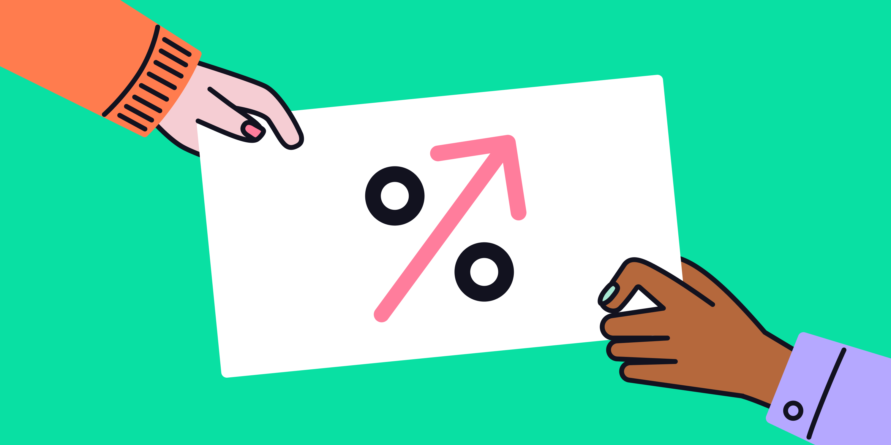
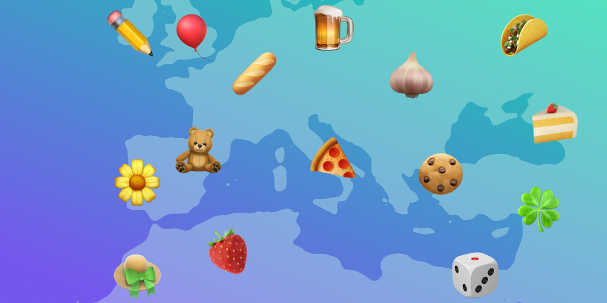
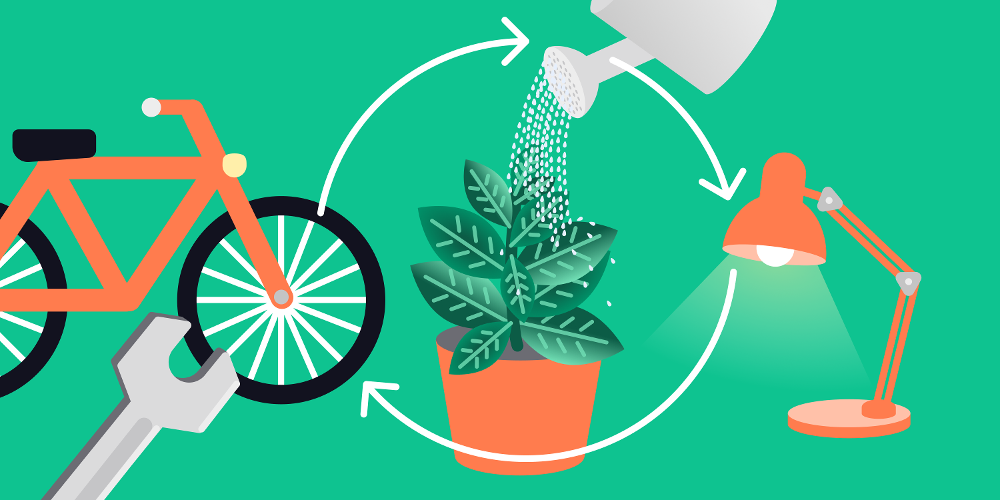
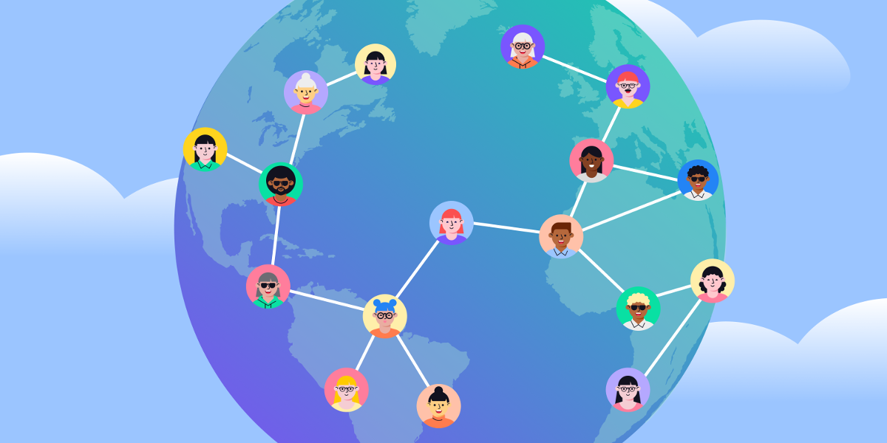
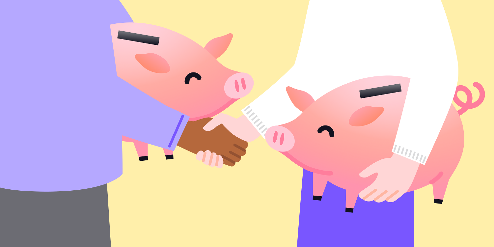

> _Disclaimer:_
>
> _Please note, that even though we do our best to ensure the quality and accuracy of the information provided, this publication may contain views and opinions, errors and omissions for which the content creator(s) and any represented organization cannot be held liable._
>
> _The wording and concepts regarding financial terminology (e.g. “money”, “payments”, “IOU”, “currency”, “credit”, “debt”, “transfer” [of value]) are exclusively used in an exemplary way to describe technological principles and do not necessarily conform to the real world or legal equivalents of these terms and concepts._

## Table of Contents

#### 1. [Bill Splitting](#bill-splitting)

#### 2. [The People’s ATM](#the-peoples-atm)

#### 3. [Time Credits](#time-credits)

#### 4. [Gift Vouchers](#gift-vouchers)

#### 5. [Microcredit](#microcredit)

#### 6. [Community Currency](#community-currency)

#### 7. [Circular Economy](#circular-economy)

#### 8. [Glocal Monetary System](#glocal-monetary-system)

#### 9. [Local Exchange Trading System (LETS)](#local-exchange-trading-system-lets)

#### 10. [Trade Exchange Network](#trade-exchange-network)

#### 11. [Degrowth Money](#degrowth-money)

#### 12. [Universal Basic Income](#universal-basic-income)

#### 13. [Collateralized Credit](#collateralized-credit)

___

In the following section, we give a brief description of how the Trustlines Protocol can be used for different purposes or communities.

## Bill Splitting

**Using Trustlines creates a nicer environment for splitting bills, since users rarely have to settle with cash.**

When splitting the bill at a restaurant or for similar group activities, settling in cash can be problematic. Using Trustlines helps create a nicer environment for recording debts between friends and acquaintances. If you go out with your friends often, these payments will go back and forth for a long time, which can make it wholly unnecessary to settle with cash or bank transfer.

Because of the "[network effect,](how_trustlines_works.html#25-the-network-effect)" using Trustlines also allows you to avoid handling cash even with people beyond your immediate circle of friends. For example, suppose a new acquaintance Alice pays a restaurant $10 for your lunch, and meanwhile, your mutual friend Bob owes you $10. You can "pay" Alice back by simply transferring Bob's debt to Alice. This transfer of credit occurs automatically via "[multi-hop payments](how_trustlines_works.html#24-multi-hop-payment)" on Trustlines.

## The People's ATM

**Trustlines users can withdraw cash from any other connected Trustlines user, reducing dependency on ATMs.**

Trustlines can be used as a way to access cash without an ATM, by enabling you to get it from individuals in the Trustlines network instead. This works because credit on Trustlines is very similar to how a bank deposit works. The money in your bank account does not actually represent cash stored in a vault. Instead, it is a record of the debt the bank owes you. When you withdraw cash at an ATM, this simply reduces that debt.

Similarly, when "withdrawing" cash from an individual in the Trustlines network, this simply reduces your net balance. The same mechanism can be used to make deposits.

For example, to make a withdrawal, you would send a payment in IOUs (an abbreviation for "I owe you") over Trustlines to the connected individual. This individual would then give you that sum in cash. To make a deposit, you would request a payment over Trustlines from the connected individual. Upon receipt, you would give them that sum in cash.

In order to successfully use the People's ATM, there must be consensus among your connections that debts in Trustlines may be exchanged for cash on demand.

Due to the [network effect](how_trustlines_works.html#25-the-network-effect), using Trustlines would enable users to withdraw or deposit cash from any connected person or entity in the currency network.

## Time Credits

**A Trustlines currency network can use "time" as its unit of account, enabling a decentralized, interoperable network of timebank communities.**

Time credits (also referred to as time dollars or timebanking) are a popular form of alternative currency. They usually emphasize a circular economy in which every individual has something both to give and to receive. A Trustlines currency network can be customized for time credits by using "time" or "work hours" as its unit of account.

In order to do this, debits and credits can simply be denominated in HOURS. Instead of a central authority issuing an arbitrary number of time dollars, using Trustlines would allow credit to be organically issued by trusted community members whenever it is needed.

With Trustlines, communities have the option to mirror the structure of existing timebanks by using an organization account. The advantage to doing so is that any timebank on Trustlines would be interoperable with other timebanking communities, as well as with  individuals that use the same currency network (with time as a unit of account).

Note that time is a universal unit of account. Thus, any currency network using "time" as its denomination has the potential to be used as a globally interoperable or "glocal" monetary system.

## Gift Vouchers

**Creating gift vouchers on Trustlines would exponentially expand their reach, since anyone connected in the network can access them.**

Many small businesses are in crisis due to the global pandemic. Some restaurants and other businesses are relying on gift cards and vouchers to stay afloat.

Trustlines is a great way to manage a gift voucher program. Using Trustlines allows for a large-scale, interoperable network of gift vouchers. This network would respect the self-governing nature of independent businesses and allow a cheap and transparent mechanism for issuing virtual vouchers to customers. The businesses would retain the flexibility to charge their customers via whichever payment method they prefer, or to give them out for free.

The network effect would exponentially expand the reach of the vouchers, since anyone connected in the Trustlines network would be able to access them. For example, if a customer buys a voucher with a restaurant, but doesn't use it fast enough, someone connected by a path of trustlines could use it instead. This is great for businesses, as it expands the reach of the vouchers. It also has an advantage for the customers, who feel secure knowing their vouchers are less likely to go unused, and may therefore be more willing to buy them.

Businesses can also choose to partner with other businesses by opening trustlines between each other. This would be like agreeing that Business A's vouchers will be redeemable with Business B, and vice versa. This would combine both businesses' customer networks, expanding the reach of both A and B vouchers.

## Microcredit

**Trustlines makes it easy to create and access microcredit securely, which can help to fight poverty.**

Microcredit is the term used for loans consisting of relatively small amounts of money. Access to microcredit helps fight poverty and supports financial inclusion.

Trustlines makes it easy to create and access microcredit securely. To engage in microcredit, the borrower would make a payment in IOUs over Trustlines to the lender. The lender would then pay out a sum in cash or bank transfer. Microloans in existing currency networks have no time limit, so lenders and borrowers currently need to set their own term agreements externally. Examples of microlending platforms that could be built on Trustlines include services like [Kiva](https://en.wikipedia.org/wiki/Kiva_(organization)).

Credit created over a trustline can have a positive interest if both trustline partners agree to these conditions. However, adding interest is an optional feature. Positive interest can help increase the risk appetite of users. Users might be more willing to give a credit line, or trust each other with higher credit limits, with the possibility to add interest. Enabling this option can thus increase the liquidity of the network.

On the other side of microcredit is [microsavings](https://www.investopedia.com/articles/07/microfinance.asp). Trustlines also makes it easy for users to offer microloans, and securely save money with their peers. An example of peer-to-peer microcredit and microsavings would be the [ROSCA](https://www.investopedia.com/terms/r/rotating-credit-and-savings-association.asp) model.

## Community Currency

**Using Trustlines for a community currency can enhance or influence spending within the community.**

Local or community currency projects seek to enhance spending within the community, or to influence community spending patterns. Such projects can use the Trustlines Protocol in a few different ways.

One way to use Trustlines for a community currency is to use a local or custom unit of account, to emphasize unity and strengthen the local economy. This can be done by opting into a local currency network, or by launching a custom currency network. Launching a custom currency network allows communities to change other features, such as using a permissioned network.

Because Trustlines Protocol is open-source, communities may choose to further tailor the feature set provided to reflect their needs or to deploy an existing solution on the Trustlines Blockchain. This means higher potential for interoperability with similar community currency projects in the ecosystem.

Note that Trustlines was designed to enhance local community trade, since it creates high levels of liquidity within dense social networks. Users would tend to have more trustlines, and higher credit limits, within their local trusted communities. This effect may encourage hyper-local trading circles within community currencies.

## Circular Economy

**Trustlines is the ideal tool for payments in a circular economy, and its use can boost sustainability and economic resilience.**

It is possible to use Trustlines to encourage circular economic activity by placing additional restrictions on how value leaves the system, by using community guidelines or a "social contract." This can strengthen local economies and support sustainable business practices.

One way to do this is if community members agree to disallow settling debts in cash or bank transfer. Instead, they may follow guidelines to use Trustlines payments only for directly transacting within the local market. In other words, anyone with money to spend within Trustlines would have to buy local. This helps encourage community members to seek out latent productivity within their community, and to reinforce sustainable economic loops in the market. The effect would be similar to using a [non-convertible currency](https://www.investopedia.com/terms/n/nonconvertiblecurrency.asp).

A similar approach would be to allow settling of debts with national currency, but only at a discount. For example, consider [BerkShares](https://www.nytimes.com/2007/02/25/us/25land.html), a local community currency in Massachusetts. BerkShares are designed so that the user takes a 5% loss if converting the currency into U.S. dollars. This incentivizes users to keep using BerkShares by buying locally.

Note that by default, any guidelines restricting the use of national currency must enter the community via a "social contract." In other words, each individual community member (or perhaps each individual trustline partnership) must make a commitment to comply with such guidelines.

Because a mature Trustlines network will mean that communities can always fall back on credit-based payments when short on cash, building up strong circular payment networks in this way could be very important.  Trustlines could become a counter-cyclical complement to fiat money, offering greater resilience to economic crises.

## [Glocal](https://www.dictionary.com/browse/glocal) Monetary System

**Trustlines can be a superior alternative to the global monetary system, since it is globally scalable yet has all the benefits of local currencies.**

One vision for Trustlines is to use peer-to-peer (P2P) credit as an alternative type of global monetary system. There are several potential economic and social benefits of moving away from existing monetary systems, and instead, moving towards a type of money issued by its users.

The idea of using P2P credit as a monetary system could result in a counter-cyclical complement to fiat money, facilitating [local trade](#community-currency) even in the face of a money shortage, which in turn would offer resilience to economic crises. However, some may go further and view it as an alternative to the commercial bank money monopoly.

If the unit of account within a Trustlines currency network is a global currency, this allows for local economies using it to remain mostly regional yet still interoperable. This is because natural trade boundaries are determined by the extent of the trusted connections (i.e., more trustlines and higher credit limits) existing between communities. In this way, Trustlines can act like a "glocal" currency, having both benefits of a local community currency and an interoperable, global monetary system.

## Local Exchange Trading System (LETS)

**Traditional LETS systems can be implemented on Trustlines, to benefit from interoperability with the rest of the network.**

Higher-order or "centralized" entities can arise on top of [decentralized currency networks](how_trustlines_works). The advantage to this is that credit risk can be socialized within a group, to mirror the popular Local Exchange Trading System (LETS) model. This is an accounting system that allows community members to exchange goods and services without using the national currency, simply by recording transactions and the resulting member balances on a centralized ledger. The LETS model is used in more than 1500 communities worldwide.

With Trustlines, a LETS group can open an organization account and create identical trustlines with all its members (using its preferred currency network). Organization accounts could be controlled by a single trusted individual or a group of people.

Such a setup in Trustlines would socialize the credit risk: Unpaid debts would equally impact all members of the organization. Such a configuration would help increase liquidity within the community. Due to the [network effect](how_trustlines_works.html#25-the-network-effect), building a LETS community on top of Trustlines means it would remain implicitly interoperable with different communities and individuals using the same currency network.

## Trade Exchange Network

**Businesses may use Trustlines to establish a decentralized B2B trade exchange, also benefiting from interoperability with the P2P network.**

Businesses may use Trustlines to establish a business-to-business (B2B) trade exchange, also called a barter network. Similar to a P2P network, in which trustlines are issued amongst friends, a B2B network occurs when businesses create trustlines with other businesses. This type of arrangement can even be considered its own type of money, "B2B money." Unlike traditional trade exchanges, using Trustlines would allow such a system to be fully decentralized.

There is a significant advantage to building such a system on top of Trustlines: It will remain interoperable with any P2P trustlines within the same currency network. Possible examples of trade exchange networks include the [WIR Bank](https://en.wikipedia.org/wiki/WIR_Bank) in Switzerland and [Sardex](http://ft.com/content/cf875d9a-5be6-11e5-a28b-50226830d644) in Italy.

## Degrowth Money

**A Trustlines currency network can implement a negative interest rate, to discourage hoarding and facilitate degrowth.**

Trustlines was designed so that currency networks can include "demurrage," i.e., negative interest. Negative interest can help discourage hoarding since all balances lose value over time.

Demurrage money can be considered a type of [Degrowth Money](https://www.degrowth.info/en/2020/05/degrowth-money/): "Making money alive through demurrage means that money will also gradually die when not in use. Degrowth money allows us to limit the extent to which accumulation can take place in the system and instead foster circulation and exchange within the values of the commons. Like this, both the issuance and the decay of money take place constantly and adapt to the seasonal needs of people who govern it, following the principles of the commons outlined by Östrom and others," (Linares and Cabaña, 2020).

The advantage to using Trustlines to launch a currency with negative interest is that it would retain all of the compelling properties of any Trustlines currency network, e.g., it would be highly accessible and decentralized, in addition to facilitating degrowth. Examples of demurrage systems include the [Chiemgauer](https://en.wikipedia.org/wiki/Chiemgauer), a regional currency in Germany.

## Universal Basic Income

**A Trustlines currency network can be a decentralized distribution system for universal basic income.**

It is difficult to distribute a universal basic income when people do not have access to bank accounts or the necessary identity documents.

Trustlines doesn't require either of them, which solves the problem and allows communities to create credit that may be spent like a basic income. Normally, user balances in Trustlines swing back and forth between positive and negative amounts. On a technical level, the amount of the basic income would correspond to a predefined limit on each user's net "negative" balance.

In principle, this can work the same way as when using peer-to-peer (P2P) credit as a ["glocal" monetary system](#glocal-monetary-system). The difference is that members should extend trustlines to anyone who can prove they are a real human being, using only one account. This is in contrast to the default version of Trustlines, in which members create trustlines with those who are trusted to pay back their debts, regardless of whether someone may be handling multiple accounts.

The fault-tolerance of Trustlines implicitly limits the basic income to one-per-person. This is because each person must judge for themselves whether to trust the "personhood" of their friends' accounts. If they trust wrongly, they risk holding credit from a duplicate account (also called a Sybil account), and thus cannot spend this credit with the rest of the community.

## Collateralized Credit

**Although collateral is not necessary to use Trustlines, any user can decide to add collateral to boost trust and trade.**

Trustlines is designed so that anyone may issue credit without needing financial collateral. However, it is possible for users or communities to secure the credit they issue with collateral, if that is desired. This can be accomplished effectively with a contract or a legal agreement. In the future, it may be possible to do this via smart contract technology, if users need to manage the collateral in a transparent and trustless way.

Using collateral makes it possible for credit from specific organizations to be "backed" by local government or private entities, depending on the situation. For example, a local municipality may want to bootstrap the local Trustlines community by guaranteeing the credit from a set of vetted, eco-friendly businesses. This would make it possible for a larger number of businesses and individuals to securely give credit lines to eco-friendly businesses, improving network liquidity and boosting trade. It is up to the users to decide whether to issue such collateral in full or in part, or according to some dynamic formula.\
An example of a partially collateralized credit model would be [BerkShares](https://www.nytimes.com/2007/02/25/us/25land.html), a local community currency in Massachusetts that is backed by U.S. dollar reserves.

___

<a href="how_trustlines_works" class="prev_next_text">Previous</a>

 

<a href="how_trustlines_works" class="prev_next_text">How Trustlines works</a>

<a href="../../guides/tl_app_user_guide" class="prev_next_text">Next</a>

 

<a href="../../guides/tl_app_user_guide" class="prev_next_text">User guide for Trustlines App</a>

