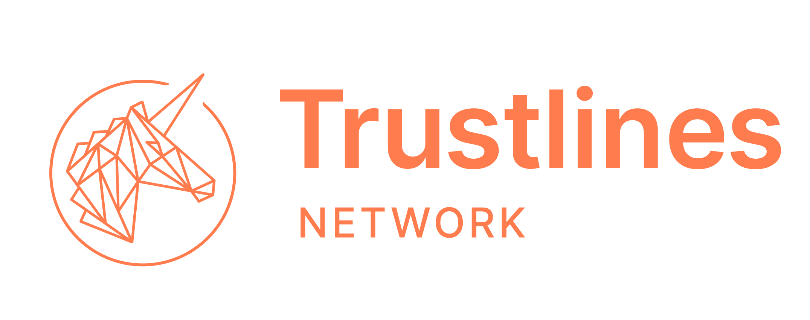
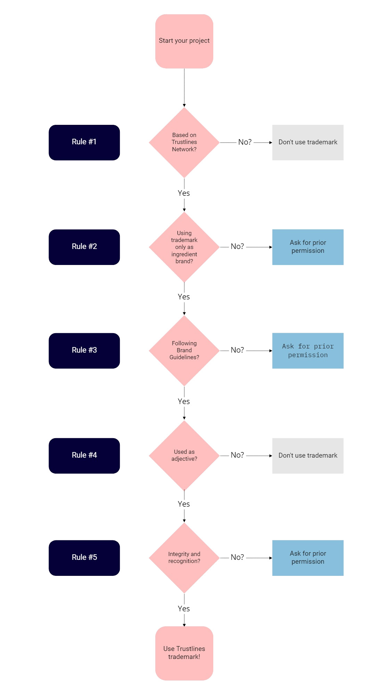

Version 1.0

_Last updated: April 2020_

## Table of Contents

#### 1. [The Trustlines Foundation's Trademarks](#1-the-trustlines-foundations-trademarks-1)

#### 2. [Rules Applicable to Trademarks Owned by Trustlines Foundation](#2-rules-applicable-to-trademarks-owned-by-trustlines-foundation-1)

  - 2.1 [Our Five Rules for the use of Trustlines trademarks](#21-our-five-rules-for-the-use-of-trustlines-trademarks)
    - 2.1.1 [Rule #1 The ecosystem rule](#211-rule-1-the-ecosystem-rule)
    - 2.2.2 [Rule #2 Use your brand and add Trustlines as an ingredient brand](#212-rule-2-use-your-brand-and-add-trustlines-as-an-ingredient-brand)
    - 2.3.3 [Rule #3 Use Trustlines trademarks according to our brand guidelines](#213-rule-3-use-trustlines-trademarks-according-to-our-brand-guidelines)
    - 2.4.4 [Rule #4 Use the trademark as an adjective](#214-rule-4-use-the-trademark-as-an-adjective)
    - 2.4.5 [Rule #5 Integrity of the Trustlines trademarks and recognition notice](#215-rule-5-integrity-of-the-trustlines-trademarks-and-recognition-notice)
  - 2.2 [Quick check flow chart](#22-quick-check-flow-chart)
  - 2.3 [Examples for rules #1 and #2](#23-examples-for-rules-1-and-2)

#### 3. [Apply for a license for Trustlines trademarks](#3-apply-for-a-license-for-trustlines-trademarks-1)

#### 4. [What is a trademark?](#4-what-is-a-trademark-1)

#### 5. [Rules That Apply to Trademarks In General](#5-rules-that-apply-to-trademarks-in-general-1)

#### 6. [Fair Use](#6-fair-use-1)

#### 7. [Questions, Comments, Reporting of misuse](#7-questions-comments-reporting-of-misuse-1)

#### 8. [Disclaimer](#8-disclaimer-1)

#### 9. [Updates](#9-updates-1)

#### 10. [Review and Remedies](#10-review-and-remedies-1)

For the purposes of this document, references to trademarks, logos, and brands include all trademarks owned by the Trustlines Foundation ("Trustlines trademarks"). Projects operating as separately incorporated entities within the Trustlines Network ecosystem may have their own trademark guidelines.

___

## 1. The Trustlines Foundation's Trademarks

Our trademarks include but are not limited to:

-   our TRUSTLINES ® trademark
-   our TRUSTLINES NETWORK ® trademark
-   our "Trustlines unicorn logo" design trademark:

  

This list may be updated from time to time, especially as other trademarks are created or registered.

## 2. Rules Applicable to Trademarks Owned by Trustlines Foundation

One of the guiding principles of the Trustlines Network vision is open source. The Trustlines Foundation both hopes and encourages external parties to share knowledge related to the Trustlines Protocol and the Trustlines Network. It also advocates the promotion of the trademarks used for products built using the Trustlines Protocol. Therefore, contributors to and participants in the Trustlines ecosystem should be able to use our trademarks to promote their Trustlines projects even beyond the right to fair use.

However, we have to keep in mind that the *incorrect* use of a brand may lead to a dilution of the trademark and, thus, to impairment due to a lack of differentiation from other brands. If its owner does not adequately protect it, a brand may weaken in meaning or become a generic term and lose its protected status. Some words were once trademarks that became generic terms because their owner did not adequately protect them. Therefore, we established the following rules for the use of Trustlines trademarks. Follow these guidelines to properly use the Trustlines trademarks to help maintain the value of our trademarks and the Trustlines brand. 

### 2.1 Our Five Rules for the use of Trustlines trademarks 

If you want to use the Trustlines trademarks, you don't require Trustlines Foundations explicit prior permission or license agreement as long as you follow these rules. We reserve the right, in our sole discretion, to alter and amend these rules, to determine when these rules are adhered too or violated, and to choose appropriate enforcement measures.

#### 2.1.1 Rule #1 The ecosystem rule 

Refer to Trustlines or use the trademark and logo only when promoting products, projects, or events based on or about the [Trustlines Protocol](https://trustlines.network/#protocol) and in accordance with the disclaimer below. Use of the Trustlines trademarks when referring to _other software or technologies_, would be misleading to the audience, as well as damaging to the Trustlines brand and ecosystem. Therefore, Trustlines trademarks must not be used when referring to software based on protocols by other entities or in another misleading or unfair manner. Any use of the trademarks in these contexts could potentially subject you to liability for trademark infringement, false advertising, and unfair competition.

#### 2.1.2 Rule #2 Use your brand and add Trustlines as an ingredient brand 

It must be clear who the owner or marketer of the promoted product, project, or event is. Use the Trustlines trademarks only as a reference. There must be no potential for confusion or misunderstanding as to such that the product, project, or event is manufactured, marketed, sponsored, endorsed, or authorized by Trustlines Foundation, when in fact, that is not the case. The reference to Trustlines only shows that your product or project uses the Trustlines Protocol or your event is about the Trustlines Protocol or the Trustlines Network. Your name, brand, or trademark must not be less prominent than the Trustlines trademarks, and Trustlines must not be the only visible name, brand, or trademark on your online/offline communication. To make it clear for your audience or users that the Trustlines Protocol or the Trustlines Network is used for your project use wording such as, for example, "_Powered by Trustlines ® Protocol_" or "_Powered with Trustlines Network ®_. "If you are promoting a strictly non-profit and free-entry event regarding the Trustlines Protocol and/or Trustlines Network, you may use the trademarks as a primary brand for the event title.

#### 2.1.3 Rule #3 Use Trustlines trademarks according to our brand guidelines 

Use the word Trustlines or Trustlines Network in the same font and size as the surrounding text. For [the logo](../brand/brand_resources.html), usage follows the [Brand Guidelines](../brand/brand_guidelines.html).

#### 2.1.4 Rule #4 Use the trademark as an adjective 

A trademark function as an adjective and must be used accordingly, so don't use it as a noun, in the plural form, or the possessive case. Always use the Trustlines trademark as an adjective preceded or followed by the appropriate generic noun for the product or product category (e.g., "_Trustlines Network ® relay server_," "_Trustlines ® pathfinding service_"; not: ~~"_App for Trustlining_"~~). Only when referencing Trustlines Foundation as an entity or the Trustlines Network as the blockchain network, it is acceptable and appropriate to use Trustlines as a noun (e.g. "_deployed on the Trustlines Network_," not: ~~"_The Trustline_"~~)

#### 2.1.5 Rule #5 Integrity of the Trustlines trademarks and recognition notice

Do not incorporate the Trustlines trademarks or any recognizable part of them into other logos, brand names, company names, domain names, or product names. Make it clear that Trustlines Foundation legally owns the Trustlines trademarks. If you are referring to a Trustlines trademark, add the following brand recognition notice at a suitable location, such as on your product, in print material or online:  
_"Trustlines ®, Trustlines Network ®, and the Trustlines unicorn logo are trademarks or registered trademarks of Trustlines Foundation."_

### 2.2 Quick check flow chart

To get a quick idea about whether or not your intended use of the trademark is allowed without asking the Trustlines Foundation first, you can go through the following flow chart. Please keep in mind that this is just a quick check, and you should always refer to the full rules or ask us when you're in doubt about your use case scenario.

### 2.3 Examples for rules #1 and #2

For your convenience, see below some examples of how the rules #1 and #2 should be applied. Please keep in mind that these are just basic examples, and you should always refer to the full rules and take your case into account. Ask us when you're in doubt about your use case scenario.

| Use case example | Permission without request? | Permissible upon request? | Reason |
|:-----------------|:-------------:|:-------------:|:----------------:|
| Merchandising products such as t-shirts with Trustlines unicorn logo? | **NO** | YES | Not fair use and doesn't comply with rules #1 and #2 |
| Use for a different blockchain network? | **NO** | **NO** | Not fair use and doesn't comply with rule #1 |
| Community currency protocol not interoperable with Trustlines Network? | **NO** | **NO** | Not fair use and doesn't comply with rule #1 |
| Community currency protocol built on top of Trustlines Network wants to use the name "Trustlines Local"? | **NO** | YES | Not fair use and doesn't comply with rule #1, but might be permitted upon request |
| A wallet interoperable with Trustline if its name uses "powered by Trustlines"? | YES |  | Complies with rule #1 and #2 |
| For-profit event about Trustlines promoted as "Trustlines Meet-Up"? | **NO** | YES | Doesn't comply with rule #2, but might be permitted upon request |
| Non-profit event about Trustlines promoted as a "Trustlines Meet-Up"? | YES |  | Non-profit events are an exemption in rule #2 and use as the primary brand is allowed |
| Event about Trustlines promoted as "Blockchain Meet-Up about Trustlines"? | YES |  | Complies with rule #1 and #2 |
| An application built on Trustlines Network that uses a Trustlines logo as the primary brand? | **NO** | YES | Doesn't comply with rule #2, but might be permitted upon request |
| A company working on a similar concept as Trustlines references "Trustlines" to describe certain similar functionalities of their product? | YES |  | Fair use |

## 3. Apply for a license for Trustlines trademarks 

If you would like to use the trademarks in another way, please contact us by email to contact@trustlines.foundation. Please describe your project and your intended use of the trademarks, why it deviates from our five rules, and why that makes sense for the ecosystem. We'll then examine whether we can issue a fitting license for your intended purpose and get back to you as quickly as possible. We reserve the right to refuse permission to use our trademarks for any reason.

## 4. What is a trademark?

You may think of trademarks as a type of consumer protection mechanism. They help identify a certain business such as a manufacturer or a service provider and distinguish them from other market participants in the same market space. A trademark may be, for example, any word, name, or symbol that is used by a person or entity to identify and distinguish their goods and services from those offered by others and to indicate the source or origin of their goods and services. In many jurisdictions, it is not required to register a trademark with the government before claiming rights in the mark.

## 5. Rules that Apply to Trademarks In General

The owner of a trademark in the EU, for example, is entitled to prevent all third parties not having their consent from using in the course of trade, in relation to goods or services, any sign where, for example, the sign is identical with, or similar to, the trademark and is used in relation to goods or services which are identical with, or similar to, the goods or services for which the EU trademark is registered, if there exists a _likelihood of confusion_ on the part of the public; the likelihood of confusion includes the likelihood of association between the sign and the trademark. The following, in particular, may be prohibited:

  - affixing the sign to the goods or the packaging of those goods;
  - offering the goods, putting them on the market, or stocking them for those purposes under the sign, or offering or supplying services thereunder;
  - importing or exporting the goods under the sign;
  - using the sign as a trade or company name or part of a trade or company name;
  - using the sign on business papers and in advertising;
  - using the sign on comparative advertising in a manner that is contrary to Directive 2006/114/EC.

## 6. Fair Use

The exclusive rights conferred by a trademark do not entitle the proprietor to prohibit the use of signs or indications by third parties which are _used fairly_ and thus in accordance with honest practices in industrial and commercial matters. The use of _descriptive_ or _non-distinctive_ signs or indications, in general, is also permitted. Furthermore, the proprietor is not entitled to prevent the fair and honest use of the trademark for the purpose of identifying or referring to the goods or services as those of the proprietor. Trademark laws should also be applied in a way that ensures full respect for* fundamental rights and freedoms*, and in particular, the _freedom of expression_.

## 7. Questions, Comments, Reporting of misuse

Please do not hesitate to reach out to by email to contact@trustlines.foundation (i) in case of doubt, interpretation issues or general questions regarding the Trustlines Foundation trademark guidelines, (ii) if you want to obtain permission to use the Trademarks, or if you want to report misuse of the Trademarks.

The Trustlines Foundation's privacy policy can be found [here](https://trustlines.foundation/legal-imprint-privacy-policy.html).

## 8. Disclaimer

The Trustlines Foundation shall not be liable for any direct or indirect damages relating to or resulting from Trademark user's usage of the Trademarks. Trademark users by their Trademark use agree to indemnify, defend and hold harmless the Trustlines Foundation, its affiliates, and its contributors for any such claims for damages. The Trustlines Foundation does not make any express or implied warranties, by fact or law, including but not limited to warranties with regard to non-infringement of any third-party intellectual property rights.

By using the Trustlines trademarks you agree that any material and/or the promoted product, project or event (i) is neither threatening, libelous, defamatory, nor obscene; (ii) would not constitute, or encourage conduct that would constitute a criminal offense, give rise to civil liability, or otherwise violate the law; (iii) doesn't infringe the intellectual property, privacy, or other rights of any third parties; (iv) doesn't contain a computer virus or other destructive elements; (v) doesn't contain advertising; and (vi) doesn't constitute or contain false or misleading statements.

## 9. Updates

We may release new versions of our trademark guidelines or statements of permitted use of our trademarks without notice. Therefore, please make sure to check this page regularly if you are using Trustlines trademarks based on these guidelines without our prior written permission from Trustlines Foundation and adjust your trademark usage according to any changes made to our trademark guidelines.

## 10. Review and Remedies

We reserve the right to review all uses of our trademarks by others and may conduct periodic spot checks of such use. Upon our request, you must provide a copy of any materials bearing our trademark. You must correct any deficiencies in the use of our trademarks. Refusal to correct such deficiencies may result in the revocation of permission to use our trademarks. Furthermore, any unauthorized or improper use of our trademarks may constitute trademark infringement, unfair competition, and/or copyright infringement in violation of applicable laws and regulations. We reserve the right to initiate legal action relating to any third party use of our trademarks that we, in our sole discretion, deem to be unlawful or improper, even if such use is not expressly prohibited in these guidelines. Nothing in our trademark guidelines is intended to waive or restrict any legal rights that we may have under applicable law, to grant any license, or to acquiesce in any infringing act.
