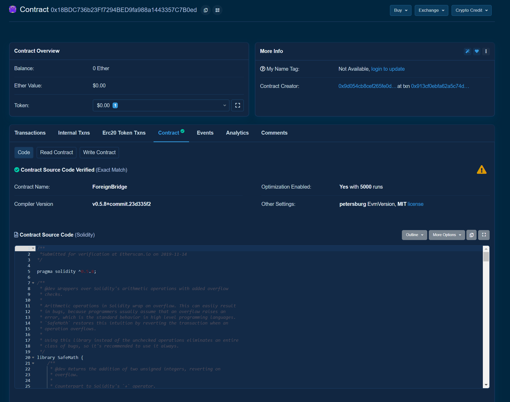
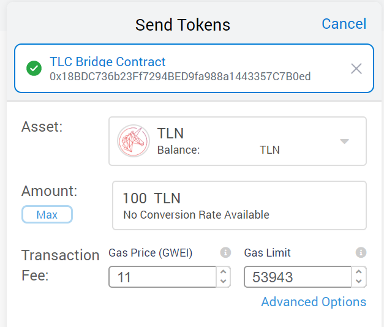
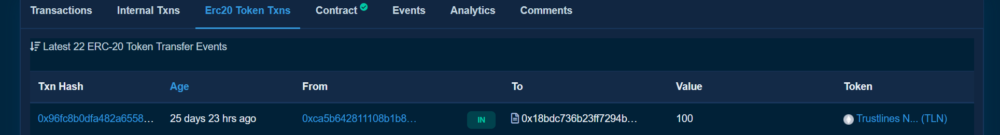
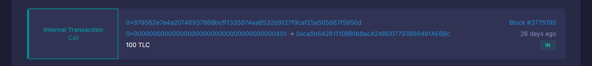

The goal for the [Trustlines Foundation](https://trustlines.foundation/index.html) is to make Trustlines Network Coins widely accessible. TLC is the native token of [Trustlines Blockchain](https://blog.trustlines.network/introducing-the-trustlines-blockchain) that Trustlines Network Tokens, TLN, can be converted to. TLC is used to pay fees on the chain. These fees are similar in [functions as ETH on Ethereum](https://blockgeeks.com/guides/ethereum-gas/#What_is_Ethereum_Gas). For example, they are used for transaction fees and smart contract deployment. A wide distribution of the token should help in creating use cases that align with the mission of financial inclusion. The primary use case envisioned for the TLN tokens would be to use the bridge between Ethereum and [Trustlines Blockchain](https://explore.tlbc.trustlines.foundation/) to convert the tokens into Trustlines Network Coins.

**Find out more about TLN in the [Merkle Drop Launch](https://blog.trustlines.network/merkle-drop-launch/) blog post.**

## Using the bridge contract

You can convert TLN to TLC by using the bridge contract on Ethereum. The bridge contract can be found at the address [0x18BDC736b23Ff7294BED9fa988a1443357C7B0ed](https://etherscan.io/address/0x18BDC736b23Ff7294BED9fa988a1443357C7B0ed).

### Sending TLN to the bridge contract

The conversion is as simple as sending your TLN tokens to the [bridge contract](https://etherscan.io/address/0x18BDC736b23Ff7294BED9fa988a1443357C7B0ed).

!!! warning "Note"
    **Do not send ETH or any other tokens than TLN to the contract!**

The transaction sending TLN is very straight-forward. **No data is needed to be entered manually**. You send the tokens like any other token transaction, to the bridge contract, and you're done.

You will be able to check the [Token transactions](https://etherscan.io/address/0x18BDC736b23Ff7294BED9fa988a1443357C7B0ed#tokentxns) at the bridge contract to see an incoming transaction.

!!! question "Where will I receive the TLC?"

    The bridge contract will burn the TLN sent to it and signal the Trustlines Blockchain validators to reimburse the amount of TLC to your account. **The address on TLBC that will receive the TLC is the same address you used on Ethereum to send the tokens**.

### Getting the TLC on the Trustlines Blockchain

Once the transaction has been mined on Ethereum, the Trustlines Blockchain's validators will pick it up. You can find the **Trustlines Blockchain explorer** at [https://explore.tlbc.trustlines.foundation/](https://explore.tlbc.trustlines.foundation/.).

It will take some time for the validators to confirm your transaction, even up to 15 minutes, so be patient. Afterward, you can check your address at the TLBC explorer, and under `Internal Transactions`, you will be able to see the TLC.

