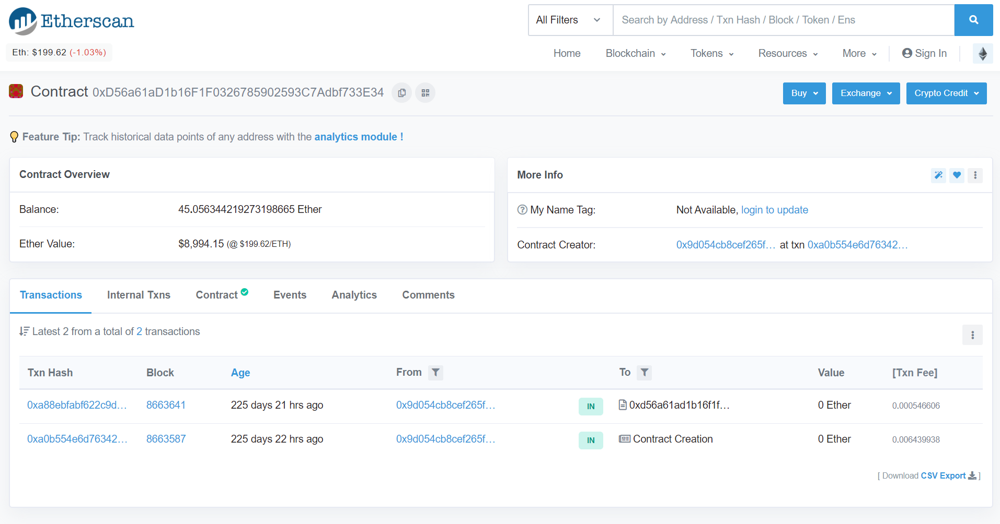
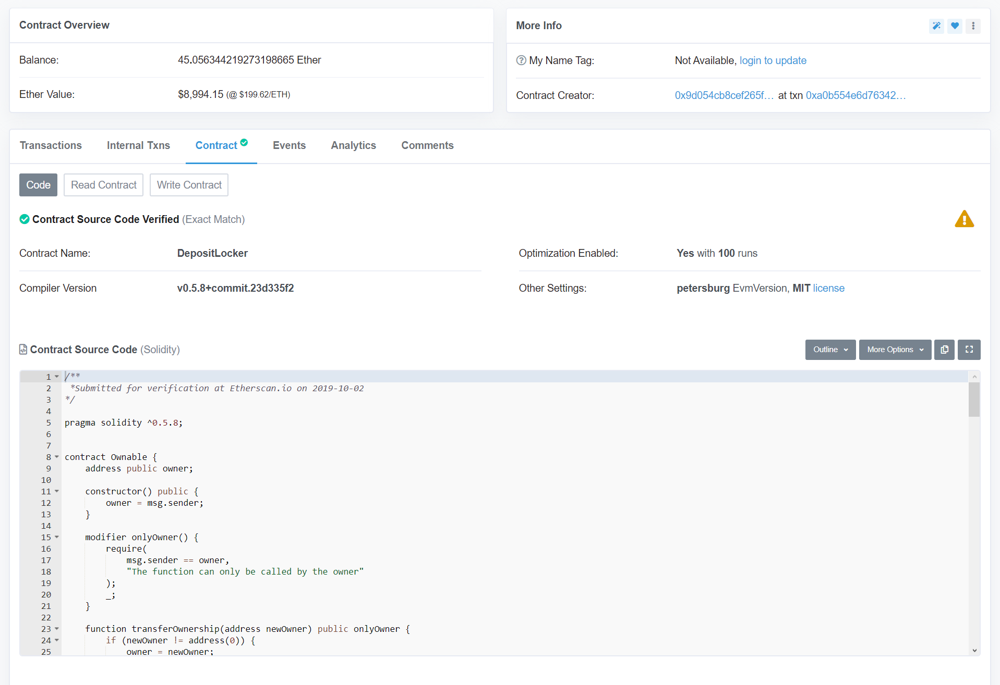
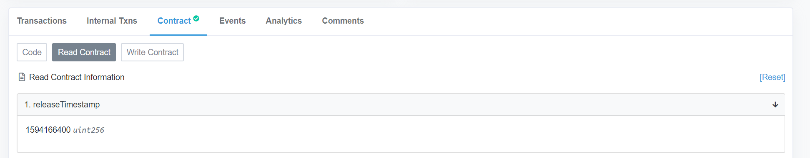
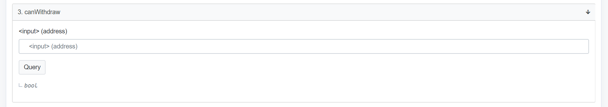
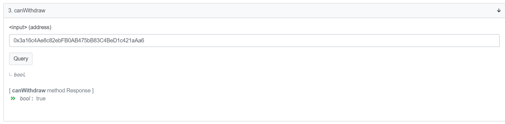
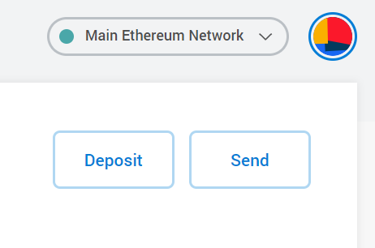
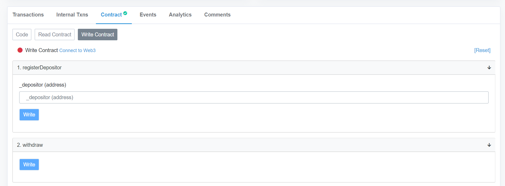
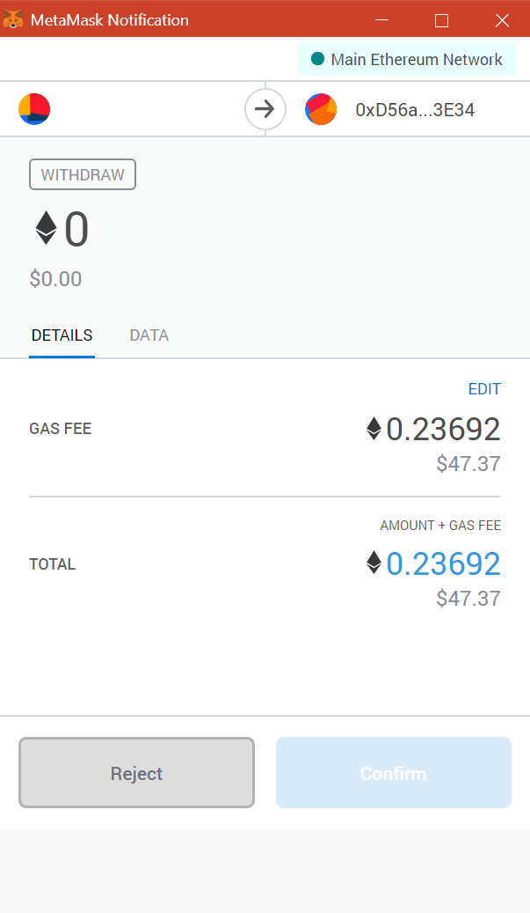

Validators are able to withdraw their deposits after the locking period ends. This guide will walk you through how to withdraw the staked tokens.

!!! note
    Those who bid on an auction, can withdraw their excess from the bids after the auction closes. In the Dutch auction format used, the last bid is the final price for all participants. Due to this format, all bids before the last one will have excess to withdraw. At the bottom of the page you will find the details for the auction contracts.

## Details for the DepositLocker contracts

To withdraw your deposit from the contract, you will need to interact with the `DepositLocker` contract.

!!! quote ""
    === "Third auction"

        * **Validator period**: March 2021 to December 2021
        * **Stake unlocked**: 17th of December, 2021
        * **DepositLocker address**: [0x1FBeB7273E32dCE3Cf1eCe3D02f393E21d90BB46](https://etherscan.io/address/0x1FBeB7273E32dCE3Cf1eCe3D02f393E21d90BB46)
        * **Staked token**: TLN

    === "Second auction"

        * **Validator period**: July 2020 to March 2021
        * **Stake unlocked**: 23rd of March, 2021
        * **DepositLocker address**: [0x3f52Cb880B534D57F3C925F2bbB6b2750E2f415A](https://etherscan.io/address/0x3f52Cb880B534D57F3C925F2bbB6b2750E2f415A)
        * **Staked token**: TLN

    === "First auction"

        * **Validator period**: November 2019 to July 2020
        * **Stake unlocked**: 8th of July, 2020
        * **DepositLocker address**: [0xD56a61aD1b16F1F0326785902593C7Adbf733E34](https://etherscan.io/address/0xD56a61aD1b16F1F0326785902593C7Adbf733E34)
        * **Staked token**: ETH

## Checking that the locking period has ended
To withdraw your deposit from the contract, you will need to interact with the `DepositLocker` contract. The contract address on Ethereum is [0xd56a61ad1b16f1f0326785902593c7adbf733e34](https://etherscan.io/address/0xd56a61ad1b16f1f0326785902593c7adbf733e34).

Make sure the deposits are unlocked by checking that the `releaseTimestamp` has passed. To do this on the contract page, click on `contract`.

Continue to click on `read contract`.

You can find out the current **Unix timestamp** using a search engine of your choice.

## Verifying that your address can withdraw from the contract

You will need to use the same address to withdraw that you used to bid.
To verify your address, you can use the third field, `canWithdraw`.

Enter your address in the field and click `Query`. You will see `bool: true` if you are able to withdraw, or `bool: false` if not.

## Withdrawing using MetaMask

Once you have verified that you’re entitled to withdraw, log-in to your MetaMask account. You should make sure you have the `Main Ethereum Network` network selected.

Click on Write Contract, then, `Connect to Web3`. This will allow Etherscan to connect to MetaMask.

For the actual withdrawal, click on `Write` under `2. withdraw`. MetaMask will then ask you to sign a transaction. The transaction should require less than 30k gas.

Once this transaction is confirmed, you should receive your deposit back.
