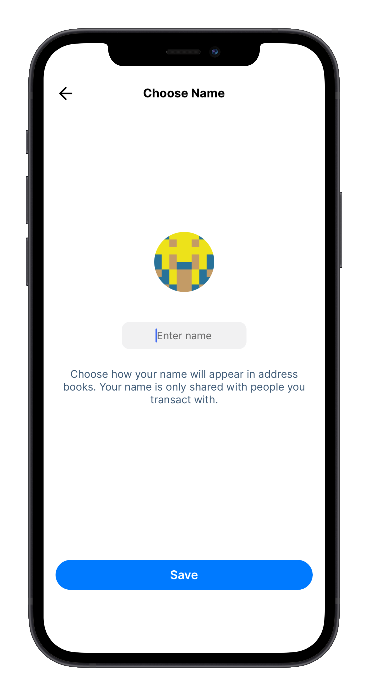
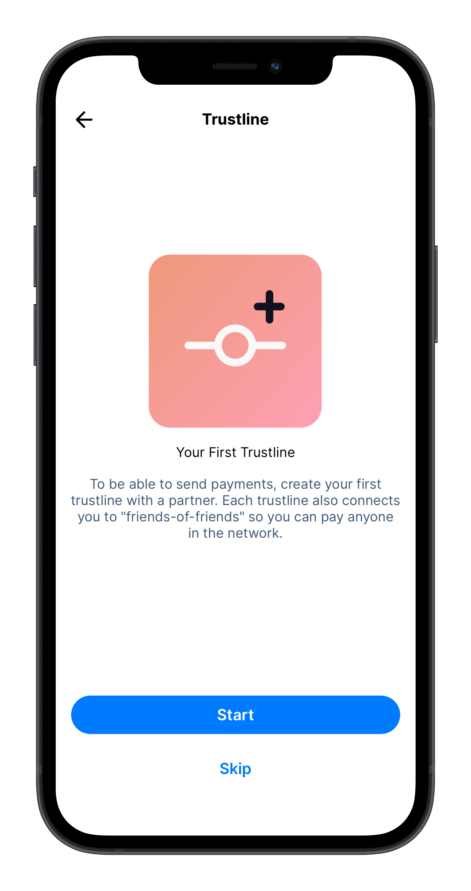
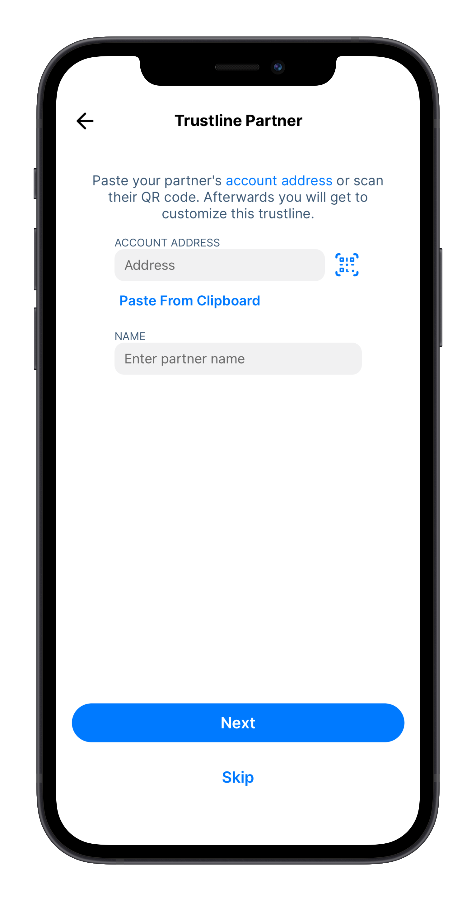
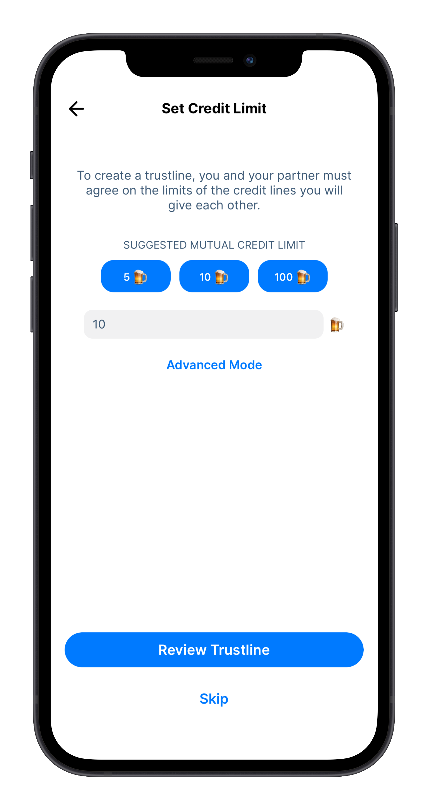
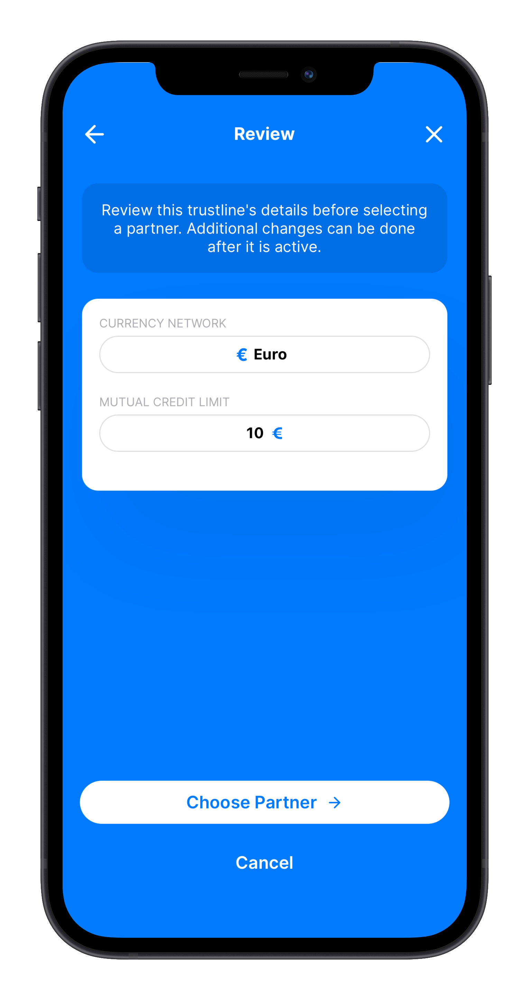
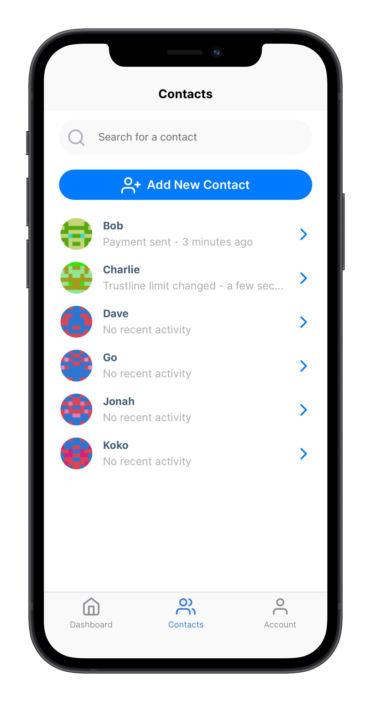
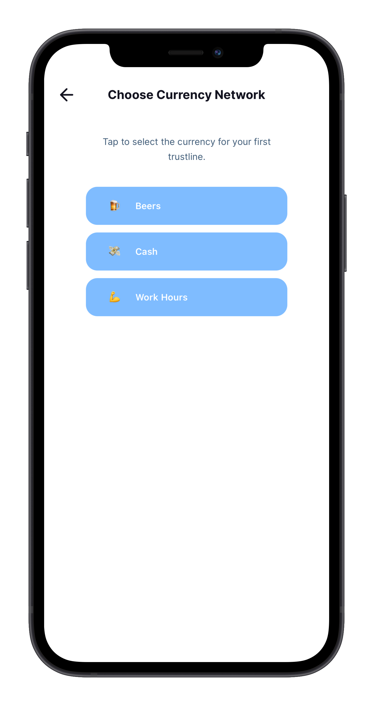
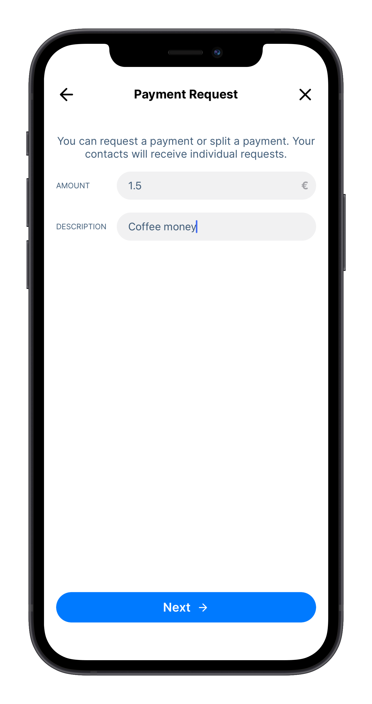
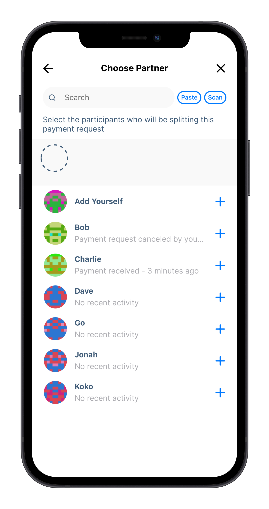

_Note: The images in this guide are for educational purposes and might not represent all the latest changes in the app_

You can get the Trustlines App for Android and iOS from <a href="https://trustlines.app/" target="_blank">https://trustlines.app</a>

## Introduction

In order for markets to function correctly, people need reliable access to a medium of exchange. Historically, due to how the world's banking system functions, this has been a difficult goal to reach. Even in times of abundance, a lack of access to simple financial tools can cause a breakdown in the availability of a medium of exchange (e.g., think of the many hardships associated with being "unbanked"). The problem becomes especially urgent in the face of economic recessions (which cause a scarcity of money). That is why we need a new form of money that can provide a medium of exchange that anyone can access: "People Powered Money."

## Mutual Credit

The Trustlines App is your key to using a form of money based on the idea of __mutual credit__. Mutual credit is an organic and accessible form of money that consists simply of credits and debits between two mutually trusted parties. Any two people can choose to transact with each other using the principle of mutual credit by creating an informal two-way credit line between them, referred to as a "trustline."

If you formalize these natural, informal agreements between trusted friends on a digital database, it becomes possible to "ripple" transactions through your network of connected friends-of-friends. That's the brilliant thing about using Trustlines: it turns trusted relationships into a payments network that looks and acts like "real" money.

## Getting started with the Trustlines App

You might have received an invite link from someone to get started with the Trustlines App, or perhaps you've just downloaded the app and are ready to get started. These two processes differ a bit, and we have a guide for each approach.

Select the appropriate choice for you, [Starting via an invite link](#starting-via-an-invite-link) or [Starting with a sign-up in the app](#starting-with-a-sign-up-in-the-app).

### Starting via an invite link

You might have received an invite link from someone to get started with the Trustlines App. This link will allow you to easily set up your account as well as create your first trustline!

The first thing you need to do when signing up for a new account is to accept the `Terms & Conditions`. Upon accepting the Terms & Conditions, the app will automatically generate a new account for you.

Once the account generation is complete, you get to choose the name displayed in the name for yourself. Choose a name you want to use in the app, and you're ready to create your first trustline!

Since you created your account via an invite link, there is already a trustline request ready for you to review. This will show the name that the other person has picked for themselves, which currency network they are suggesting for the trustline, as well as the mutual credit limit. As this invite was a request for you to create a trustline with the other person, they will also still need to confirm the creation of the trustline.

That's it. You're ready to start using the Trustlines App!

### Starting with a sign-up in the app

Starting with a sign-up in the app is pretty similar to [starting via an invite link](#starting-via-an-invite-link). There are a couple of fewer steps to take before getting to the `Dashboard`, but the app won't be very useful at this point until you [create a trustline](#create-a-trustline) with someone.

_If you already went through the [starting via an invite link](#starting-via-an-invite-link) steps, feel free to [skip](#create-a-trustline) this section._

The first thing you need to do when signing up for a new account is to accept the `Terms & Conditions`.

Upon accepting the Terms & Conditions, the app will automatically generate a new account for you. Once the account generation is complete, you get to choose the name displayed in the name for yourself.

<a href="../../assets/images/app_user_guide/v1.11/your_first_trustline.png"></a>

After choosing a name that you want to use in the app, you're ready to create your first trustline! You can enter your partner's address either by scanning their QR code or by entering the address to the input field. Make sure to enter a name for them as well so you will be able to easily see who you're interacting with!

Next, you will choose a currency network you would like to use as a denomination for this trustline. On the next screen, you will need to choose and suggest a credit limit for this trustline.

Review the details of the trustline you wish to request before sending, and that's it, you're ready to start using the Trustlines App!

## Securing access to your account

**This is a crucial step you should always take when starting to use the Trustlines App!**

Backing up your passphrase will guarantee that you will be able to access your account in the case that you, i.e., lose or break your phone. **Without the passphrase, you won't be able to access your account again on another device.**

You start by going to the `Account` tab in the menu bar. There you need to select `Passphrase` to start the backing up process.

The next step will show you your personal passphrase associated with your account. This passphrase is 12 words long, and you will need to copy it to a secure location like a password manager. After copying your passphrase, you will need to verify that you have the correct passphrase stored. The app will ask you to enter the 12-word passphrase in the correct order, ensuring that you have the right one copied and allowing you to access your account in the future if needed.

These are all the steps needed to secure access to your account. As a reminder, **storing your passphrase, i.e., in a screenshot, email, or at cloud storage, is not a secure way of storing your passphrase**.

## Creating a trustline

The app is not useful without at least one trustline! So if you don't have one, the first thing you should do upon downloading the Trustlines App is to create a trustline with a trusted peer.

To create a trustline, first, one party must create a proposal, and the other must accept it.

Each trustline consists of two credit lines. As a default, we suggest you set both limits to the same value and use an interest rate of zero. It's best to **discuss this together** as you fill in the numbers. Selecting the `Advanced Mode` will allow you to set two values; the left is the amount you would lend, and the right is the amount you can borrow. “Borrow” can be thought of as your “spend limit” with this partner. These two amounts can be set to whatever values you and your partner agree on. There is also an option to add interest to either of these credit lines.

Start by heading to the `Dashboard`. Here you can either start the process by tapping on `New Trustline`.

The first step is to select which currency network, and thus, denomination you wish to use for this specific trustline.

Next, you need to set a credit limit for the trustline. It's best to **discuss this together** as you fill in the numbers. The `Advanced Mode` will provide you with more options if you wish to set different credit limits for you and your partner or add a custom interest for the trustline.

After selecting the credit limit for the trustline, review the request before choosing a partner. You can select a contact from your list, paste their account address, or scan their QR code.

Then, review the details, making sure everything is correct, and send the request!

## Adding a contact

To add a contact, your partner must share their account address. You, adding the contact, should click on the `Contacts` item in the menu bar. In the top part of the screen, there's a button for adding new contacts. Click this.

Your partner sharing their contact information should go to the `Account` tab in the menu bar and select `Show QR` at the top of the screen.

You can now scan this with your QR scanner by clicking on the `Scan` button.

If you are not physically together, your partner can also become a contact by clicking `Copy Address` under `Account` and sending their wallet address to you via a messaging service.

Make sure to enter a name for them as well! Make sure to label them with a name that you'll be able to recognize.

## Choosing currency networks to use

You'll need to enable currency networks in order to create trustlines using different denominations. Pick something you are interested in using---purely as a "unit of account." Popular currency networks are USD, EUR, Hours, and Beer. You may also want to use your local currency.

To enable different currency networks, simply select the `Account` tab at the bottom menu bar and then select `Currencies`. Here you can enable, or disable, different currency networks that you can easily then use from your `Dashboard`.

When presented with the `Choose Currency Network` screen, tap on `More options` to see the whole list of currency networks that you can choose from.

## Setting a credit limit

Each trustline consists of two credit lines. As a default, you set both limits to the same value and use an interest rate of zero. It's best to **discuss this together** as you fill in the numbers. Selecting the `Advanced Mode` will allow you to set two values; the left is the amount you would lend, and the right is the amount you can borrow. “Borrow” can be thought of as your “spend limit” with this partner. These two amounts can be set to whatever values you and your partner agree on. There is also an option to add interest to either of these credit lines.

## Checking your global credit limit

As you head on over to the `Dashboard` screen, you'll see a big number at the top, with the word "Available" underneath, and "Send" and "Receive" buttons. This number is not your balance. Instead, it is your global credit limit, the sum of all the credit available on every trustline you have opened within a particular currency network. (It is similar to a credit limit on a credit card.)

This number will go **down** whenever you make a payment using the Trustlines App because paying uses up available credit. It cannot go below zero.

But this number will go **up** when you receive payments, like if a friend pays you using a credit line that you have given to them. In other words, if a friend borrows some money from you (and thus owes you money), this amount is recorded as **additional** credit on top of your available credit.

The higher your global credit limit is, the higher your capacity to make payments in the network. If you want to raise your limit, open more trustlines with more people that you trust (or ask existing friends to raise their credit limits with you).

## Sending and receiving payments

### Sending a payment

Creating a trustline allows you to transact not just with this trusted friend, but also with all the people that your friend is connected to, and all the people their friends are connected to, etc. You can ripple payments across many chains of friends, as long as there is a high enough credit limit (enough "capacity") on each connected trustline.

To send a payment to someone you don't yet know, you can use your QR scanner to directly scan their payment request or ask them to send their account address via a messaging service.

If it's someone you plan to transact with again in the future, you can add them as a contact, too (see [Adding a contact](#adding-a-contact)). If you already have them as a contact, you can hit "Send" directly from the Dashboard. Make sure you swipe to select the right currency network before hitting `Send`.

### Requesting a payment

To request a payment from someone, you hit the `Request` button in the `Dashboard`. Make sure you swipe to select the right currency network before hitting `Request`.

You will need to enter the amount that you are requesting, choose a partner to send the request to, and review the request before confirming it. You can also easily split the payment between multiple people by selecting the `Split Bill` option (see [Splitting the bill](#split-request) for more details).

#### Split request

With the Trustlines App, you can easily split a payment between multiple people. You start [requesting payment](#requesting-a-payment) as you normally would, and when you get to the `Choose Partner` screen, select the `Split Bill` option.

You will be presented with a `Split Request` screen showing that you will be requesting a payment between multiple contacts. Next, you will select the people you wish to send this payment request to.

You can also include yourself in this split payment request. This is especially useful if you are splitting a payment evenly among the participants.

By default, the amount you're requesting will be split evenly between the people you chose. You also have the option here to change the sums manually by entering the amounts per person.

Review the payment request and send multiple requests with a single tap!

## Checking balances with contacts

By selecting a contact in the `Contacts` view, you will be able to view all the trustlines you have with that person. Swipe left and right to view different currency networks. Each trustline will prominently display the available credit at the top. Below are three numbers: `Balance`, `Given credit line`, and `Received credit line`.

The given and received credit line amounts correspond to the two credit lines you and your partner have agreed on for this trustline.

Your balance indicates the amount "owed." If it is negative, this is the amount you owe your partner. If it is positive, this is the amount your partner owes you. You should only need this information if you decide to settle your balance and close the trustline.

## Support and feedback

This is a newly released app. We are very interested in hearing about your experiences, anything you had trouble with, and any feedback you might have.

The [Trustlines Forum](https://forum.trustlines.network/) has sections for [Support](https://forum.trustlines.network/c/trustlines-app/app-support/16) as well as for [Feedback](https://forum.trustlines.network/c/trustlines-app/app-feedback/17) regarding the [Trustlines App](https://forum.trustlines.network/c/trustlines-app/15); come tell us what you think!

____

_This content is created by Auxiliary GmbH and is provided as educational material for Trustlines App users._

___

<a href="../resources/glossary" class="prev_next_text">Previous</a>

 

<a href="../resources/glossary" class="prev_next_text">Glossary</a>

<a href="../use_cases/time_credits/time_credits_on_trustlines" class="prev_next_text">Next</a>

 

<a href="../use_cases/time_credits/time_credits_on_trustlines" class="prev_next_text">Time Credits on Trustlines</a>

