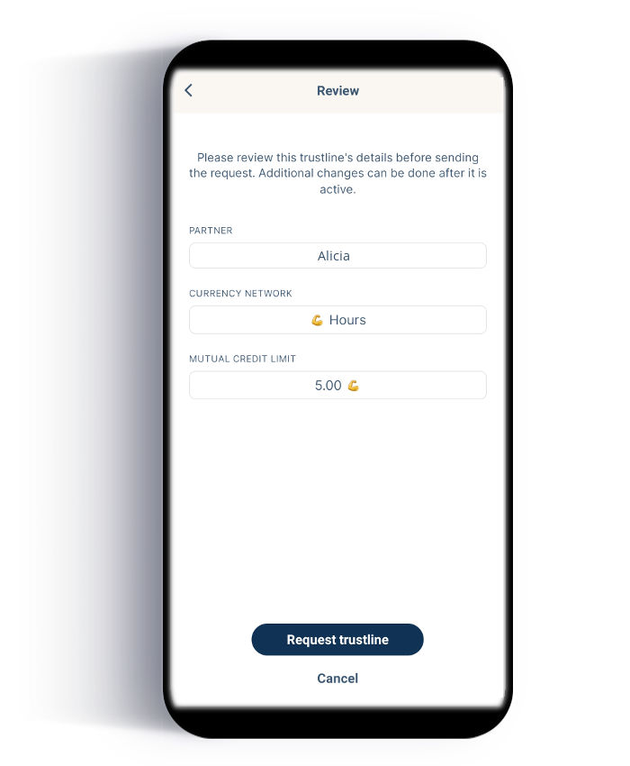

_Note: The images in this guide are for educational purposes and might not represent all the latest changes in the app_

## Getting started with the Trustlines App

You can get the Trustlines App for Android and iOS from <a href="https://trustlines.app/" target="_blank">https://trustlines.app</a>

## Introduction

In order for markets to function correctly, people need reliable access to a medium of exchange. Historically, due to how the world's banking system functions, this has been a difficult goal to reach. Even in times of abundance, a lack of access to simple financial tools can cause a breakdown in the availability of a medium of exchange (e.g., think of the many hardships associated with being "unbanked"). The problem becomes especially urgent in the face of economic recessions (which cause a scarcity of money). That is why we need a new form of money that can provide a medium of exchange that anyone can access: "People Powered Money."

## Mutual Credit

The Trustlines App is your key to using a form of money based on the idea of __mutual credit__. Mutual credit is an organic and accessible form of money that consists simply of credits and debits between two mutually trusted parties. Any two people can choose to transact with each other using the principle of mutual credit, by creating an informal two-way credit line between them, referred to as a "trustline."

If you formalize these natural, informal agreements between trusted friends on a digital database, it becomes possible to "ripple" transactions through your network of connected friends-of-friends. That's the brilliant thing about using Trustlines: it turns trusted relationships into a payments network that looks and acts like "real" money.

## Create a trustline with a friend

The first thing you must do upon downloading the Trustlines App is to create a trustline with a trusted peer. (The app is not useful without at least one trustline!)

### 1. Add a contact

To add a contact, your friend must share their account address. You should both click on the "Contacts" item in the menu bar. In the upper right-hand corner of the screen is a "plus" sign for adding new contacts. Click this.

Your friend should click "Show QR." You can scan this with your QR scanner (located in the upper right-hand corner of the screen).

If you are not physically together, your friend can also become a contact by clicking "Share link" and sending their wallet address to you via a messaging service.

You can edit your new contact's name. Make sure to label them with a name that you'll be able to recognize.

### 2. Choosing a currency network

Now you'll need to enable a currency network. Pick something you are interested in using---purely as a "unit of account." Popular currency networks are USD, EUR, Hours, and Beer. You may also want to use your local currency.

Now click on your contact's name. There will be an option to "Add trustline" for each enabled currency network (swipe left and right to find the one you want). Click the "plus" sign when you're ready to create your first trustline.

### 3. Create a trustline

To create a trustline, first one party must create a proposal, and the other must accept it.

Each trustline consists of **two credit lines**. That is why there are two numbers to fill in: the left is the amount you would **lend**, and the right is the amount you can **borrow**. ("Borrow" can be thought of as your "spend limit" with this friend.) These two amounts can be set to whatever values you and your friend agree on. There is also an option to add interest to either of these credit lines. As a reasonable default, for real friends, we suggest you set both limits to the same value and use an interest rate of zero.

Note that you are not actually lending or borrowing anything yet. You are simply agreeing on a credit limit between each other, similar to what happens when a bank issues a credit card.

It's best to **discuss this together** as you fill in the numbers. When you're ready, hit "Sign." This will send the trustline proposal to your friend to approve. After they sign it, you will both be able to send and receive payments over this trustline.

## View your global credit limit

If you return now to the Overview screen, you'll see a big number at the top, with the word "Available" underneath, and "Send" and "Receive" buttons. This number is not your balance. Instead, it is your global credit limit: the sum of all the credit available on every trustline you have opened within a particular currency network. (It is similar to a credit limit on a credit card.)

This number will go **down** whenever you make a payment using the Trustlines App because paying uses up available credit. It cannot go below zero.

But this number will go **up** when you receive payments, like if a friend pays you using a credit line that you have given to them. In other words, if a friend borrows some money from you (and thus owes you money), this amount is recorded as **additional** credit on top of your available credit.

The higher your global credit limit is, the higher your capacity to make payments in the network. If you want to raise your limit, open more trustlines with more people that you trust (or ask existing friends to raise their credit limits with you).

## Sending and receiving payments

The trustline you just created allows you to transact not just with this trusted friend, but also with all the people that your friend is connected to, and all the people their friends are connected to, etc. You can ripple payments across many chains of friends, as long as there is a high enough credit limit (enough "capacity") on each connected trustline.

To send a payment to someone you don't know yet, you can use your QR scanner to directly scan their payment request, or ask them to send their account address via a messaging service.

If it's someone you plan to transact with again in the future, you can add them as a contact too (refer to step 1). If you already have them as a contact, you can hit "Send" directly from the Overview screen. (Make sure you swipe to select the right currency network before hitting "Send.")

To send a payment to someone with whom you do not share a direct trustline, there needs to be enough capacity in the trustlines that connect you. You will be able to see whether or not the payment is possible when you fill out the details. There is a small text below the payment amount that will say "Max: ____." The payment will fail if it exceeds this max amount.

## Checking balances with friends

If you click on a contact's name, you will be able to view all the trustlines you have with them. Swipe left and right to view different currency networks. Each trustline will prominently display the available credit at the top. Below this are three numbers: "Lend up to," "Borrow up to," and "Balance."

The lend and borrow amounts correspond to the two credit lines you and your friend agreed on when you first opened the trustline.

Your balance indicates the amount "owed". If it is negative, this is the amount you owe your friend. If it is positive, this is the amount your friend owes to you. You should only need this information if you decide to settle your balance and close your trustline.

## Bill splitting

A good way to get started with using the Trustlines App is to use it for sending payments to your friends when splitting the bill at restaurants or for similar group activities. If you go out with your friends often, these payments will go back and forth for a long time, so Trustlines is a nice way to keep track of these little debts without anyone having to handle cash.

Here's how it could work: The person who pays the restaurant bill creates a general payment request for 10 euros. **Each friend** who owes her that portion of money can scan this QR code, and send her the suggested payment, using their available credit on Trustlines.

## Feedback is welcome!

This is a newly released app. We are very interested in hearing about your experiences, anything you had trouble with, and any feedback you might have.

The [Trustlines Forum](https://forum.trustlines.network/) has sections for [Support](https://forum.trustlines.network/c/trustlines-app/app-support/16) as well as for [Feedback](https://forum.trustlines.network/c/trustlines-app/app-feedback/17) regarding the [Trustlines App](https://forum.trustlines.network/c/trustlines-app/15), come tell us what you think!

____

_This content is created by Auxiliary GmbH and is provided as educational material for Trustlines App users._
