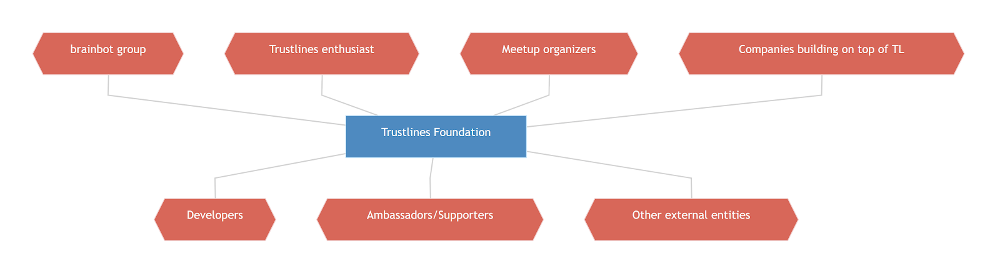
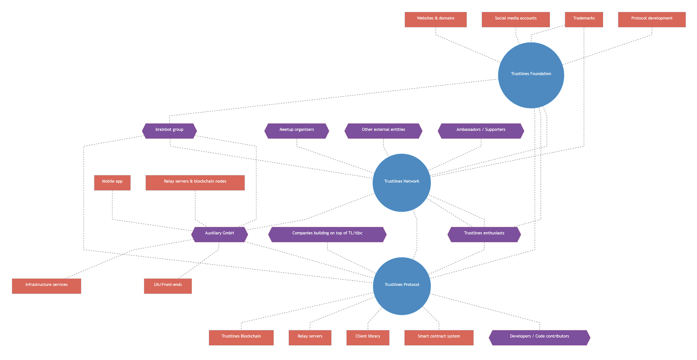

General information
--------------------------------------------------------------------------------------------------------------------------------

### Background

The Trustlines Stiftung (Foundation) was set up to support the protocol development for the Trustlines Network. Since there has been in the past and will probably continue to be efforts relating to the Trustlines Network outside of the Foundation, there might be confusion about naming and communication in general. This document aims at providing general guidelines for anyone involved in the Trustlines Network, be that as part of work for the community, open-source developers and other interested parties.

### The Trustlines Network

The Trustlines Network ecosystem describes the ecosystem of individuals, projects, and entities aligned toward the idea of mapping trust-based relationships on to trustless infrastructure. Sometimes this is also simply referred to as the Trustlines Network. No single entity owns, is, or can be, in charge of this construct.

### The Trustlines Protocol

The Trustlines Protocol represents a set of rules, processes, and definitions forged into deployable code, which aims to enable the mapping of trust-based relationships on to trustless infrastructure, e.g. a blockchain.

More specifically, the Trustlines Protocol implementation will include the components used to calculate paths and store transactions:

-   The Trustlines Blockchain, which is a mPoS (minimal viable Proof of Stake) sidechain to Ethereum and stores transactions 

-   The relay servers, which calculate the optimal paths and relay the transactions sent by applications they are connected to

-   The client library, a high-level API, which enables applications to interact with the smart contract system on the Trustlines Blockchain via the relay servers

-   The smart contract system which includes the currency networks and other smart contacts supporting currency network related transactions, e.g. identity contract(s)

### Trustlines Access

Trustlines Access describes the technology stack that enables convenient access to use the Trustlines Protocol implementation. This can comprise of end-user facing apps and the operation of the relay servers.

Entities are supposed to run business models under this brand. If they do, they need to license the trademark "Trustlines" from the Trustlines Foundation.

### Entities

#### Trustlines Stiftung/Foundation

The mission of the Trustlines Foundation is to pursue the charitable goal of promoting the financial and economic inclusion of all people through decentralized peer-to-peer network protocols that serve common accounting.

The Trustlines Foundation is supporting research, development, deployment, governance, and adoption of the Trustlines Protocol, with a focus on acting in a supporting role within the Trustlines Network enabling different decentralized p2p use cases.

The Foundation is/does:

-   Supporting (financially and in-kind) research, development, and governance of the Trustlines Protocol while being unbiased about specific use cases

-   Support the adoption of the Trustlines Protocol even in specific use cases to the extent that these do not conflict with its charitable purpose

-   To that end, it's specifically organizing and promoting open-source development around the Trustlines Protocol and maintaining respective Github repositories

-   Incentivising and supporting developers or other entities that want to build on top of the Trustlines Protocol

-   For example, for the use case, people powered money: community currency projects

-   The foundation does this in a purely educational, nonprofit way

-   In charge of maintaining the "Trustlines" and "Trustlines Network" names/trademarks and related domains

-   Deploy needed core components, e.g. smart contracts, which support the Trustlines Protocol

-   Has ownership over the Trustlines brand and trademark

The Foundation isn't/doesn't:

-   Own the Trustlines Network ecosystem, it only owns the trademarks!

-   Own the Trustlines Protocol related code; everything is open-source licensed

-   Targeting or providing access to end-users

-   Related to brainbot group or its subsidiaries

#### Brainbot Technologies

brainbot technologies AG is a software development company operating in the blockchain space, focusing on core blockchain technology. It offers its services to third parties outside of, and inside, the brainbot group. In the context of Trustlines, brainbot technologies conducted a feasibility study for an early internal testing version of the Trustlines Network protocol and a mobile app that lets its users interact with the Trustlines Protocol. The mobile app is being developed by Auxiliary GmbH. Also, brainbot is continuing to contribute to the open-source software of the Trustlines Foundation.

#### Auxiliary GmbH

Auxiliary GmbH is a new entity under the brainbot group umbrella. It aims to provide infrastructure services and develop, as well as potentially operate, components that provide access to decentralized networks. Examples for this:

-   UI/Front-ends/Apps to interact with blockchain data, e.g. the mobile application

-   Relay servers to facilitate easier access to blockchain data

-   Blockchain nodes

In the Trustlines Network ecosystem context, Auxiliary aims to develop and deploy an app and potentially other components providing access to the Trustlines Network, most probably within the German regulatory framework.

<a href="../../assets/images/external_comms_guide_map_extended.png">

Resources
------------------------------------------------------------------------------------------------------------

These resources should help you dive deeper into the world of Trustlines. There are also items to help you with presenting Trustlines to an audience and images to use concerning Trustlines.

The official brand names in the Trustlines ecosystem follow a specified pattern of capitalization. These would be the trademarked names as well as other related brand names. The brand names are capitalized when used in a context in relation to the brand being used. When referring to the general technology or other aspects that aren't in direct connection being used regarding the brand, the words aren't capitalized.

Examples of capitalizing brand names would be Trustlines Network, Trustlines Protocol, and Trustlines Blockchain. So if you are generally referring to the blockchain or the associated technology, capitalization isn't used. Or when referring to a protocol other than the Trustlines Protocol. And a networking event about the Trustlines Network would have a lowercase network used.

##### [TRUSTLINES PROTOCOL 101](https://trustlines.foundation/trustlines-101.html)

##### [TRUSTLINES FAQ](https://trustlines.foundation/faq.html)

##### BRAND GUIDELINES

##### IMAGE RESOURCES, LOGOS ETC.

##### PRESENTATION TEMPLATE

Arranging a Meetup
------------------------------------------------------------------------------------------------------------------------------

Hey, you're interested in organizing a meetup presenting Trustlines, great!

Here you can find more information on how the community and contributors can help you succeed in creating an amazing event.

You can find a 

Promoting Trustlines
----------------------------------------------------------------------------------------------------------------------------------

Use cases of the Trustlines Protocol
------------------------------------------------------------------------------------------------------------------------------------------------------------------

When communicating about Trustlines a clear distinction must be made between the protocol and the potential use cases. The protocol is technical and, as is the Foundation, impartial towards all potential use cases. 

One of the use cases that is , established and well developed is the people powered money use case.

### People Powered Money (PPM)

The Trustlines Network supports the creation of blockchain-based peer-to-peer currency networks. In dense societal networks and due to the transitive nature of financial relationships, one could imagine a plethora of financial use cases that utilize these networks. Leading among them would be the ability to engage in economic transactions that could be viewed as a substitute for general payments of all kinds. This twist, i.e. the transition from a credit registry towards a system that could be used to facilitate payment-like transactions, is comparable to the principles of LETS-systems or, for example, the unofficial financial network "Hawala".

Link to the [People Powered Money vision blog post](https://medium.com/trustlines-protocol/people-powered-money-on-the-trustlines-protocol-ed411a86cc35).

### Others

A plethora of other use cases is being discussed by the community, such as financing of SMEs, non-financial use cases, or even using Trustlines as an "operating system" for a more traditional banking system.

Trademarks and licensing
------------------------------------------------------------------------------------------------------------------------------------------

"Trustlines" and "Trustlines Network" are registered trademarks that are owned by the Trustlines Foundation. The purpose of the registration is to protect the usage of the terms "Trustlines" and "Trustlines Network" from inappropriate or malicious use. Soon, guidelines will be made publically available on how a party may use the "Trustlines" and "Trustlines Network" trademarks.

Official communication Channels
--------------------------------------------------------------------------------------------------------------------------------------------------------

**Websites**

<https://trustlines.network/>

<https://trustlines.foundation/>

**Trustlines Foundation Twitter**

<https://twitter.com/TrustlinesFound>

<https://twitter.com/tl_validator>

**Trustlines Foundation Medium Blog**

<https://medium.com/trustlines-foundation>

**Trustlines Subreddit**

<https://www.reddit.com/r/trustlines>

**Trustlines Protocol Reddit account**

<https://www.reddit.com/user/TrustlinesProtocol/>

**Trustlines Network Community (unofficial) Telegram**

<https://t.me/trustlines_network>

**Trustlines Technical Chat on Gitter**

<https://gitter.im/trustlines/community>

**Trustlines YouTube channel**

<https://www.youtube.com/channel/UCdNvItQZDL8Qj0HJGIM_AYA>
