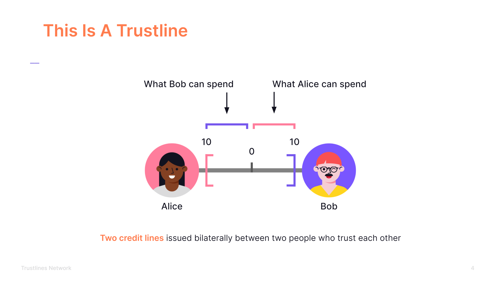
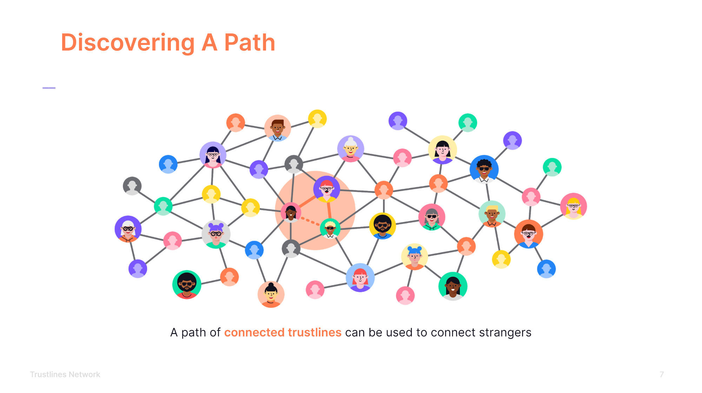
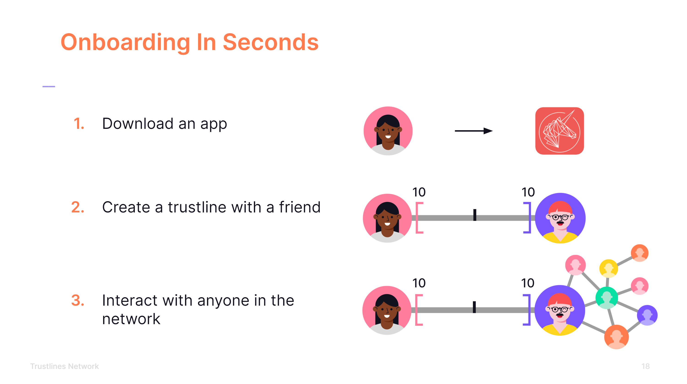
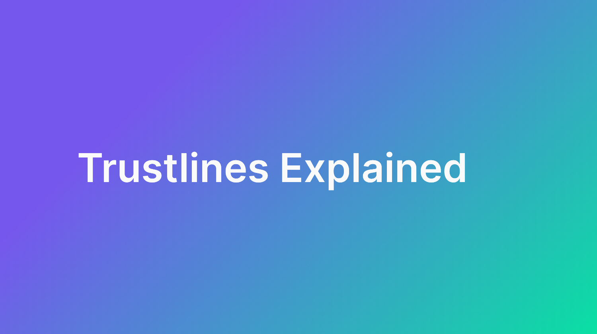
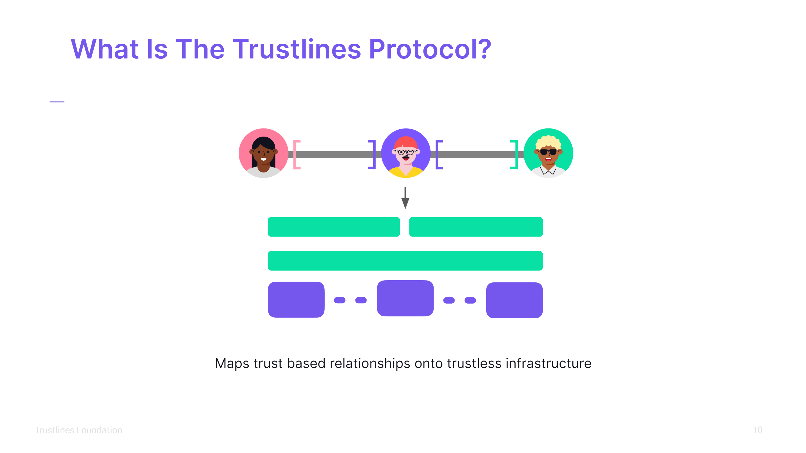
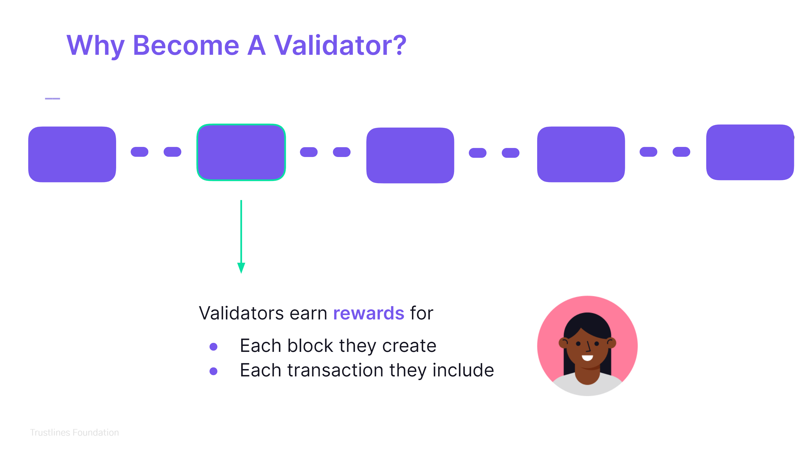
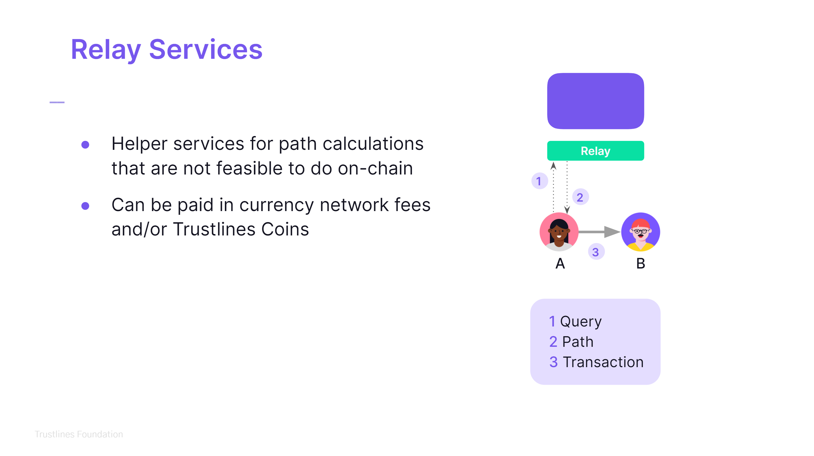

This page contains presentation slides available for anyone to use who would like to do a presentation about Trustlines and its different aspects.

## People Powered Money

A presentation slide deck about People Powered Money.

[Download TL_StandardPresentation_PPM_16_9_V3.pdf](TL_StandardPresentation_PPM_16_9_V3.pdf)

	

		

	

  

		

	

  

    

  

  

    

  

## Trustlines Protocol

A presentation slide deck about the Trustlines Protocol.

[Download TL_StandardPresentation_Protocol_16_9_V3.pdf](TL_StandardPresentation_Protocol_16_9_V3.pdf)

	

		

	

  

		

	

  

    

  

  

    

  

___

<a href="../../use_cases/bill_splitting/bill_splitting_on_trustlines" class="prev_next_text">Previous</a>

 

<a href="../../use_cases/bill_splitting/bill_splitting_on_trustlines" class="prev_next_text">Bill splitting on Trustlines</a>

<a href="../../guides/tl_app_user_guide" class="prev_next_text">Next</a>

 

<a href="../../guides/tl_app_user_guide" class="prev_next_text">User guide for Trustlines App</a>

