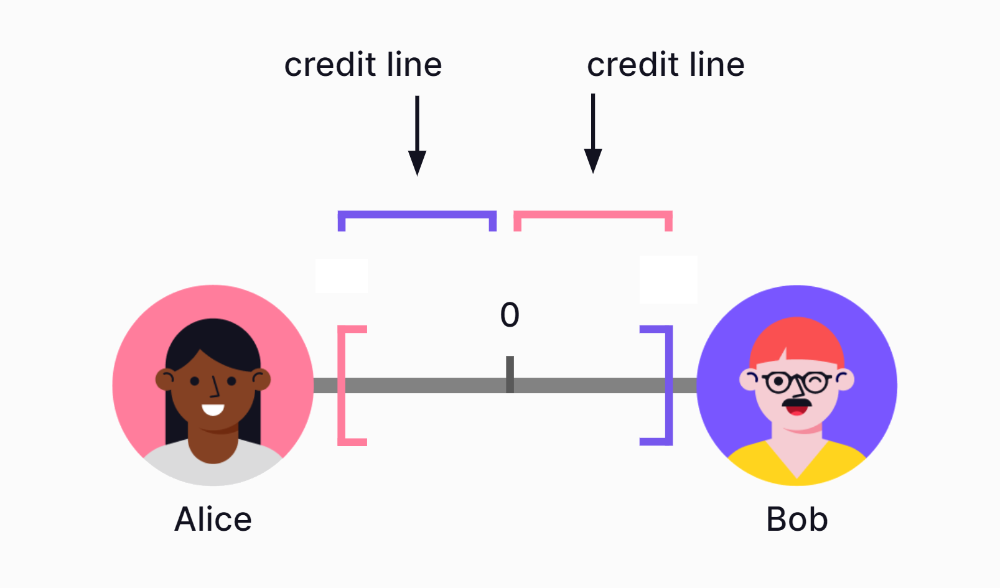
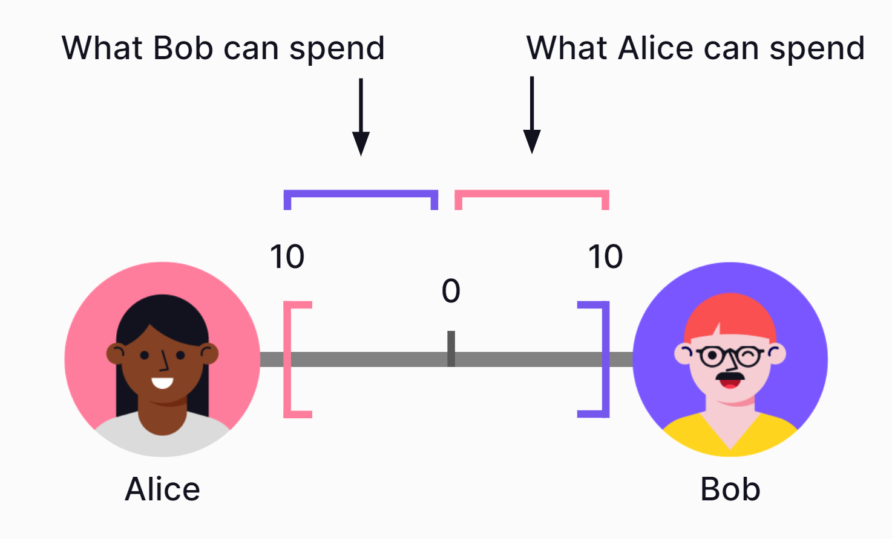
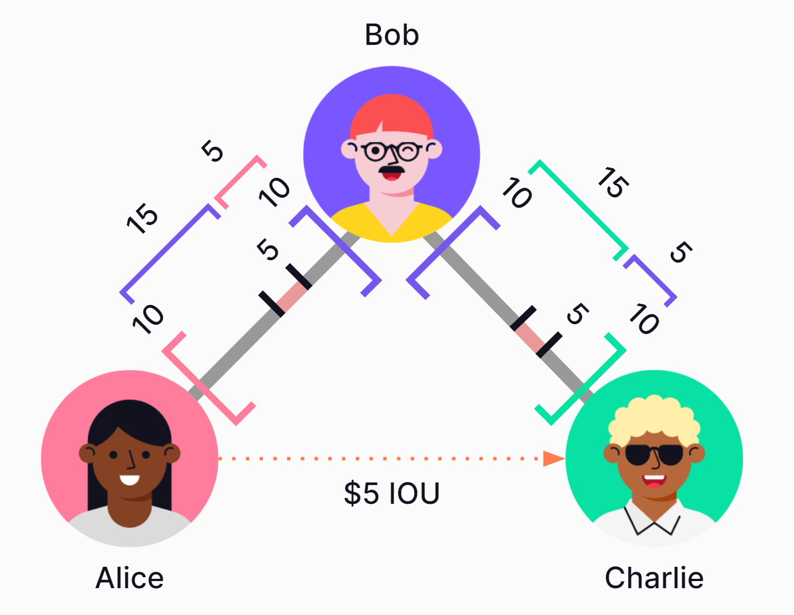
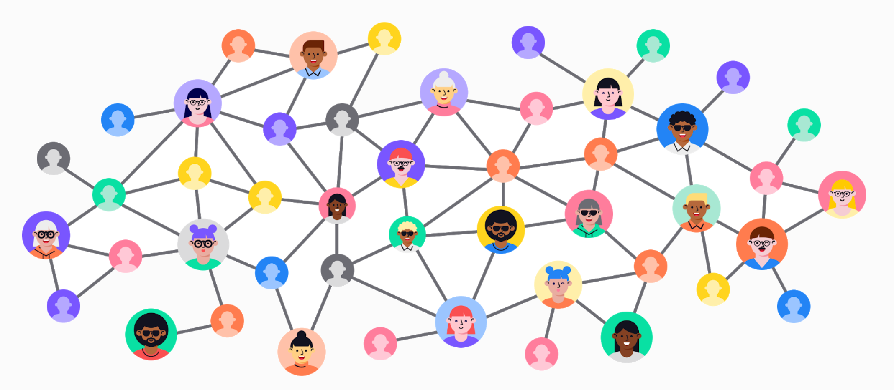
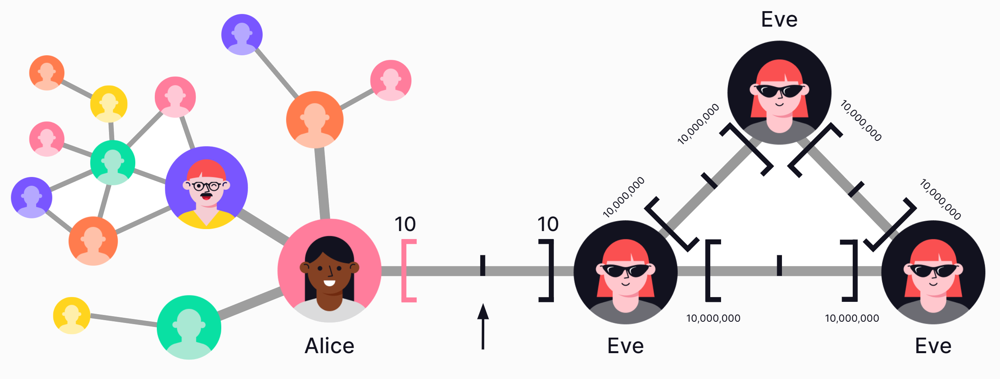

## Table of Contents

#### 1. [Overview](#1-overview-1)

#### 2. [Core idea](#2-core-idea-1)

#### 3. [Protocol design choices](#3-protocol-design-choices-1)

#### 4. [Trustlines Protocol technology stack](#4-trustlines-protocol-technology-stack-1)

#### 5. [Cryptoeconomics of the Trustlines Protocol](#5-cryptoeconomics-of-the-trustlines-protocol-1)

___

## 1. Overview

The Trustlines Protocol is an open-source technology stack that provides a highly accessible medium of exchange. Its core idea is to provide an accounting system based on peer-to-peer credit. This is a highly accessible financial tool since any two people who trust each other can decide to open a credit line at any time, without typical restrictions like needing a bank account or identity documents. Credit is a powerful medium of exchange: Even if someone does not have access to national currency ([fiat money](https://www.investopedia.com/terms/f/fiatmoney.asp#:~:text=Fiat%20money%20is%20government%2Dissued,the%20government%20that%20issued%20it.)), the credit created on Trustlines Protocol could be used in its place.

When designing for financial inclusion, it is important to use accessible, decentralized technology. That is the goal of public blockchain technology: It can provide a permissionless and censorship-resistant platform. This is why Trustlines Protocol was designed to be implemented on a blockchain.

There are many faults with the modern monetary system, in which the majority of money is created as debt by commercial banks. There are also weaknesses to using cryptocurrencies, which remain structurally inaccessible for most people. These can be mitigated by switching to a decentralized, credit-based monetary system, as is possible with the Trustlines Protocol.

The combination of an accessible medium of exchange and decentralized infrastructure is what makes Trustlines the starting point for a truly decentralized monetary system.

## 2. Core idea

### 2.1 How to pay with debt

The term IOU ( an abbreviation for "I owe you") acknowledges that the issuing party has a debt towards the receiving party. Suppose Alice wants to buy something from Bob but cannot pay with cash or a bank transfer. Instead, she will acknowledge a debt towards him by issuing an IOU. Since Alice receives the goods and Bob receives an IOU, this transfer of debt is as good as a cash payment or bank transfer. But rather than having a claim towards his bank he now has a claim towards his trusted friend, Alice.

IOUs can also be referred to as self-issued debt.  They can be used for payment as long as users accept it.

### 2.2 What is a trustline?

A trustline is a bilateral credit relationship between two partners. Every trustline consists of two corresponding credit lines (each partner giving one to the other partner) as well as a balance that indicates if and how much credit one partner has drawn from the other.

A trustline can represent different kinds of credit relationships, like a contract with or without collateral that is legally binding, or simply an agreement between friends. This makes a trustline a formal representation of a real world agreement between two entities that are willing to lend value to each other. This trustline enables Alice to make credit-based payments to Bob, and vice versa.

### 2.3 Credit lines

A credit line is a preset borrowing limit (credit limit) that can be used at any time and represents the highest amount that can be borrowed.

In this example, Alice and Bob each give a credit line with a credit limit of ten. Ten is the maximum amount each of them would be able to borrow from the other.

### 2.4 Multi-hop payment

Even when two users do not have a trustline, they can still transfer value, as long as there is a path of trustlines connecting them. In a multi-hop payment, each user along the path of connected trustlines automatically sends credit to the next, until the last user receives credit. This process can also be referred to as rippling a payment. The net value transfer is always exclusively between the sender and receiver without the intermediaries needing to take any action.

For example, Alice wants to pay Charlie using credit. Because Charlie does not share a trustline with Alice, she cannot directly pay him with credit. Luckily, Bob is a mutual friend! This means Alice can pay Charlie by "rippling" credit through Bob.

Before the transfer, Bob's balance with Alice was zero. Bob's balance with Charlie was also zero. During the transfer, Bob's balance with Alice increased to "plus five," while his balance with Charlie decreased to "minus five." However, Bob's net balance remains unchanged at zero (-5+5=0). Because Bob is only an intermediary, this transaction happens automatically without Bob needing to take any action.

### 2.5 The network effect

People that are not connected through a Trustline can make multi-hop payments via any path of connected trustlines. 

Leveraging the network effect, users only need a small amount of trustlines to transact with a large number of people. This is clearer in the context of the [six degrees of separation](https://en.wikipedia.org/wiki/Six_degrees_of_separation) concept.

The greater effect is that the rippled credit can be used as a medium of exchange in small, dense, circular economies. However, because it would naturally connect these small economies, it may equally serve as a medium of exchange for a global economy. Trustlines could turn existing trusted relationships into liquid payment networks that look and act like regular money.

### 2.6 Fault tolerance

So, why not create fake accounts with "fake credit" to use in the network? This can't actually do much damage because the system relies on individual, trusted relationships. This is important to consider for designing scalable systems.

For example, Eve created duplicate accounts to give herself millions in fake credit. But Eve's spending limit with the network is determined by the credit limit her friends have given her. In this example, Alice has given Eve a credit limit of ten. Because she knows Eve in real life and opening a Trustline needs the approval of both parties involved, Alice isn't going to create additional trustlines with the duplicate Eve accounts. Nor is she going to accept millions in credit from the real Eve.

The system is naturally fault-tolerant because each trustline is bilateral. In other words, a trustline can affect only the two users who created it. Even if Eve manages to fool Alice, it will not affect the rest of the network.

### 2.7 Real-world enforcement of credit claims

Because [social norms affect informal enforceability](https://academic.oup.com/restud/article-abstract/59/1/63/1516727), all users do have tangible social incentives to respect their obligations---whether or not there exists an external contract or collateral. Defaulting would have a negative impact on the user's social relationship with their trustline partner. It could also affect a user's reputation with the rest of the community.

In case of a user not being able to pay back the obligation, there's also always the option to forgive the debt or settle in other ways than first anticipated. Payment from the creditor to the debtor would reflect this.

As long as all trustlines and transactions are notarized on secure, auditable infrastructure, there can be a tamper-proof record of all credit agreements and their balances. This reduces the possibility of disputes.

### 2.8 Interoperable credit systems

Although the system is naturally decentralized, it is possible to create layers of centralized systems on top of it. This is possible by creating organization accounts that create trustlines with their members based on accepted community rules. Creating such configurations of trustline relationships can serve the greater effect of "socializing" the risk of default within a defined group.

The advantage to creating centralized systems using Trustlines is that these organizations would be inherently interoperable with other organizations, as well as with individuals, as long as all entities are connected in the network. A trustline can also be used to directly connect two organization accounts, which would connect groups using centralized methods. But because the network is based on individual trusted relationships, they do not need to do so in order to connect. Disparate communities using Trustlines will remain connected at the edges, wherever they are naturally interconnected by individual friends and families.

This variety of possible credit configurations on Trustlines provide the flexibility to realistically represent real trust relationships in existing economies, and thus also naturally represent the boundaries between different communities. This is because natural economic borders would emerge between communities where there are fewer trusted relationships.

## 3. Protocol design choices

### 3.1 Multiple currency networks

The Trustlines Protocol was designed to be an open protocol on which several different denominations of trustlines coexist. Each denomination in which trustlines can be created is called a currency network. When a user creates a trustline, as long as there is enough capacity, anyone connected through a path can use it to facilitate multi-hop payments within the currency network. Users can participate in multiple currency networks.

The purpose of having several different currency networks is to let communities use the currency design that best fits their needs. For example, users can pick currency networks according to their preferred denomination (the unit of account for recording transactions). Users can also opt-in to currency networks according to other parameters. For example, currency networks may enable or disable the ability to add interest. In future it will also be  possible for users to convert or exchange between different currency networks.

By default, currency networks are shared platforms, not controlled by a single party. Diverse communities are interoperable when they use the same currency network. There are[ 47 currency networks](https://dev.trustlines.network/docs/contracts/currency_networks_tlbc.html) currently deployed on the Trustlines Blockchain which can be accessed through the [Trustlines App](https://trustlines.app/), each defined by different parameters.

### 3.2 Open-source

Trustlines Protocol was conceived as an open-source technology stack to encourage open collaboration, innovation, and transparency. When creating technology that is to be used as a public good, it is important to safeguard the intellectual property in this way, to ensure accessibility and to prevent it being used in an exploitative way.

### 3.3 Application ready

Because accessibility is the goal, Trustlines was designed to be readily accessible from an application. For this we provide a set of tools (e.g. client library) that lets developers build their applications on top of the Trustlines Protocol. A reference implementation of such an application is the [Trustlines App](https://trustlines.app/). It provides a first look at how mobile devices can serve as a gateway to this alternative financial system. 

### 3.4 Censorship resistance through blockchain technology

The Trustlines Protocol was designed to include an [EVM-based](https://medium.com/mycrypto/the-ethereum-virtual-machine-how-does-it-work-9abac2b7c9e) blockchain, which is decentralized peer-to-peer technology. A blockchain is often referred to as "trustless" infrastructure which provides tamper-proof accounting, censorship-resistance, and relies on a decentralized governance of the system.

Censorship-resistant public blockchains are designed with the goal that no hacker entity, corporation, or state can tamper with transactions, freeze accounts, or shut down the blockchain.

They achieve this property because:

-   the protocol and data is stored in a distributed way 

-   transactions are processed according to autonomous code

-   pseudo-anonymous entities verify transactions

This type of infrastructure is particularly important in parts of the world where stable, secure money can be difficult or dangerous to access.

### 3.5 Delegate service

Cryptocurrencies are inconvenient and many times inaccessible for most people. In addition, a cryptocurrency must normally be purchased with national currency in order to interact with a blockchain. Because accessibility is the goal, Trustlines was designed to avoid placing such excessive burdens on the end user. However, since Trustlines is designed to be implemented on a public blockchain, making transactions requires the use of a native cryptocurrency to pay transaction fees. Acquiring this cryptocurrency to pay these fees would place a heavy burden on the end user.

Instead, Trustlines delegates offer a service to pay transaction fees on behalf of end users. They may offer this for free in support of the community, or allow users to reimburse them using credit within an accepted Trustlines currency network. This can be useful for many different entities: Community groups that want to enable local economic activity, businesses that want to pay for the transactions of their customers, or simply third parties that want to encourage users to use Trustlines without them needing to deal with transaction costs.

## 4. Trustlines Protocol technology stack

The full Trustlines Protocol technology stack is composed of four main components. These components are each a part of the Trustlines Protocol.

1.  The Trustlines Blockchain, aka TLBC. A minimal viable Proof-of-Stake (mPoS) Ethereum sidechain. It stores and processes transactions.

2.  The relay servers. They are a bridge between applications and the blockchain. They offer services that are not feasible to implement on-chain or on devices on which applications run. Most notably, they do the pathfinding for multi-hop payments and include the delegate service.

3.  The smart contract system. Implements all transaction logic and business logic necessary for the currency networks. It is deployed on the Trustlines Blockchain.

4.  The client library. A high-level API which enables applications to interact with the smart contract system on the blockchain via the relay servers.

### 4.1 Trustlines Blockchain

The Trustlines Blockchain, aka TLBC, is a minimal viable Proof-of-Stake (mPoS) Ethereum sidechain.

Pseudo-anonymous validators run TLBC to ensure censorship-resistance. TLBC can adapt to changes required to ensure scalability, low transaction costs, and censorship-resistance. Its aim is to fulfill the following predefined requirements:

-   Censorship-resistant

-   Has the capacity to process up to 10 million trustline transfers per day

-   Single transaction cost is less than €0.01

-   Features the EVM (Ethereum Virtual Machine) which allows the operation of smart contracts

The Trustlines Blockchain went live on November 21st 2019. You can read more about the launch in the [Launching the Trustlines Blockchain blog post](https://blog.trustlines.network/t-x-launching-the-trustlines-blockchain/). There is also a Blockchain Explorer for TLBC: <https://explore.tlbc.trustlines.foundation/>.

TLBC is based on [Parity's Aura consensus algorithm](https://wiki.parity.io/Aura). Aura (known from Kovan, xDAI, and others) is usually used in Proof-of-Authority chains. For our purposes of making it suitable for mPoS, we rely on the following additional features:

-   Staking and slashing mechanisms to combat equivocation

-   Hard-forking as an extra defense mechanism

#### 4.1.1 Aura description

Aura uses a predefined set of public authorities that fill in as validators. These authorities get assigned time slots in a [round-robin](https://en.wikipedia.org/wiki/Round-robin_scheduling) fashion. They then produce a block that increases the blockchain length. Block finality is reached if more than 50% of validators build on top of the produced block. This relies on an honest and online majority assumption, as well as an asynchronous network.

#### 4.1.2 mPoS (minimal viable Proof of Stake)

In contrast to Proof-of-Authority blockchains, in the mPoS system, validators are pseudo-anonymous. Introducing pseudo-anonymous validators creates the need to ensure that no entity can get 51% of the voting power. Popular Proof of Stake chains with pseudo-anonymous validators, like Ethereum 2.0, can achieve this because it would be prohibitively expensive to buy 51% of the voting power. A new and unknown blockchain, such as the Trustlines Blockchain, cannot prevent a [51% attack](https://academy.binance.com/en/articles/what-is-a-51-percent-attack) the same way.

To prevent this kind of attack, mPoS is designed to place additional restrictions on validators. These [validators](https://blog.trustlines.network/trustlines-validator-spotlight-deep-dive-on-rewards-economics-and-opportunities-for-validators/) are defined through a [validator auction](https://blog.trustlines.network/summary-and-results-of-the-second-trustlines-validator-auction/). The participants of the auction need to be part of a whitelisted, Sybil-resistant set of candidates. Bids are made using Trustlines Network Token (TLN). At the end of the auction, TLN from winning bids are staked on the Ethereum blockchain for nine months.

It is important that validators stake some amount of TLN, to prevent certain attacks. If validators misbehave, their stake can get "slashed." In other words, the validator's TLN deposit can be automatically rendered inaccessible. Under mPoS, staking and slashing features prevent validator equivocation. This is an attack in which a validator uses their private key to sign two or more different blocks with the same step number, irrespective of the block's height, validity, or other fields. Adding the mPoS features creates a consensus algorithm with sufficient safety measures for TLBC.

#### 4.1.3 Hard-forking as an additional security option

Pseudo-anonymous validators and mPoS features cannot ensure security from all attacks and threats. Such attacks and threats would include, but would not be limited to, inactive validators, reorganization of blocks by collusion, withholding blocks, building empty blocks, censoring transactions, or filling blocks with unusable information. Thus, as an additional defense mechanism, TLBC is intended to hard-fork to address these security risks and threats.

Hard-forks are a simple, yet powerful way to remove misbehaving validators. They can also prevent other attack scenarios without slashing deposits of the validators. Since we expect a well-aligned community, we assume that coordination efforts around this will be manageable. Hard-forks should thus become reasonably easy to execute. Distribution of agreed-upon updates resulting in hard-forks can occur via updates and/or via a configuration file. The configuration file would be available at the [Trustlines Protocol GitHub](http://github.com/trustlines-protocol/) organization. The validators can then add the changed configuration into their clients/nodes.

### 4.2 Relay servers

The relay servers act as a bridge between client applications and the Trustlines Blockchain. They offer services that aren't feasible to implement on-chain, or within the client applications or the devices they run on.

Relay servers establish the main features needed to connect the users to the smart contract system:

-   Forwarding users signed transactions from an application to the Trustlines Blockchain.

-   Indexing and storing event information.

-   Discovering a path between a sender and a receiver in the graph of trustlines by using [Dijkstra's Algorithm](https://en.wikipedia.org/wiki/Dijkstra%27s_algorithm). Taking into consideration the shortest path in the number of hops.

-   Users do not need to trust relay servers with their accounts (private keys). Transactions are signed locally on the device. The signed transactions are then processed on the Trustlines Blockchain. 

-   The relay servers have the option to enable the delegation service which allows the operator to pay for connected users transaction costs.

Using an existing relay server to send transactions to the Trustlines Blockchain is optional. It is possible for end users to calculate and specify their own paths or even use their own relay servers. In theory, the system could work without relay servers at all. However, this would significantly degrade the user experience. The pathfinding algorithm depends on knowing all available trustlines and a graph of the network. Doing pathfinding without a relay server would require the mobile app to sync the state of TLBC directly. Whenever this would take place, potentially millions of trustlines would need to be fetched from the blockchain. This would introduce significant latency and be a burden on the device the application is installed. It would lead to very intensive use of bandwidth, RAM.

### 4.3 Smart contract system

The smart contract system is a collection of smart contracts deployed on TLBC. The smart contracts execute transfers within the Trustlines Protocol. All trustlines (i.e., credit lines and balances) are notarized on TLBC. The smart contracts also enforce the rules determining how trustlines can be created, used, and updated.

The smart contract system is at the core of the Trustlines Protocol. It implements a secure, tamper-proof, decentralized, permissionless environment to host currency networks.

#### 4.3.1 Currency networks

The currency networks are the foundation of Trustlines. This is why they are implemented on-chain. These are the core smart contracts that end users interact with.

The contracts record all properties a currency network has. This includes the symbol, the name, and the fee structure of the currency network. Trustlines are modeled as "accounts" within the currency networks. Included is also the account information: the users, their blockchain addresses, balances, and trustlines.

Currency networks can be customized in various ways in addition to using different denominations (units of account). For example, they can be designed to restrict access, impose limits on interest rates. A currency network creator can specify conditions such as

-   the maximum number of trustlines that a user can have

-   the maximum value that a trustline can have

-   whether interest can be added

-   whether joining the network is open or permissioned

#### 4.3.2 Identity contracts

The identity contracts enable the delegate service, which allows end users to avoid paying their transaction costs with Trustlines Network Coins (TLC). This is a service offered by an entity that wishes to pay for the transactions of others, either for free or in exchange for credit within the given currency network. This feature can be useful for many different entities. For example, it may be community groups that want to enable local economic activity, businesses that want to pay for the transactions of their customers, or simply third parties that want to encourage users to use Trustlines without transaction costs.

First, the user signs a message providing information about the trustlines transfer to be executed. The delegate then forwards a transaction containing this message and signature to an identity contract on the TLBC. By doing so, the delegate service pays for the transaction fees. The identity contract can then verify the signature provided by the user and execute its transfer concealed in the message. We use identity contracts as specified in [Ethereum Improvement Proposals 1077](https://github.com/ethereum/EIPs/blob/master/EIPS/eip-1077.md) to implement delegates.

### 4.4 The client library

The client library is a Javascript library that makes it easy to build applications on top of the Trustlines Protocol. It encapsulates application client functionalities in a ready-to-use way. It provides a high-level API enabling applications to interact with the smart contract system on TLBC via a relay server.

## 5. Cryptoeconomics of the Trustlines Protocol

### 5.1 Tokens

There are two different tokens used in connection with Trustlines:

-   The Trustlines Network Token (TLN) is an ERC-20 token on the [Ethereum](https://ethereum.org/) mainchain. Since this is a popular token standard, TLN is highly versatile, easily transferable, and generally very accessible for the Ethereum community.

-   TLN is currently required for staking in the validator auctions for the Trustlines Blockchain.

-   Trustlines Network Tokens (TLN) are distributed via a Merkle drop to a wide range of recipients. You can find more information about this in the [Merkle drop launch](https://trustlines.foundation/merkle-drop.html) blog post. The Trustlines Foundation will also consider other distribution models in the future.

-   TLN can be converted into TLC via a bridge. No bridge exists for TLC to TLN conversion.

-   The Trustlines Network Coin (TLC) is the native token of the Trustlines Blockchain, which means it is useful for people who are using the Trustlines Protocol in their everyday lives.

-   Any user wanting to pay their own transaction fees must obtain TLC. TLC can be purchased directly, or instead users can buy TLN and convert it to TLC.

-   Typically, it is the relay server operators that enable delegate services who use the most TLC.

### 5.2 Fees

There are different fees necessary for the system to function correctly. Transaction fees are payable in TLC. All other fees are payable using credit within each currency network. End users do not need to hold TLC in order to pay any fees.

#### 5.2.1 Trustlines Blockchain transaction fee (aka gas)

This fee is payable in TLC and is required to pay for the "gas" used when the system processes any transaction, like for sending payments, as well as for creating new accounts or updating trustlines. The fee goes to the Trustlines validators. This fee is the predominant one and is typically paid by relay server operators. End users are not required to pay this fee directly (although they may do so if they wish). Instead, the typical end user will pay a delegate fee.

#### 5.2.2 Delegate fee

This fee is paid by the end user, who will pay this instead of paying the transaction fee directly. The delegate fee is payable in credit within a currency network, which makes it a better option for users who do not hold any TLC. The fee reimburses delegates for paying transaction costs on behalf of the end user.

#### 5.2.3 Imbalance fee

This is a fee that is paid to the mediators of a transfer. It can be paid by either the sender or receiver of a multi-hop payment. The fee is only applied if a multi-hop payment results in increased balances, rather than decreased balances. The purpose of this fee is to incentivize users to provide enough capacity for multi-hop payments, and to disincentivize users or relay operators from using payment paths that increase the imbalance of the network.

### 5.3 Interest

In some currency networks, users may earn or pay interest on their credit if there is an imbalance (e.g., the other party owes them money) in a trustline. The accrued interest is calculated continuously. Currency networks can either have a network-wide interest rate, user-defined interest rates, or prohibit interest entirely. Network-wide interest rates result in every trustline having the same predefined interest rate (either negative or positive) applied to them. Within currency networks that have user-defined interest rates, each user has the option to set a custom interest rate on each of their individual credit lines. Both trustline partners must consent to the requested interest rates. Interest will continue to accrue as long as the trustline is open and has an imbalance. Note that interest can continue to accrue beyond a user's credit limit, and the total balance must be settled in order to close the trustline.

### 5.4 Validators on the Trustlines Blockchain

A Trustlines validator is a person or entity that has won the validator auction and is part of the active validator set of the Trustlines Blockchain. The number of validators and validator slots may increase or decrease in the future according to what the Trustlines community decides. The validators have the responsibility of ensuring the security of the Trustlines Blockchain by validating transactions and adding blocks to the existing blockchain. They earn Trustlines Network Coins (TLC) from transaction fees and block rewards in this process. Additionally, Trustlines validators monitor the Trustlines bridge to ensure a Trustlines Network Token (TLN) to TLC transfer and decide on blockchain forks and resulting protocol changes with the rest of the Trustlines ecosystem. To ensure that each Trustlines validator is able to fulfill their role, we suggest that a Trustlines validator should meet the following criteria:

-   Be able to run a Trustlines Blockchain node without a dedicated UI (some technical knowledge required)

-   Have the necessary financial means to take part in the validator auction

-   Understand the operational and legal risks associated with this activity

-   Understand the responsibilities of being a Trustlines validator

#### 5.4.1 Validator incentives

The validators have the responsibility of ensuring the security of the Trustlines Blockchain by validating transactions and adding blocks to the blockchain. They earn TLC from transactions and as block rewards.

#### 5.4.2 Token bridge

The token bridge is a unidirectional bridge between the Ethereum blockchain and the Trustlines Blockchain. It is run by the Trustlines validators. [It allows TLN holders to transfer these tokens to the Trustlines Blockchain](https://docs.trustlines.network/docs/guides/converting_tln_to_tlc.html) in return for TLC.

#### 5.4.3 Trustlines Blockchain governance

Validators can also decide on blockchain forks and resulting protocol changes with the rest of the Trustlines ecosystem. After some time of inactivity, active validators will most likely propose a fork that would remove inactive validators from the active validator set. 

#### 5.4.4 Validator auction

[The Trustlines validator auction](https://trustlines.foundation/auction.html) is a Dutch auction held every 9 months to discover the fair price of a validator slot. The Ethereum addresses of successful bidders in a successful auction will be included in the validator set.

The validator slot price is defined as the last successful bid. [This amount will be locked as each validator's stake](https://docs.trustlines.network/docs/guides/how_to_withdraw_validator_deposit.html) for nine months. Any validator who placed a bid above this final price can withdraw the difference at this point (after the auction smart contract reaches withdrawal state). [After the conclusion of the auction](https://blog.trustlines.network/all-you-need-to-know-as-a-validator-after-an-auction/), each validator will be able to start their Trustlines Blockchain node with validator rights and can begin proposing blocks.

-   Acceptable tokens for a bid: The validator auction takes place on a smart contract on the Ethereum mainchain. The smart contract will not accept any other tokens than TLN as a bid.

-   Participation: To be able [to take part in the auction](https://blog.trustlines.network/the-second-validator-auction-for-the-trustlines-blockchain/), your Ethereum address must have been whitelisted by the Trustlines Foundation before the start of the auction. Every whitelisted Ethereum address can participate in the auction only once.

___

<a href="../time_credits/time_credits_on_trustlines" class="prev_next_text">Previous</a>

 

<a href="../time_credits/time_credits_on_trustlines" class="prev_next_text">Time Credits on Trustlines</a>

<a href="../../guides/tl_app_user_guide" class="prev_next_text">Next</a>

 

<a href="../../guides/tl_app_user_guide" class="prev_next_text">User guide for Trustlines App</a>

