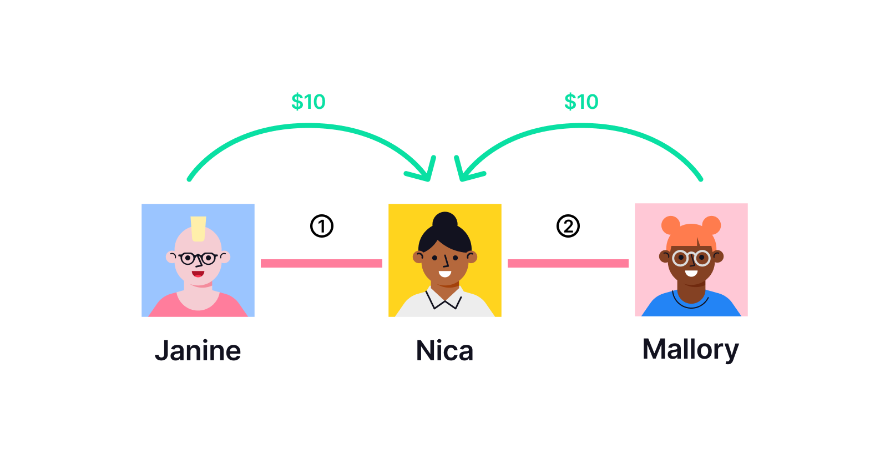
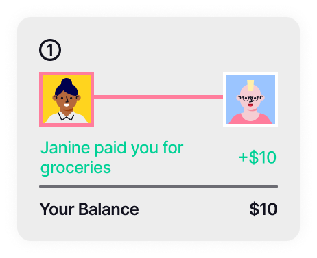
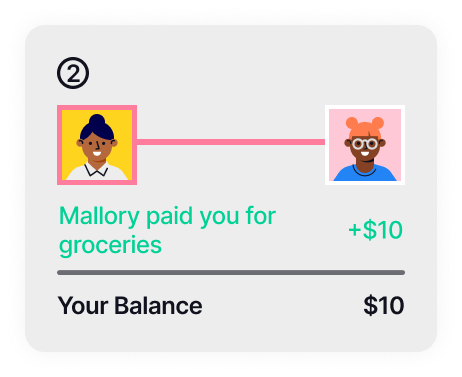
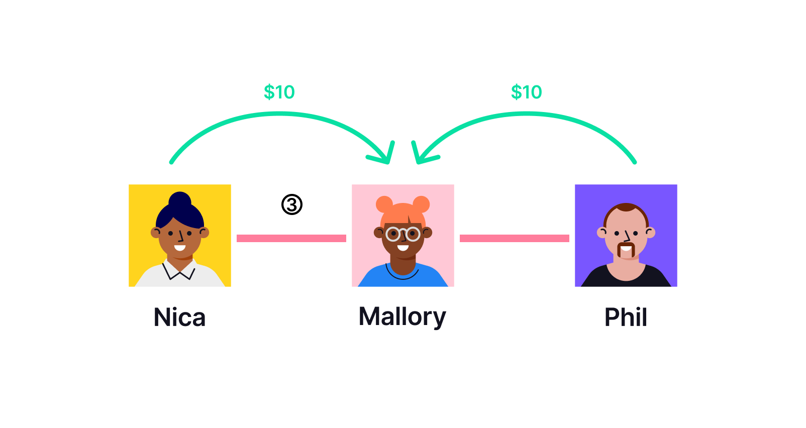
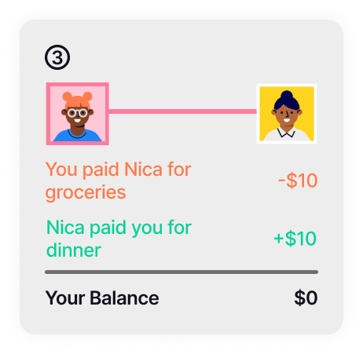
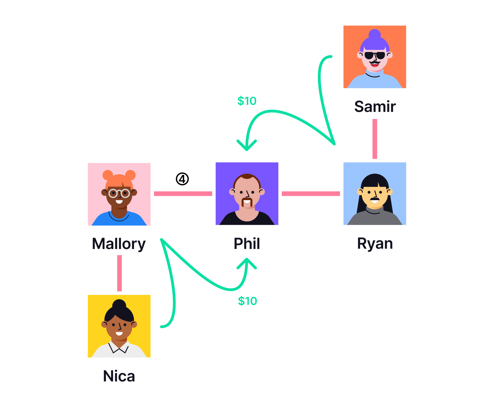
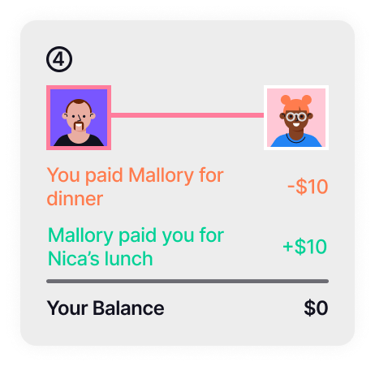

Trustlines is an excellent way to keep track of debts without the need to handle cash. For example, it is useful when splitting the bill at restaurants or for similar group activities. If you go out with your friends often, these payments will go back and forth for a long time. Using Trustlines helps create a friendlier environment for recording debts between friends, reducing the frequency of needing to settle with cash or bank money. It can even make settling wholly unnecessary.

One advantage of using Trustlines is that it also allows you to avoid handling cash even with people beyond your immediate circle of friends, by automatically moving around the credit in your network. For example, if your acquaintance Alice pays a restaurant $10 for your lunch, and your mutual friend Bob owes you $10, you can "pay" Alice back by simply transferring Bob's debt to Alice. This transfer of credit occurs automatically during "multi-hop payments" on Trustlines.

Before you can use Trustlines for payments, you first need to create some trustlines with your trusted friends. You can create trustlines even with those you don't plan to transact with often, increasing the extended network of people with whom you can transact. Higher credit limits on your trustlines will allow you to send larger payments. See the [User Guide](../../../guides/tl_app_user_guide) for instructions about opening trustlines.

## Why use Trustlines for bill splitting

Traditional apps for bill splitting usually encourage quick settlement, often compelling users to connect a bank account or create an account with the service provider. These apps allow users to accumulate debt with friends, but they assume users will settle these debts directly via cash or bank transfer. They do not provide a general accounting system in which users can instead _take advantage of [credit clearing](https://en.wikipedia.org/wiki/Credit_clearing) within the complete network of users_, [without necessarily settling in cash](https://youtu.be/m8N3hLKDvcY?t=113).

As money circulates in an economy, most debts should naturally cancel out over time. This is why it makes sense to use an accounting system like Trustlines for tracking debts, without the need for immediate settlement. An accounting system that clears credit automatically will reduce the frequency of needing to settle, and can even make settling wholly unnecessary. Furthermore, since Trustlines is highly secure, it does not require any intermediaries (like banks). Users can trust the ledger to keep good records, and do not need to connect an external bank account since no "real money" is transferred until users decide to settle.

In addition, unlike typical bill splitting apps, Trustlines can be used with people outside the user's immediate circle of friends, or even with complete strangers. Strangers do not ordinarily trust each other with unsecured debt, so in most payment scenarios, people are obliged to use national currency. For example, most people rely on cash, bank cards, or traditional payment apps like PayPal or Venmo. But Trustlines allows users to avoid handling national currency and use credit instead, by rippling debts through friends-of-friends in the same currency network. This means you can use Trustlines to split the bill with people you don't know very well, without worrying about getting your money back—since you will always end up holding credit directly with the people you trust. If you use Trustlines, you could potentially transact with credit in any scenario, and never have to connect a bank account.

The following section will provide some illustrative examples of how Trustlines may be used for bill splitting.

## Split the groceries with roommates

Today it's Nica's turn to go shopping for groceries to share with her roommates, Mallory and Janine. Both Mallory and Janine have trustlines with Nica. The groceries cost $30, and Nica pays this with her debit card. She will need to ask her roommates for $10 each in order to split the cost evenly.

It doesn't make sense to demand cash from her roommates right now because Nica knows that next week they will do the grocery shopping, and she will have to pay them back. Instead, she decides to hold credit from each roommate. In other words, she'd like each roommate to make a promise that they owe her ten dollars.

To record these promises, she shares an electronic payment request for ten dollars with each of her roommates. She makes sure to add a note to the payment request explaining that it's for this week's groceries.

Soon after she sends these requests, each of her roommates receives a notification on their mobile phone. They each fulfill Nica's payment request by sending credit for ten dollars, using Trustlines. None of them have to handle any cash during this process. If Nica checks her balances, she'll notice that her balance with each roommate is $10. (If Mallory or Janine check their balances, they will each see it is -$10.)

## Split a meal with trusted friends

Mallory, Nica, and Phil all work in the same office and often hang out together. Mallory has trustlines with both Nica and Phil. After work, the three of them go out to dinner together. The meal costs $30. Mallory offers to pay the restaurant bill with her debit card, and her friends agree to pay her $10 each.

But it doesn't make sense for Mallory to demand cash from her friends right now, because she trusts them to pay the next time they go out together. Instead, Nica and Phil can each make a promise to Mallory that they owe her ten dollars.

To keep track of these promises, Mallory creates a payment request for ten dollars and shares this with Nica and with Phil. Nica and Phil each scan the request, and each of them sends ten dollars in credit to Mallory.

Remember that Mallory already owes Nica $10 from splitting the groceries. When Nica sends $10 in credit to Mallory, this debt is simply canceled out. If Mallory checks her balance with Nica after the transaction, she will notice that it has returned to zero.

## Split a meal with people you don't know well

Later that week, Phil goes out for lunch at a restaurant with two other people from his office, Nica and Samir. They are all using Trustlines, but none of them know Phil well enough to have direct trustlines with him. The meal costs $30. Phil offers to pay the restaurant bill with his debit card, and his colleagues agree to pay him back $10 each.

Because Phil knows that he will probably go out for lunch with other colleagues again in the future, he'd rather have credit instead of cash. Even though neither Nica nor Samir has trustlines with him, meaning they can't send him credit directly, they want to check if they are connected through their network and able to send credit with a multi-hop payment. If they're all connected through trustlines with mutual friends, like Mallory and Ryan, it should be possible for each of them to transfer credit to Phil through a multi-hop payment. (Note that each trustline along the payment path must have enough credit capacity for the entire transferred amount—it won't work if someone along the way has "maxed out" their credit already.)

So Phil shares a payment request for ten dollars. Nica and Samir each scan the request, and automatically see a confirmation that they are connected and have enough capacity in their trustlines to fulfill the payment. Next, they each send him credit for ten dollars through a multi-hop payment.

If Phil checks his balances after the transaction, he'll notice that he is now owed credit only from people with whom he has a direct trustline. His balance with Ryan is now $10, since Samir rippled a payment through Ryan. (The rippling happened automatically, without Ryan needing to take action. If Ryan decided to check his balances now, he would notice that Samir now owes him $10.)

Also, remember that Phil previously owed Mallory $10 from dinner. When he checks his balance with Mallory, he notices that it has returned to zero. This is because Nica rippled a payment of $10 through Mallory, canceling out this debt. (The rippling happened automatically, without Mallory needing to take action. If Mallory decided to check her balances now, she would notice that Nica now owes her $10.)

## People powered money

Using Trustlines in your everyday transactions can add simplicity to your life, but it also has larger societal benefits. Even if you're just using Trustlines to split bills, you're implicitly using an ancient and radical type of money and an alternative to the traditional financial system, People Powered Money. Each new trustline is a contribution to the creation of a sustainable and egalitarian monetary system. That is because when you create new trustlines, you're growing the network and making it more useful for others, too.
