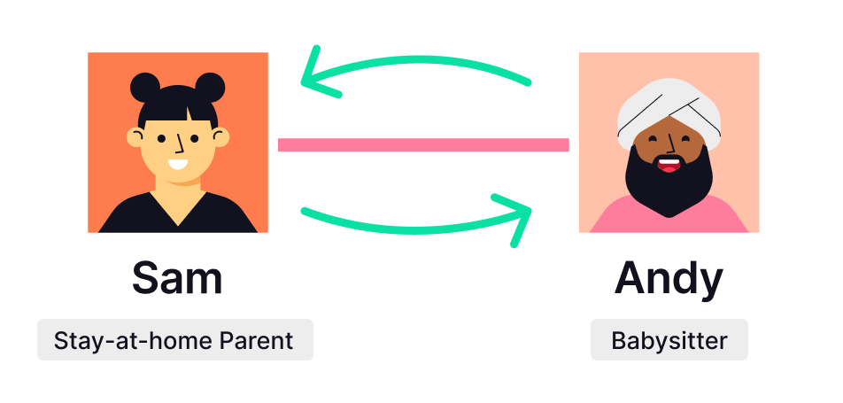
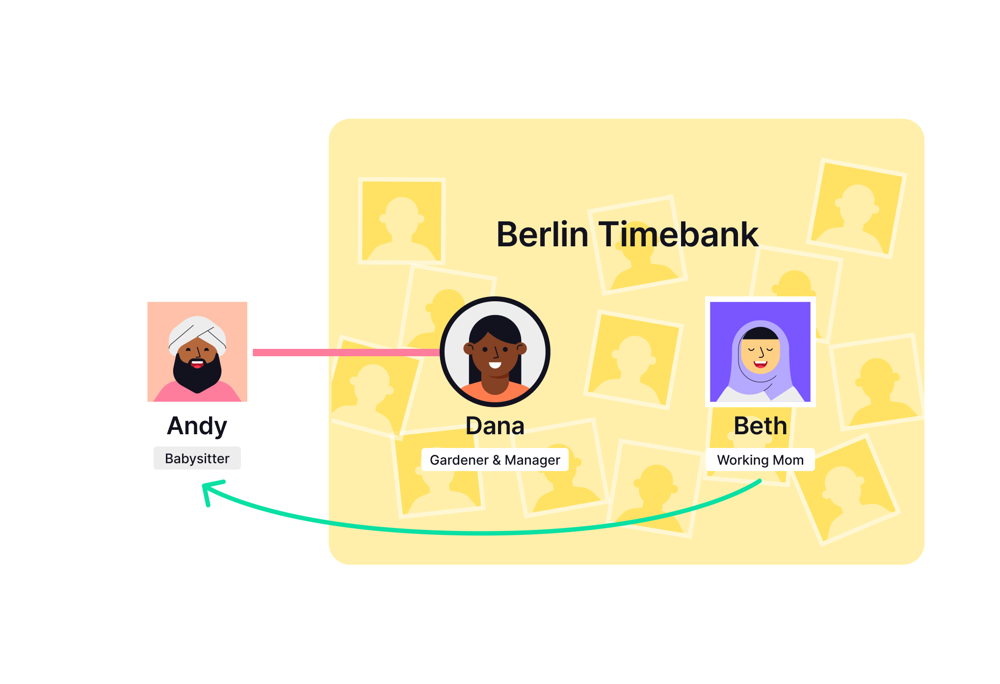

## Table of Contents

#### 1. [Decentralized Timebank](#1-decentralized-timebank-1)

#### 2. [Mutual Aid with a Neighborhood Timebank](#2-mutual-aid-with-a-neighborhood-timebank-1)

#### 3. [Volunteer Groups](#3-volunteer-groups-1)

#### 4. [Direct Giving through Volunteer Groups](#4-direct-giving-through-volunteer-groups-1)

#### 5. [Partnerships between Businesses and Community Groups](#5-partnerships-between-businesses-and-community-groups-1)

  - 5.1 [Growing the Local Economy](#51-partner-businesses-growing-the-local-economy)
  - 5.2 [Gifting](#52-partner-businesses-gifting)

#### 6. [Peer-to-Peer Transactions: The Network Effect](#6-peer-to-peer-transactions-the-network-effect-1)

  - 6.1 [Encouraging reciprocity in community groups](#61-encouraging-reciprocity-in-community-groups)
  - 6.2 [Creating new friendships because of community groups](#62-creating-new-friendships-because-of-community-groups)
  - 6.3 [Rippling through friends to shop at local businesses](#63-rippling-through-friends-to-shop-at-local-businesses)

#### 7. [Community Partnerships: The Network Effect](#7-community-partnerships-the-network-effect-1)

#### 8. [Partner Businesses: Supporting Networks of Communities](#8-partner-businesses-supporting-networks-of-communities-1)

___

The following user stories are intended to illustrate possible ways to use Trustlines in a time credits system. This document is not comprehensive. It is meant to guide and inspire.

<section>
This diagram shows how different entities using time credits are naturally interconnected through Trustlines. A pink line represents a trustline between two individuals. A purple line represents a trustline between two organization accounts. Boxes represent communities in which each member has a trustline with the organization account. Characters with a round border are managers of an organization account. Anyone can ripple a transaction to anyone else in the network, as long as each connecting trustline has enough capacity.</section>

## 1. Decentralized Timebank

The easiest way to start using time credits is to join the decentralized timebank. Group clusters will occur around geographic areas or according to interest groups. For example, several individuals may want to start using time credits in the Berlin area.

|:---|
| **Scenario 1: Decentralized Timebank**  Individuals can start using time credits independently, with anyone they trust. By doing so, they join the "decentralized timebank." |

### How to integrate with Trustlines

Several people in Berlin become interested in the idea of timebanking and want to try it out. Some of them know each other from the neighborhood, and others share a coworking space. Others are just good friends. All of these connections are the basis for different trust relationships: Each person individually opens a trustline with the people they trust. Most people agree that five hours is a reasonable mutual credit limit for regular acquaintances.

Andy and Sam are neighbors. They open a trustline with each other because Sam has children, and Andy babysits once a week. Also, Sam has a car, and Andy sometimes needs a ride. They transact with each other often, so they set a mutual credit limit of ten. Even though it's just the two of them, being able to track these exchanges using time credits has made the value of their services more visible, and mutually enriched their lives.

<section>
Andy and Sam have a trustline. Andy pays Sam for giving him a ride. Sam pays Andy for babysitting.</section>

But it's not just Andy and Sam. Dana, a gardener, is a good friend of Andy's. They decide to open a trustline with a mutual credit limit of five. Even though Andy and Dana may not directly have skills to offer each other right now, they will each benefit from their trustline by being better connected to the rest of the network. For example, Dana offers gardening classes for children, and Sam's children want to attend.

<section>
The pink lines represent trustlines. Sam pays Dana for gardening classes. Andy can pay for services from one of Dana's friends, and receives payments for babysitting.</section>

Similarly, Andy is a babysitter and would like Dana's connections to be able to use his babysitting skills. In return, Andy can benefit from services provided by Dana's connections.

## 2. Mutual Aid with a Neighborhood Timebank

In the traditional scenario, a Berlin neighborhood may start a centralized timebank, to encourage neighbors to share skills, support their neighbors, and enrich the community.

|:---|
| **Scenario 2: Mutual Aid with a Neighborhood Timebank**  Trustlines allows centralized timebanks to form. These are inherently interoperable with people outside the timebank, as well as other timebanks. |

### How to integrate with Trustlines

Everyone in Berlin is eligible to join the Berlin Timebank. The community elects Dana as a manager to monitor new applications.

Beth applies to join the timebank. Dana conducts an interview, in which she helps Beth figure out which skills to contribute, and what kind of requests to make. Beth signs a document committing to honor the principles of the timebank. Next, Dana has the Berlin Timebank create a trustline with Beth. The mutual credit limit on this trustline is 25, which is the same amount for all new members.

There are fifty members of the timebank, including Dana. Beth can now transact with all fifty members, by rippling payments through the organization account. But Beth's overall balance with the timebank cannot go higher than 25 credits, and cannot go lower than -25 credits either. Beth offers to help Dana with her website, and enrolls her children in Dana's gardening class. Beth and Dana can pay each other time credits by rippling through the Berlin Timebank.

<section>
Dana is manager of Berlin Timebank. Both Dana and Beth have trustlines with Berlin Timebank. Beth pays Dana for gardening classes. Dana pays Beth for website help. Both payments ripple through the Berlin Timebank account.
</section>

Andy is a babysitter and wants to get paid for this service in time credits. But Andy is new to the neighborhood and does not feel comfortable applying for membership with a big neighborhood timebank. Luckily, Andy and Dana are good friends and share a trustline with a mutual credit limit of five. This connection enables Beth, who needs babysitting, to send a payment to Andy. Beth's payment ripples first through the Berlin Timebank, then through Dana, before ending up with Andy.

<section>
Dana and Andy have a trustline. Both Dana and Beth have trustlines with Berlin Timebank. Beth pays Andy for babysitting. The payment ripples through the Berlin Timebank account and then through Dana.
</section>

## 3. Volunteer Groups

Time credits can also be used for more specific purposes. For example, the manager of an altruistic community group can use Trustlines to reward volunteers for their work. An added benefit of using Trustlines is they would be better able to estimate the total number of hours their volunteers plan to contribute over a set time period. They estimate this based on the received credit limits on their trustlines.

|:---|
| **Scenario 3: Volunteer Groups**  Trustlines allows organizations that coordinate specific community services, like Emma's Foodsharing program in Berlin, to reward volunteers like Sam, by issuing time credits to them. Sam can spend earned credits with people and organizations that support Berlin Foodsharing. And Emma can share program statistics with her local government to demonstrate how important their work is. |

### How to integrate with Trustlines

Sam, a food delivery volunteer, opens a trustline with Berlin Foodsharing, managed by a chef, Emma. As a good rule of thumb, Sam should set the credit limit to be the maximum number of hours they expect to contribute over a set period of time. Sam expects to contribute ten hours per month, so they give Berlin Foodsharing a credit limit of ten. The other credit limit is zero for now. Emma can now pay Sam in time credits for food deliveries, using this trustline.

<section>
Emma is the manager of Berlin Foodsharing. Sam has a trustline with Berlin Foodsharing. Emma uses the Berlin Foodsharing account to pay Sam for volunteering.
</section>

Sam begins accumulating time credits. Every month, Sam earns ten credits and then spends ten credits with connected people and organizations. For an explanation of spending, see [Scenarios 5 to 8](#5-partnerships-between-businesses-and-community-groups-1).

But one month, Sam earns ten credits and doesn't spend them. Ten is the maximum amount of credits allowed by this credit limit. So next month, to continue earning credits, Sam agrees to raise Berlin Foodhsharing's credit limit to 20. This enables Emma to pay Sam an additional ten credits that month.

Now Sam has accumulated 20 credits. But guess what, this month Sam adopts a new baby! Sam tells Emma that they will be busy parenting and no longer have time to volunteer. Sam decides to lower their credit limit to zero for now, to indicate less availability. Sam still has 20 earned credits and can spend them anytime, but can no longer earn new credits.

Now Sam is deep in diapers and really needs help. It's a good time to talk to Andy, who can help out with babysitting. Andy will be able to earn credits directly from Sam, and also spend them through Sam, because of Sam's accumulated credits with Berlin Foodsharing (see [Scenario 6.3](#63-rippling-through-friends-to-shop-at-local-businesses)).

## 4. Direct Giving through Volunteer Groups

In a more advanced scenario, the manager of a community group could enable recipients of community services to pay volunteers directly. Using Trustlines helps the community group take a background role and act as a connector.

|:---|
| **Scenario 4: Direct Giving through Volunteer Groups**  Trustlines allows organizations that coordinate community services targeted towards helping vulnerable individuals, like Emma's Foodsharing program in Berlin, to act as a trusted intermediary in facilitating direct value transfers between service recipients like Fred and volunteers like Sam. |

### How to integrate with Trustlines

Berlin Foodsharing opens a trustline with each service recipient that chooses to participate. Fred is a senior citizen with reduced mobility. He applies to be a recipient of Berlin Foodsharing. Emma arranges a visit to meet Fred and assesses a need for weekly meal deliveries. So, Emma has Berlin Foodsharing give Fred a monthly credit limit of four. This is enough to pay for deliveries four times each month. The other credit limit is zero for now. This trustline enables Fred to directly pay a time credit to Sam every week, by rippling through Berlin Foodsharing.

<section>
Emma is the manager of Berlin Foodsharing. Sam and Fred each have a trustline with Berlin Foodsharing. Fred pays Sam for food deliveries. The payment ripples through the Berlin Foodsharing account.
</section>

At the end of the month, Fred has a balance of negative four. To make sure Fred can keep paying next month, Emma keeps track of Fred's balance. At the end of the month, Berlin Foodsharing gifts four credits to Fred, which resets his balance to zero. (Gifting is the practice of giving something voluntarily without payment in return.) This ensures that Fred can pay for next month's deliveries.

Note that some months, Berlin Foodsharing doesn't have to gift any credits to Fred. That's because Fred can earn credits as well. For an explanation, see [Scenario 5.2](#52-partner-businesses-gifting).

## 5. Partnerships between Businesses and Community Groups

Emma wants to make sure her volunteers have a way to spend their time credits. Similarly, Dana wants members of the Berlin Timebank to have more opportunities for spending and earning time credits.

So, Emma and Dana start approaching businesses in the community, especially those that may have extra resources. For example, they may look for theaters that will have unused tickets or gyms that can offer free memberships. They may also look for cafes and restaurants interested in growing their business by offering discounts.

A partnership is established when a business opens a trustline with a community group. In other words, they can agree to honor a certain amount of time credits as vouchers for goods or services.

Using Trustlines to do this has a few added benefits for the business:

* Friends of community members can also transact with supporting businesses by rippling payments, which greatly expands the reach of each business (see [Scenario 6.3](#63-rippling-through-friends-to-shop-at-local-businesses)).
* The partnership helps ensure that resources (like unused theater tickets) don't go to waste.
* Businesses are able to spend earned time credits back into the community.

There are two ways businesses can establish partnerships with community groups: By accepting time credits as payment from the trusted group ([Scenario 5.1](#51-partner-businesses-growing-the-local-economy)), or by gifting time credits to that group ([Scenario 5.2](#52-partner-businesses-gifting)).

## 5.1 Partner Businesses: Growing the Local Economy

The Berlin Timebank is known in the region as a network of reliable people with many different skills and talents, who are passionate about building a stronger community. Dana is easily able to demonstrate to several businesses that the members of the Berlin Timebank can be both a loyal customer base and a valuable resource.

|:---|
| **Scenario 5.1: Growing the Local Economy**  Gigi, who manages the local theater, wants to reserve a certain number of unused tickets for members of the Berlin Timebank, and for anyone connected to members of the Berlin Timebank via the network of trustlines. |

### How to integrate with Trustlines

Gigi's Theatre should open a trustline with the Berlin Timebank. Gigi gives a credit limit of 25, and the other credit limit is zero for now. Beth, who has earned time credits through the timebank, will then be able to ripple payments through the timebank to pay for theater tickets. Anyone sharing a trustline with Beth will be able to do this as well.

<section>
Dana is the manager of Berlin Timebank. Dana and Gigi open a trustline between Berlin Timebank and the Theatre. Beth has a trustline with the Berlin Timebank. Beth pays Gigi's Theatre for tickets to a show. The payment ripples through the Berlin Timebank account.
</section>

Afterward, Gigi's Theatre will end up being "owed" a number of time credits. Gigi can spend these time credits back into the community. For example, she can use them to pay theater volunteers in the future.

## 5.2. Partner Businesses: Gifting

Berlin Foodsharing is highly regarded in the community and has been featured in the local paper. Emma is easily able to demonstrate to several businesses that Berlin Foodsharing is authentic: distributing time credits to real volunteers doing valuable work. So businesses wanting to give back to the community can support Berlin Foodsharing.

|:---|
| **Scenario 5.2: Gifting**  Heidi's Café decides to gift time credits to Berlin Foodsharing to support their work. These can be redeemed as a discount (i.e., as partial payment) at the cafe. |

### How to integrate with Trustlines

Berlin Foodsharing opens a trustline with Heidi's Café. Berlin Foodsharing gives a credit limit of 50, and the other credit limit is zero for now. Heidi can now immediately gift 50 time credits to Berlin Foodsharing, using this trustline. Sam, a volunteer who has earned time credits from Berlin Foodsharing, will then be able to ripple payments through Berlin Foodsharing to pay at Heidi's Café. Anyone sharing a trustline with Sam will also be able to use this discount unless Heidi decides to limit the reward to volunteers (in that case, the café must manually request proof of membership with Berlin Foodsharing before accepting the payment).

<section>
Emma is the manager of Berlin Foodsharing. Emma and Heidi open a trustline between Berlin Foodsharing and the Café. Sam has a trustline with Berlin Foodsharing. Sam pays for coffee at Heidi's Café. The payment ripples through the Berlin Foodsharing account.
</section>

* **Case A**: Each month, 50 time credits are redeemed at the cafe. Heidi can choose to replenish it by gifting further time credits at the end of each month.
* **Case B**: Perhaps Heidi needs some help supporting the influx of new customers. Berlin Foodsharing can allow Heidi's Café to use the trustline to access their volunteer base. Suppose volunteers from Berlin Foodsharing have already redeemed a total of 50 credits with the cafe. Heidi can offer to pay five credits out of this balance, to Sam, who agrees to help out for five hours each month. These credits are rippled through Berlin Foodsharing.
* **Case C**: But perhaps Berlin Foodsharing needs Sam, and all the other volunteers, to use the majority of their time for deliveries. Emma explains this to Heidi. To reflect this, Emma can choose to reduce their credit limit after receiving Heidi's 50 gifted credits. (This can be done even before redeeming the gifted credits.)

## 6. Peer-to-Peer Transactions: The Network Effect

As described in the Decentralized Timebank ([Scenario 1](#1-decentralized-timebank-1)), individual community members may choose to accept time credits from other individuals, outside the constraints of a registered business. Depending on how these individuals are connected to the rest of the community, they may be able to ripple their time credits through different groups in order to make a payment to another individual or supportive business accepting time credits.

## 6.1. Encouraging reciprocity in community groups

|:---|
| **Scenario 6.1: Encouraging reciprocity in community groups**  Perhaps Fred is also a retired professor. Fred can offer tutoring services to Sam, who has children. Fred can accept time credits in return. |

### How to integrate with Trustlines

Fred has rippled payments in the past to Sam, through Berlin Foodsharing. Now, Sam can use these earned time credits to ripple a payment in the other direction, back to Fred.

<section>
Sam and Fred each have a trustline with Berlin Foodsharing. Sam pays Fred for tutoring Sam's children. The payment ripples through the Berlin Foodsharing account.
</section>

## 6.2. Creating new friendships because of community groups

|:---|
| **Scenario 6.2: Creating new friendships because of community groups**  Alternatively, suppose Sam has been delivering meals to Fred for months, so they know and trust each other. They can choose to start transacting directly, without using Berlin Foodsharing. |

### How to integrate with Trustlines

Fred can open a trustline directly with Sam, and they agree to set a mutual credit limit of ten---higher than what Berlin Foodsharing allows. Then Sam can use this trustline to pay Fred for tutoring services for Sam's children, and Fred can use the trustline to pay for meal deliveries. They no longer need to ripple payments through Berlin Foodsharing.

<section>
Sam and Fred open a trustline between each other. Fred pays Sam for food deliveries. Sam pays Fred for tutoring Sam's children.
</section>

## 6.3. Rippling through friends to shop at local businesses

|:---|
| **Scenario 6.2: Rippling through friends to shop at local businesses**  Remember that Sam has a neighbor named Andy. Sam often uses time credits to pay Andy for babysitting. Andy can redeem his time credits at local businesses, even though he does not have trustlines with any of them, because he is connected through Sam. |

### How to integrate with Trustlines

Andy already has a trustline with Sam. Since Andy is receiving time credits from Sam, who is a member of Berlin Foodsharing, Andy could eventually ripple a payment through Sam to pay for a discount at Heidi's Café.

<section>
Andy and Sam have a trustline. Sam has paid Andy for babysitting. Berlin Foodsharing and Heidi's Café have a trustline. Andy pays for hot chocolate at Heidi's Café. The payment ripples through Sam, then through the Berlin Foodsharing account.
</section>

## 7. Community Partnerships: The Network Effect

Different community groups can open trustlines between each other as well, allowing payments to ripple through each one's members and network of partner businesses, and thus expanding the network of all members.

|:---|
| **Scenario 7: The Network Effect**  The Berlin Timebank (managed by Dana) and the Paris Timebank, a similar program managed by Ivan, want to connect their members, and also share their network of partner businesses. |

### How to integrate with Trustlines

The Berlin Timebank can open a trustline with the Paris Timebank. Dana and Ivan agree on a mutual credit limit of 25. This is the maximum amount either group can have "outstanding" at any point in time, between their communities.

This connection enables members of both programs to spend and earn time credits in each other's communities, by rippling payments over the trustline. For example, this enables Côme, a member of the Paris Timebank, to use time credits while visiting Berlin, in order to pay for a theater ticket.

<section>
Dana is the manager of the Berlin Timebank. Ivan is the manager of the Paris Timebank. They open a trustline between the two timebanks. Côme pays for theatre tickets at Gigi's Theatre. The payment ripples through the Paris Timebank account and then the Berlin Timebank account. This is possible because Côme has a trustline with the Paris Timebank, and there is a trustline connecting the Berlin Timebank to Gigi's Theatre.
</section>

## 8. Partner Businesses: Supporting Networks of Communities

Businesses may also choose to accept time credits from a large and diverse set of community groups.

|:---|
| **Scenario 8: Supporting Networks of Communities**  Josh is the community organizer managing a European Timebank Network. Kamal, an online crafts seller from London, wants to support mutual aid initiatives using timebanks, and also grow his customer base. He decides to offer a discount to the European Timebank Network. This would open Kamal's offer to timebanks across Europe, like the Berlin Timebank or the Paris Timebank. |

### How to integrate with Trustlines

Kamal reaches out to Josh to explain why he supports their organization and to introduce his crafts shop. Josh agrees that connecting to Kamal's Craft Shop will add value to the European Timebank Network, since it is a unique shop where members can spend their credits. They agree to open a trustline.

The European Timebank Network gives a credit limit of 20 to Kamal, and the other credit limit is zero for now. Kamal immediately uses this trustline to gift 20 time credits to the organization. Now, the European Timebank Network has a balance of 20 credits to spend at Kamal's Craft Shop, to be used as a discount.

The European Timebank Network has trustlines with many timebanks across the continent, each of which has a mutual credit limit of 25. Because of this, connected timebank members like Beth can redeem their time credits for crafts by rippling a payment to Kamal's Craft Shop. In this scenario, Beth's payment would ripple first through the Berlin Timebank, and then through the European Timebank Network, until finally it is paid to Kamal.

<section>
Josh is the manager of the European Timebank Network. He opens a trustline with Kamal's Craft Shop. Beth has a trustline with the Berlin Timebank. Beth pays for handmade crafts at Kamal's Craft Shop. The payment ripples through the Berlin Timebank and then the European Timebank Network.
</section>

After accumulating credits over this trustline, Kamal can choose to pay some credits back into the community. Since Kamal lives in London, he checks the directory of the London Timebank to see what services are available. He will be able to ripple a payment through the European Timebank Network, and then through the London Timebank, before it is received by someone in his community.

<a href="time_credits_on_trustlines" class="prev_next_text">Previous</a>

 

<a href="time_credits_on_trustlines" class="prev_next_text">Time Credits on Trustlines</a>

